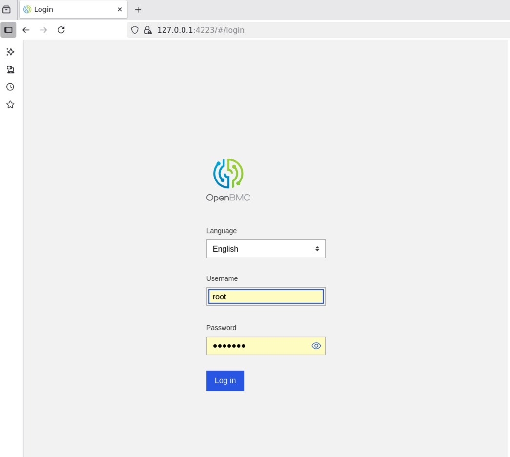
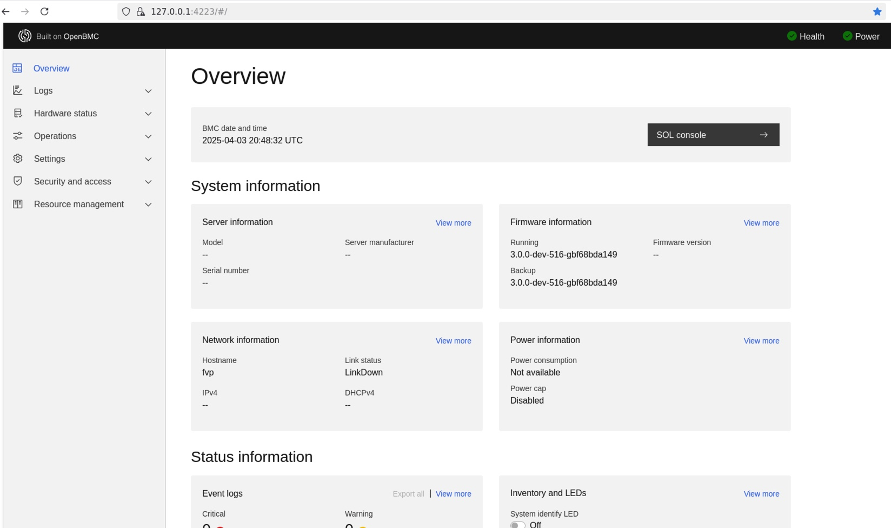
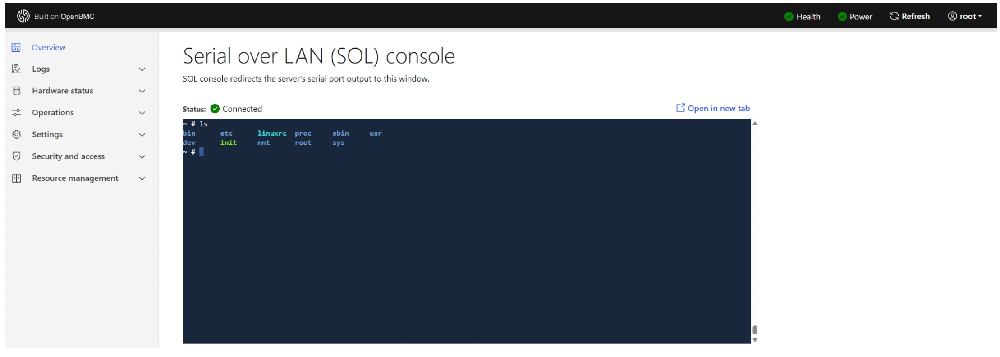

## Access the host console via OpenBMC SOL

OpenBMC provides Serial oOer LAN (SOL) so you can access the host console (RD-V3 FVP) remotely through the BMC without a physical serial cable. In this section, you create a virtual UART bridge with `socat`, verify the port mappings, and open the host console from the BMC web UI.

### Step 1: Connect the BMC and host consoles

Run this command on the Linux machine where the simulation is running to bridge the BMC and host UART ports:

```bash
socat -x tcp:localhost:5005 tcp:localhost:5067
```

This command connects the host-side UART port 5005 to the BMC-side port 5067 to enable bidirectional serial communication.

{}
If you see a Connection refused error, check the FVP logs to verify the port numbers:
* In `fvp_boot.log`, look for a line like:
terminal_ns_uart0: Listening for serial connection on port 5005
* In `obmc_boot.log`, confirm the corresponding line:
terminal_3: Listening for serial connection on port 5067
{}

Ensure both ports are active and match the socat command arguments.


### Step 2: Manually set the host power state

After the SOL bridge is established, run the following command from the OpenBMC console shell to simulate the host as powered on:

```bash
busctl set-property xyz.openbmc_project.State.Host /xyz/openbmc_project/state/host0 xyz.openbmc_project.State.Host CurrentHostState s xyz.openbmc_project.State.Host.HostState.Running
```

This command updates the BMC internal host state so UEFI can begin execution.

### Step 3: Access the host console from the web UI

- From your simulation host, launch a browser and open the BMC Web UI at:
  https://127.0.0.1:4223
   

- Login using the default credentials:
   - Username: root
	- Password: 0penBmc
   {}
   As a reminder, the first character of the password is the number ***0***, not a capital ***O***.
   {}
   After login, you should see the Web UI dashboard:

- From the Overview page, click the `SOL Console` button.
   

- The SOL terminal in the Web UI will display the host console output (UEFI shell or Linux login). You can type commands directly as if you were connected over a physical serial line.
   

When you are connected to the SOL terminal, you can monitor the UEFI boot sequence, interact with the host shell, and run diagnostic or recovery workflows just as you would over a physical serial port.

This process confirms that OpenBMC manages host power and console access in your simulated environment.

In the next section, you extend this control by sending IPMI commands to the BMC to test low-level system interactions and implement custom OEM command handlers.
