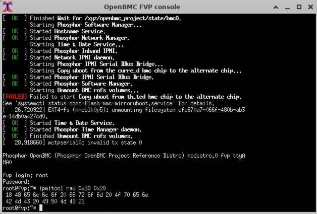

## Customize IPMI commands in OpenBMC

With the host console accessible through OpenBMC, you can extend platform management by implementing a custom IPMI command handler.

The Intelligent Platform Management Interface ([IPMI](https://en.wikipedia.org/wiki/Intelligent_Platform_Management_Interface)) is a standardized protocol for out-of-band server management, even when the operating system is not running. In OpenBMC, IPMI support is built-in and can be extended with custom handlers through the D-Bus and IPMI infrastructure.

In this section, you implement a custom IPMI command handler that returns a simple string response. You write the handler in C++, package it with a BitBake recipe, build it into the OpenBMC image, and test it with `ipmitool` in the FVP simulation environment.

### Step 1: Create a BitBake recipe

Create a new file named `phosphor-ipmi-example.bb` in the same folder.

```bash
touch ~/openbmc/meta-evb/meta-evb-arm/meta-evb-fvp-base/recipes-phosphor/ipmi/phosphor-ipmi-example.bb
```

Paste the following content into the file:

```bash
SUMMARY = "Custom IPMI commands"
LICENSE = "CLOSED"
PR = "r1"
SRC_URI = "file://fvp-ipmi.cpp"
S = "${UNPACKDIR}"

DEPENDS += "phosphor-ipmi-host sdbusplus systemd"
TARGET_CXXFLAGS += " -std=c++23"
TARGET_LDFLAGS += " -lsystemd -lsdbusplus"

do_compile() {
    ${CXX} ${TARGET_CXXFLAGS} -fPIC -shared     -o libmyipmi.so ${UNPACKDIR}/fvp-ipmi.cpp     -I${STAGING_INCDIR} -L${STAGING_LIBDIR}     ${TARGET_LDFLAGS}
}

do_install() {
    install -d ${D}${libdir}/ipmid-providers
    install -m 0644 libmyipmi.so ${D}${libdir}/ipmid-providers/
}

FILES:${PN} += "${libdir}/ipmid-providers/libmyipmi.so"
```

### Step 2: Create a custom IPMI handler

Create a folder `phosphor-ipmi-example` at the same path, and add a new file called `fvp-ipmi.cpp`:

```bash
mkdir ~/openbmc/meta-evb/meta-evb-arm/meta-evb-fvp-base/recipes-phosphor/ipmi/phosphor-ipmi-example
touch ~/openbmc/meta-evb/meta-evb-arm/meta-evb-fvp-base/recipes-phosphor/ipmi/phosphor-ipmi-example/fvp-ipmi.cpp
```

Add the following contents to `fvp-ipmi.cpp`:

```cpp
#include <ipmid/api.hpp>
#include <ipmid/utils.hpp>
#include <string>

// Example handler: return a string
ipmi::RspType<std::string> myIpmiCommand() {
    std::string reply = "Hello from OpenBMC IPMI!";
    return ipmi::responseSuccess(reply);
}

void register_my_ipmi() __attribute__((constructor));
void register_my_ipmi() {
    ipmi::registerHandler(
        ipmi::prioOemBase,
        0x30,                   // NetFn code
        0x20,                   // command code
        ipmi::Privilege::Admin, 
        myIpmiCommand
    );
}
```

This function registers a custom IPMI handler with NetFn `0x30` and command `0x20`.  
When invoked, it returns the ASCII string `"Hello from OpenBMC IPMI!"`.  
At runtime, the string is encoded as hexadecimal bytes and returned in the IPMI response. You will observe this with `ipmitool raw` and by decoding the output.

### Step 3: Add to build configuration

To test the IPMI command, add `ipmitool` and `phosphor-ipmi-example` to your build configuration. Edit `fvp.conf` at:

`~/openbmc/meta-evb/meta-evb-arm/meta-evb-fvp-base/conf/machine/fvp.conf`

Append the following packages:

```bash
IMAGE_INSTALL:append = "\ 
    phosphor-ipmi-example     ipmitool "
```

Rebuild the OpenBMC image with your IPMI handler included

```bash
cd ~/openbmc
source setup fvp
bitbake obmc-phosphor-image
```

After the build completes, the generated image contains both `ipmitool` and `phosphor-ipmi-example`

For details about the final image configuration, inspect the generated FVP configuration file at:

`~/openbmc/build/fvp/tmp/deploy/images/fvp/obmc-phosphor-image-fvp.fvpconf`

### Step 4: Verify the IPMI command in simulation

After launching the FVP simulation and logging into the OpenBMC console, run the following command to invoke your custom IPMI handler

```bash
ipmitool raw 0x30 0x20
```

This command invokes your custom IPMI handler registered under

- NetFn: `0x30` (OEM function)  
- Command: `0x20`

You should see a response similar to

```output
root@fvp:~# ipmitool raw 0x30 0x20
 18 48 65 6c 6c 6f 20 66 72 6f 6d 20 4f 70 65 6e 
 42 4d 43 20 49 50 4d 49 21
```

This response is a sequence of hexadecimal bytes returned by the BMC

- The first byte indicates the length of the payload — in this case `0x18`, 24 bytes  
- The remaining 24 bytes are the data payload, encoded as ASCII



To decode the message, copy the payload portion (excluding the first byte) and run

```bash
echo "48 65 6c 6c 6f 20 66 72 6f 6d 20 4f 70 65 6e 42 4d 43 20 49 50 4d 49 21" | tr -d ' ' | xxd -r -p
```

The output is

```output
Hello from OpenBMC IPMI!
```

This confirms that the custom string returned by your `myIpmiCommand()` function has been correctly encoded and transmitted using IPMI:

```cpp
std::string reply = "Hello from OpenBMC IPMI!";
return ipmi::responseSuccess(reply);
```

The response from `ipmitool raw` confirms that your custom IPMI handler was:

- Successfully compiled and included in the OpenBMC image  
- Properly registered to respond to NetFn `0x30` and command `0x20`  
- Executed correctly in the simulated environment via IPMI raw access  
- Returning the intended payload, encoded as ASCII and received in hexadecimal format

By decoding the hexadecimal payload into ASCII, you verified the full path from handler registration to command execution and payload delivery.

You have now implemented and tested a custom IPMI command in OpenBMC using pre-silicon simulation. This sets the foundation for adding OEM commands or platform-specific extensions to your BMC firmware. You can expand this pattern to support argument parsing, custom data formats, or system-level control to prototype features such as sensor telemetry, power domain control, or boot policy configuration.
