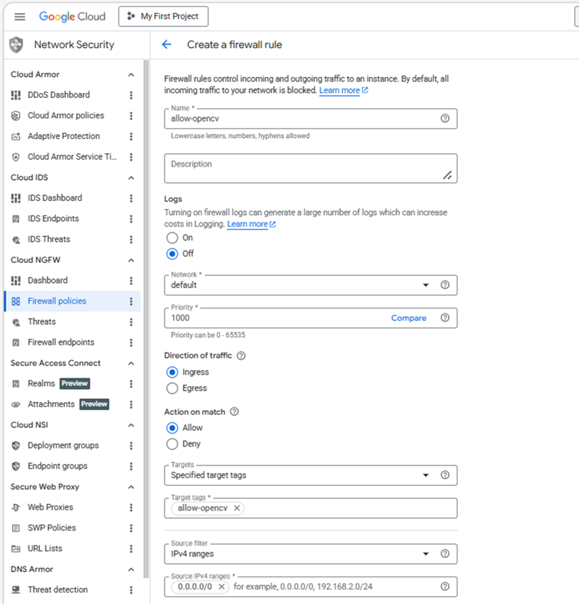
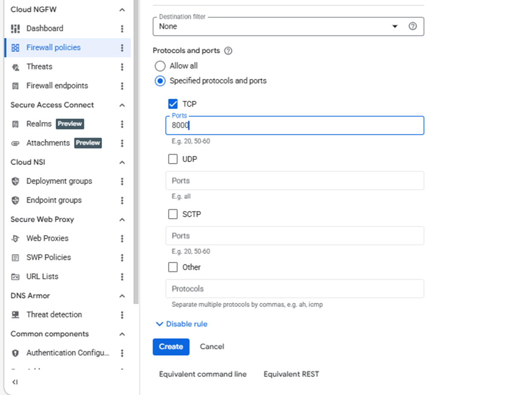

---

title: Create a firewall rule for OpenCV browser visualization

weight: 3
 
### FIXED, DO NOT MODIFY

layout: learningpathall

---

## Expose port for OpenCV browser-based visualization

Create a firewall rule in Google Cloud Console to allow browser access to your OpenCV output on port 8000.
 
{}

For help with Google Cloud Platform setup, see the Learning Path [Getting started with Google Cloud Platform](/learning-paths/servers-and-cloud-computing/csp/google/).

{}
 
### Configure the firewall rule

Configure the firewall rule using the Google Cloud Console:
 
1. Open the [Google Cloud Console](https://console.cloud.google.com/), navigate to **VPC Network > Firewall**, and select **Create firewall rule**.
 

 
2. Set the **Name** of the new rule to **allow-opencv-port**. Select the network that you intend to bind to your VM.
 
3. For **Direction of traffic**, select **Ingress**.  

4. For **Allow on match**, select **Allow**.  

5. For **Targets**, select **Specified target tags**.  

6. For **Target tags**, enter **allow-opencv**.  

7. Set **Source IPv4 ranges** to your current machine's public IP address. Run the following command in a terminal on your local machine to find the address:

```bash
curl -4 ifconfig.me
```

The `-4` flag forces an IPv4 response. Take the returned address and append `/32` to convert it to CIDR notation, for example `203.0.113.42/32`. Restricting access to your own IP prevents port 8000 from being exposed to the public internet.

{}If your IP address changes or you need to access the visualization from a different machine, update this field with the new IP address. Using `0.0.0.0/0` opens the port to all traffic and is not recommended.{}
 

 
 
8. For **Protocols and ports**, select **Specified protocols and ports**.
 
9. Select the **TCP** checkbox and, for **Ports**, enter **8000**.
 
10. Select **Create**.



## What you've accomplished and what's next

You've now created a firewall rule for OpenCV visualization that enables external browser access to your VM and exposes port 8000 for real-time pipeline outputs.

Next, you'll create a Google Axion virtual machine to host your OpenCV application.
