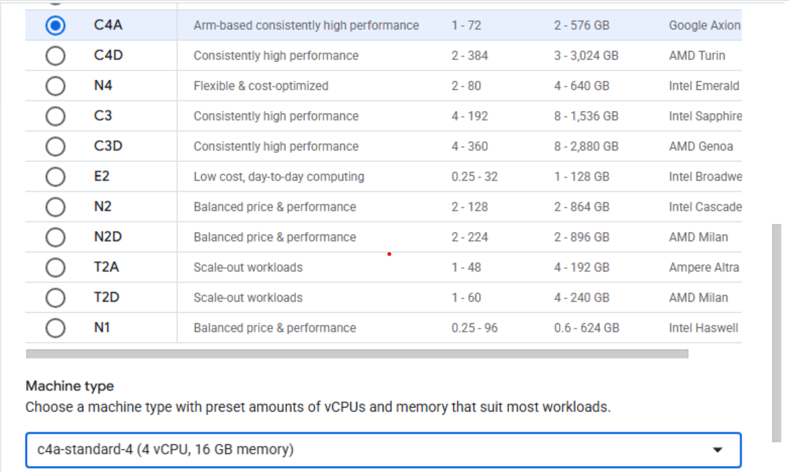
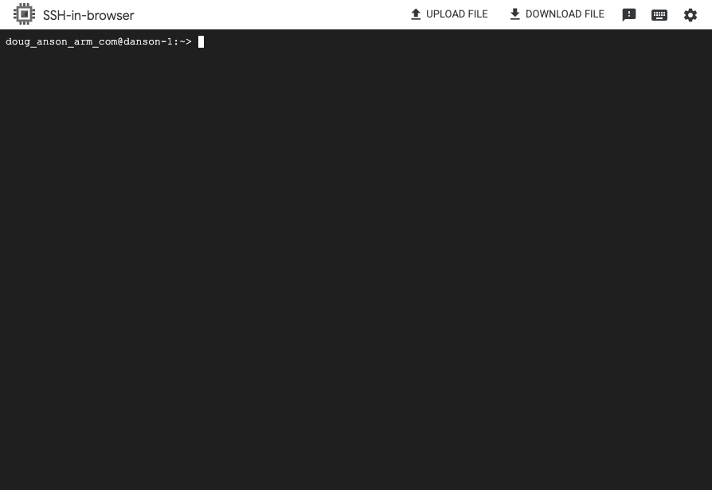

## Provision a Google Axion C4A Arm-based VM

In this section, you'll create a Google Axion C4A Arm-based virtual machine (VM) on Google Cloud Platform (GCP). You'll use the `c4a-standard-4` machine type with four vCPUs and 16 GB of memory. This VM will host your OpenCV application.

{}
For help with GCP setup, see the Learning Path [Getting started with Google Cloud Platform](/learning-paths/servers-and-cloud-computing/csp/google/).
{}

## Provision a Google Axion C4A Arm VM in Google Cloud Console

To create a virtual machine based on the C4A instance type:

1. Navigate to the [Google Cloud Console](https://console.cloud.google.com/).
2. Go to **Compute Engine** > **VM Instances** and select **Create Instance**.
3. Under **Machine configuration**:
    - Populate fields such as **Instance name**, **Region**, and **Zone**.
    - Set **Series** to `C4A`.
    - Select `c4a-standard-4` for **Machine type**.

4. Under **OS and storage**, select **Change**, and then choose an Arm64-based operating system image. For this Learning Path, select **SUSE Linux Enterprise Server**.
    - For the license type, choose **Pay as you go**.
    - Increase **Size (GB)** from **10** to **100** to allocate sufficient disk space.
    - Select **Choose** to apply the changes.
5. Expand the **Networking** section and enter `allow-opencv` in the **Network tags** field. This tag links the VM to the firewall rule you created earlier, so your browser can access the OpenCV output.
6. Select **Create** to launch the virtual machine.

After the instance starts, select **SSH** next to the VM in the instance list to open a browser-based terminal session.

A new browser window opens with a terminal connected to your VM.

## What you've accomplished and what's next

You've now provisioned a Google Axion C4A Arm VM and connected to it using SSH. You'll use this VM to run your OpenCV application.

Next, you'll install OpenCV and the required dependencies on your VM.
