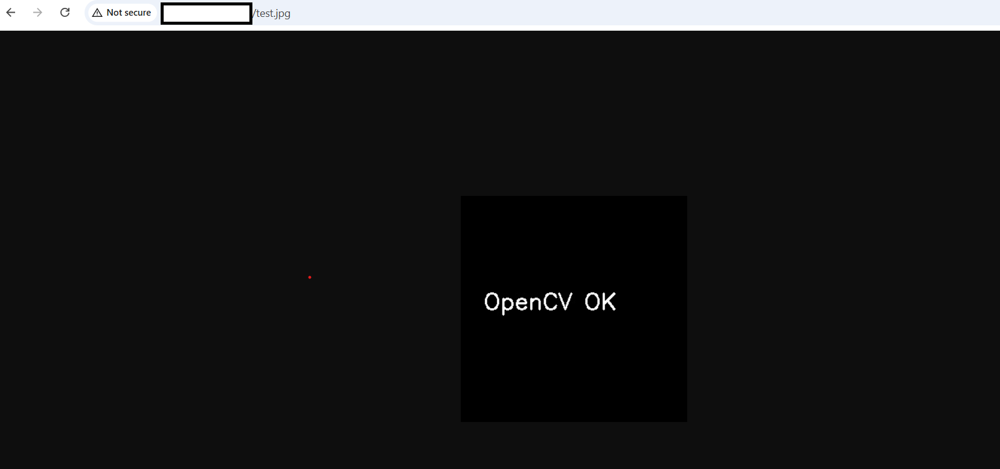
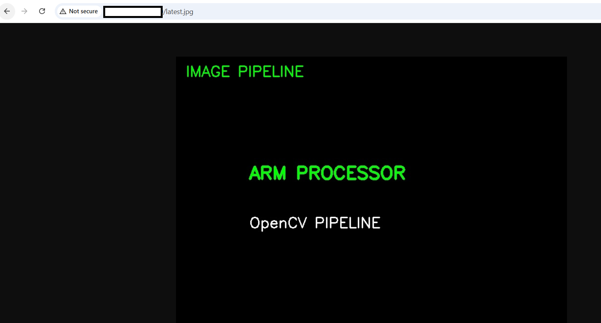
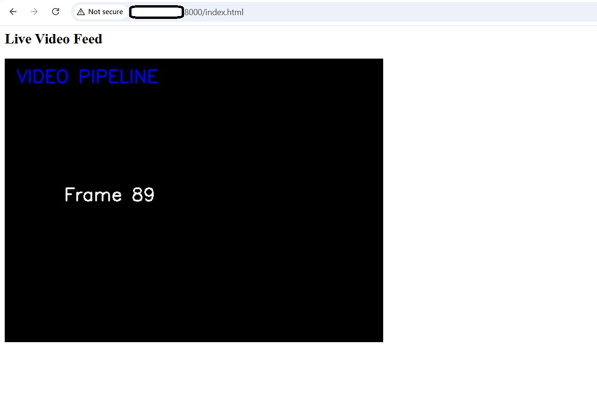

## Set up OpenCV on an Arm-based virtual machine

In this section, you'll learn how to set up OpenCV on an Arm-based VM and build image and video processing pipelines with browser visualization.

### Update your system

Refresh the package metadata to ensure you install the latest available versions:

```bash
sudo zypper refresh
```

### Install dependencies

Install Python 3.11 and the build tools that OpenCV's pip package requires to compile native extensions:

```bash
sudo zypper install -y \
python311 python311-pip python311-devel \
gcc gcc-c++ make cmake 
```

### Create the project directory

Create a dedicated workspace for your OpenCV project and navigate to it:

```bash
mkdir -p ~/opencv-project
cd ~/opencv-project
```

### Set up a Python virtual environment

Create an isolated Python environment to keep OpenCV and its dependencies separate from the system Python installation:

```bash
python3.11 -m venv cv-env
source cv-env/bin/activate
```

### Install Python packages

Install the following Python packages:

```bash
pip install --upgrade pip
pip install numpy opencv-python-headless flask
```

`opencv-python-headless` is the server-appropriate OpenCV build. It omits GUI window support, which is not available on a remote VM. `flask` is included for optional HTTP serving use cases.

### Start the browser server

Before verifying any output in the browser, start an HTTP server in the background. This server serves files from `~/opencv-project` on port 8000 and must remain running throughout this Learning Path.

```bash
python -m http.server 8000 &
```

The `&` runs the server as a background process so you can continue using the same terminal. To stop it later, run `kill %1` or `pkill -f "http.server"`.

### Verify OpenCV is working

Before building pipelines, verify that OpenCV is working correctly. This script creates an image using OpenCV and saves it for browser viewing.

```bash
python - <<EOF
import cv2
import numpy as np

# Create a blank image
img = np.zeros((300,300,3), dtype=np.uint8)

# Add text using OpenCV
cv2.putText(img, "OpenCV OK", (30,150),
            cv2.FONT_HERSHEY_SIMPLEX, 1,
            (255,255,255), 2)

# Save output
cv2.imwrite("test.jpg", img)

print("Test image created")
EOF
```

Open the following URL in your browser, replacing `<VM-IP>` with your VM's external IP address:

```text
http://<VM-IP>:8000/test.jpg
```

You should see an image with the following text:

```text
OpenCV OK
```



## Set up an image pipeline

The image pipeline reads an input image, applies transformations using OpenCV, and saves the result so the HTTP server can serve it to your browser.

### Create image pipeline

First, create the image pipeline.

Create the pipeline script by saving the following in `image_pipeline.py`:

```python
import cv2

img = cv2.imread("input.jpg")

if img is None:
    print("Image not found")
    exit()

img = cv2.resize(img, (800,600))

cv2.putText(img, "IMAGE PIPELINE", (20,40),
            cv2.FONT_HERSHEY_SIMPLEX, 1, (0,255,0), 2)

cv2.imwrite("latest.jpg", img)
```

The script loads an image using OpenCV and applies basic processing such as resize and text overlay. It then saves output as `latest.jpg`. The output file is used for browser visualization.

### Generate a sample input image

Instead of downloading an external image, generate an image locally. Doing so ensures the pipeline works in all environments without an internet dependency.

```bash
python - <<EOF
import cv2
import numpy as np

# Create blank image
img = np.zeros((600,800,3), dtype=np.uint8)

# Add ARM-themed labels
cv2.putText(img, "ARM PROCESSOR", (150,250),
            cv2.FONT_HERSHEY_SIMPLEX, 1.2, (0,255,0), 3)

cv2.putText(img, "OpenCV PIPELINE", (150,350),
            cv2.FONT_HERSHEY_SIMPLEX, 1, (255,255,255), 2)

# Save image
cv2.imwrite("input.jpg", img)

print("Generated input.jpg")
EOF
```

The output is similar to:

```output
Generated input.jpg
```

### Run the image pipeline

Run the pipeline against the generated input image:

```bash
python image_pipeline.py
```

Open the processed image in your browser, replacing `<VM-IP>` with your VM's external IP address:

```text
http://<VM-IP>:8000/latest.jpg
```

You should see the resized image with the `IMAGE PIPELINE` label overlaid in green.



## Set up a video pipeline

The video pipeline reads frames from a video file in a loop, overlays a text label on each frame, and writes the current frame to `latest.jpg`. The HTTP server always serves the latest file on disk. This is why refreshing `latest.jpg` in your browser shows the current frame, providing a live video effect without requiring a streaming protocol.

### Create a video file

First, create a synthetic video file so you don't depend on an external video source.

```bash
cat > create_video.py <<'EOF'
import cv2
import numpy as np

out = cv2.VideoWriter("video.mp4",
                      cv2.VideoWriter_fourcc(*'mp4v'),
                      20,
                      (640,480))

for i in range(200):
    frame = np.zeros((480,640,3), dtype=np.uint8)
    cv2.putText(frame, f"Frame {i}", (100,240),
                cv2.FONT_HERSHEY_SIMPLEX, 1, (255,255,255), 2)
    out.write(frame)

out.release()
EOF
```

This creates a 200-frame MP4 at 20 fps (10 seconds total). Each frame is a black 640×480 image with the frame number written in white.

Run the script to generate `video.mp4`:

```bash
python create_video.py
```

When the script completes, verify the file was created:

```bash
ls -lh video.mp4
```

The output is similar to:

```output
-rw-r--r-- 1 user user 1.2M May 11 10:00 video.mp4
```

### Create the video pipeline

The pipeline reads frames from `video.mp4` in a continuous loop. When the video ends, `cap.set(cv2.CAP_PROP_POS_FRAMES, 0)` resets playback to the first frame so it loops indefinitely. Each frame is written to `latest.jpg` and the loop sleeps for 50 ms, giving an effective frame rate of 20 fps in the browser.

```bash
cat > video_pipeline.py <<'EOF'
import cv2
import time

cap = cv2.VideoCapture("video.mp4")

while True:
    ret, frame = cap.read()

    if not ret:
        cap.set(cv2.CAP_PROP_POS_FRAMES, 0)
        continue

    cv2.putText(frame, "VIDEO PIPELINE", (20,40),
                cv2.FONT_HERSHEY_SIMPLEX, 1, (255,0,0), 2)

    cv2.imwrite("latest.jpg", frame)

    time.sleep(0.05)
EOF
```

### Run the video pipeline

The pipeline runs as a foreground process and loops continuously. Press `Ctrl+C` to stop it.

```bash
python video_pipeline.py
```

### View the live video feed in your browser

The `index.html` viewer uses a JavaScript `setInterval` to reload `latest.jpg` every 200 ms with a cache-busting query string. This gives a live video effect without requiring a streaming protocol, as the browser keeps fetching the latest frame written to disk by the pipeline.

Create the viewer:

```bash
cat > index.html <<'EOF'
<html>
<head>
<title>Video Pipeline</title>
</head>
<body>

<h2>Live Video Feed</h2>


<script>
setInterval(function(){
    document.getElementById("img").src =
        "latest.jpg?t=" + new Date().getTime();
}, 200);
</script>

</body>
</html>
EOF
```

Open the viewer in your browser, replacing `<VM-IP>` with your VM's external IP address:

```text
http://<VM-IP>:8000/index.html
```

With the video pipeline running in the terminal, you should see frames update automatically in the browser with the `VIDEO PIPELINE` label overlaid in blue.



## What you've learned and what's next

You've now installed OpenCV on a Google Axion Arm VM. You've built an image pipeline that applies transformations and saves output for browser viewing. You've also created a video pipeline that loops frames and serves them as a live feed via a lightweight HTTP server.

Next, you'll extend this setup by integrating a machine learning model with the OpenCV pipeline.
