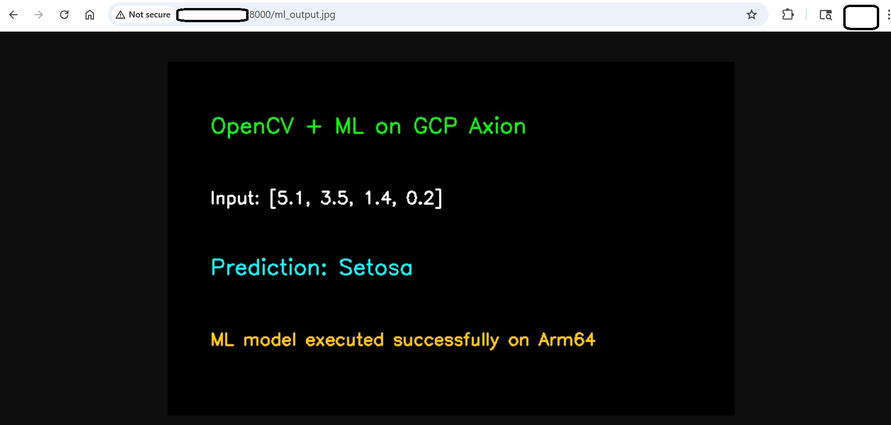

 
## Integrate a machine learning model with an OpenCV pipeline

In this section, you'll integrate a machine learning model with an OpenCV pipeline. You'll train a simple ML model, load it inside an OpenCV-based Python script, generate a visual prediction output, and view the result in your browser.
 
### Before you begin

Make sure you have:

- A running Google Axion Arm-based VM with SUSE Linux
- Python 3.11 installed
- The OpenCV project directory at `~/opencv-project` with the `cv-env` virtual environment created and OpenCV installed
- Port `8000` open in the GCP firewall
 
Navigate to the project directory and activate the virtual environment:
 
```bash
cd ~/opencv-project
source cv-env/bin/activate
```
 
Verify Python is version 3.11:

```bash
python --version
```

The output is similar to:

```output
Python 3.11.10
```

Verify OpenCV is installed:

```bash
python - <<'PYEOF'
import cv2
print("OpenCV version:", cv2.__version__)
PYEOF
```

The output is similar to:

```output
OpenCV version: 4.13.0
```
 
### Install machine learning dependencies

`scikit-learn` provides the machine learning algorithms and datasets used in this section. `joblib` handles serialization, saving the trained model to disk so it can be loaded later without retraining:
 
```bash
pip install scikit-learn joblib
```
Verify the installation:

```bash
python - <<'PYEOF'
import sklearn
import joblib
print("scikit-learn version:", sklearn.__version__)
print("joblib imported successfully")
PYEOF
```

The output is similar to:

```output
scikit-learn version: 1.8.0
joblib imported successfully
```

### Train an ML model

The training script uses the Iris dataset — a standard benchmark dataset with 150 samples across three flower species — and trains a random forest classifier. The trained model and label names are saved to disk with `joblib` so the OpenCV pipeline can load them without retraining.

```bash
cat > train_ml_model.py <<'EOF'
from sklearn.datasets import load_iris
from sklearn.ensemble import RandomForestClassifier
from sklearn.metrics import accuracy_score
from sklearn.model_selection import train_test_split
import joblib
 
iris = load_iris()
X = iris.data
y = iris.target
 
X_train, X_test, y_train, y_test = train_test_split(
    X,
    y,
    test_size=0.2,
    random_state=42
)
 
model = RandomForestClassifier(
    n_estimators=100,
    random_state=42
)
 
model.fit(X_train, y_train)
 
predictions = model.predict(X_test)
accuracy = accuracy_score(y_test, predictions)
 
joblib.dump(model, "iris_model.joblib")
joblib.dump(iris.target_names, "iris_labels.joblib")
 
print("ML model trained successfully")
print("Model file: iris_model.joblib")
print("Label file: iris_labels.joblib")
print(f"Accuracy: {accuracy:.2f}")
EOF
```
 
Run the training script:

```bash
python train_ml_model.py
```
 
The output is similar to:
 
```output
ML model trained successfully
Model file: iris_model.joblib
Label file: iris_labels.joblib
Accuracy: 1.00
```
 
Verify that both model files were created:
 
```bash
ls -lh iris_model.joblib iris_labels.joblib
```
### Create the OpenCV and ML pipeline

The pipeline loads the trained model and label names, and runs a prediction on a fixed sample input. It then uses OpenCV to render the input features and prediction result as text on an output image. The image is saved as `ml_output.jpg` for the HTTP server to serve.

```bash
cat > opencv_ml_pipeline.py <<'EOF'
import cv2
import numpy as np
import joblib
 
model = joblib.load("iris_model.joblib")
labels = joblib.load("iris_labels.joblib")
 
# Sample input format:
# [sepal length, sepal width, petal length, petal width]
sample = np.array([[5.1, 3.5, 1.4, 0.2]])
 
prediction = model.predict(sample)[0]
predicted_label = labels[prediction]
 
img = np.zeros((500, 900, 3), dtype=np.uint8)
 
cv2.putText(
    img,
    "OpenCV + ML Pipeline on GCP Axion",
    (50, 80),
    cv2.FONT_HERSHEY_SIMPLEX,
    1,
    (0, 255, 0),
    2
)
 
cv2.putText(
    img,
    "Platform: Arm64",
    (50, 150),
    cv2.FONT_HERSHEY_SIMPLEX,
    0.8,
    (255, 255, 255),
    2
)
 
cv2.putText(
    img,
    f"Input Features: {sample.tolist()[0]}",
    (50, 230),
    cv2.FONT_HERSHEY_SIMPLEX,
    0.75,
    (255, 255, 255),
    2
)
 
cv2.putText(
    img,
    f"Prediction: {predicted_label}",
    (50, 320),
    cv2.FONT_HERSHEY_SIMPLEX,
    1,
    (255, 255, 0),
    2
)
 
cv2.putText(
    img,
    "ML model executed successfully with OpenCV visualization",
    (50, 410),
    cv2.FONT_HERSHEY_SIMPLEX,
    0.7,
    (0, 200, 255),
    2
)
 
cv2.imwrite("ml_output.jpg", img)
 
print("OpenCV + ML pipeline completed")
print("Prediction:", predicted_label)
print("Output image saved as ml_output.jpg")
EOF
```
 
Run the pipeline:

```bash
python opencv_ml_pipeline.py
```
 
The output is similar to:
 
```output
OpenCV + ML pipeline completed
Prediction: setosa
Output image saved as ml_output.jpg
```
 
Verify the output image was created:

```bash
ls -lh ml_output.jpg
```

### View the pipeline output in your browser

If the HTTP server from the previous section is no longer running, restart it:

```bash
cd ~/opencv-project
source cv-env/bin/activate
python -m http.server 8000 &
```

Open the following URL in your browser, replacing `<VM-PUBLIC-IP>` with the external IP address of your Google Axion VM:

```text
http://<VM-PUBLIC-IP>:8000/ml_output.jpg
```

You should see an image showing the pipeline title, the Arm64 platform label, the input feature values, and the predicted Iris species.



 
### Troubleshoot integration issues

#### ModuleNotFoundError: No module named 'sklearn'

Make sure the virtual environment is activated and reinstall the dependency:

```bash
cd ~/opencv-project
source cv-env/bin/activate
pip install scikit-learn joblib
```

#### iris_model.joblib not found

Run the training script before running the ML pipeline:

```bash
python train_ml_model.py
```

#### Browser cannot access the output image

Check that the HTTP server is running:

```bash
python -m http.server 8000 &
```

Also make sure port `8000` is allowed in the Google Cloud Platform firewall.

#### Output image does not update

Run the pipeline again after changing the sample input, then refresh the browser:

```bash
python opencv_ml_pipeline.py
```
 
#### Clean up generated files
 
Use this only if you want to remove generated ML and output files.
 
```bash
rm -f iris_model.joblib iris_labels.joblib ml_output.jpg
```
 
## What you've accomplished

You've trained a random forest classifier on the Iris dataset, saved it with `joblib`, and loaded it inside an OpenCV pipeline to generate a browser-viewable prediction image on a Google Axion Arm64 VM. This pattern — train offline, load at inference time, render output with OpenCV — mirrors production vision pipelines, where models are updated independently of the display layer.
