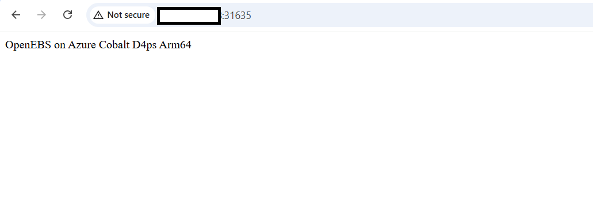

## Configure external traffic for the OpenEBS application

To allow external traffic to the Kubernetes application, open the Kubernetes NodePort in the Network Security Group (NSG) of your virtual machine (VM).

{}For more information about Azure setup, see the [Getting started with Microsoft Azure Platform Learning Path](/learning-paths/servers-and-cloud-computing/csp/azure/).{}

### Identify the Kubernetes NodePort

In the previous section, you exposed the NGINX deployment as a NodePort service. Run the following command on your VM to find the port that Kubernetes assigned.

```bash
kubectl get svc
```

The output is similar to:

```output
NAME            TYPE        CLUSTER-IP      EXTERNAL-IP   PORT(S)
nginx-openebs   NodePort    10.x.x.x        <none>        80:31635/TCP
```

In this example, the NodePort is `31635`. Kubernetes assigns this port dynamically, so your value may differ. Use the port shown in your own output in the firewall rule.

### Add an inbound firewall rule in Azure

To expose the Kubernetes NodePort externally, create a firewall rule:

1. Navigate to the [Azure portal](https://portal.azure.com), go to **Virtual Machines**, and select your virtual machine.


2. In the left menu, select **Networking**, then select **Network settings**.


3. Navigate to **Create port rule**, and select **Inbound port rule**.


4. Configure the inbound security rule with the following settings:

    - **Source:** My IP address  
    - **Source IP addresses:** *(auto-populated with your current public IP)*  
    - **Source port ranges:** `*`
    - **Destination:** Any  
    - **Destination port ranges:** **31635** *(replace with your actual NodePort)*  
    - **Protocol:** TCP  
    - **Action:** Allow  
    - **Name:** `allow-openebs-port`

{}Setting **Source** to `My IP address` restricts access to the Kubernetes application to your current machine only. The **Source port ranges** setting remains set to `*` because this refers to the client's ephemeral outbound port, which is dynamically assigned. If your IP address changes or you need to access the application from another machine, update the source IP in this rule.{}

5. After providing the details, select **Add** to save the rule.

## Access the application

Open the following URL in your browser. Replace `<VM_PUBLIC_IP>` with the public IP address of your Azure virtual machine, and replace `31635` with your actual NodePort if it differs.

```text
http://<VM_PUBLIC_IP>:31635
```

You should see the content written to the persistent volume in the previous section:

```output
OpenEBS on Azure Cobalt D4ps Arm64
```



## (Optional) Clean up resources

Delete the deployment:

```bash
kubectl delete -f nginx-openebs.yaml
```

Delete the PVC:

```bash
kubectl delete -f pvc.yaml
```

## What you've accomplished

You've configured the Azure Network Security Group to allow external access to the Kubernetes application running with OpenEBS LocalPV persistent storage, and confirmed that the application is reachable from your browser.

The persistent data written earlier survived pod recreation. The data is now served by a stateful NGINX workload backed by OpenEBS on an Arm64 virtual machine powered by Azure Cobalt 100.

You can use this workflow to add persistent storage to your own Kubernetes applications with OpenEBS on Arm. 
