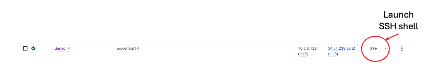

## Overview

In this section, you provision a Google Axion C4A VM on Google Cloud Platform (GCP) using the `c4a-standard-4` machine type, which provides 4 vCPUs and 16 GB of memory.

{}
For general guidance on setting up a Google Cloud account and project, see the Learning Path [Getting started with Google Cloud Platform](https://learn.arm.com/learning-paths/servers-and-cloud-computing/csp/google).
{}

## Provision a Google Axion C4A VM in the Google Cloud Console

Open the [Google Cloud Console](https://console.cloud.google.com/) and go to **Compute Engine** > **VM instances**, then select **Create instance**. Give the instance a name, and choose your preferred **Region** and **Zone**.

Under **Machine configuration**, set the series and machine type:

- Set **Series** to **C4A**
- Set **Machine type** to **c4a-standard-4**

Under **OS and storage**, select **Change** and choose an Arm64-based image. For this Learning Path, select **SUSE Linux Enterprise Server** with the **Pay as you go** license type, then select **Select** to apply.

Under **Networking**, enable **Allow HTTP traffic** and **Allow HTTPS traffic**, then select **Create** to launch the VM.

After the instance starts, select **SSH** next to the VM in the instance list to open a browser-based terminal session. 

Alternatively, if you have the [gcloud CLI](/install-guides/gcloud/) installed, you can connect from a local terminal using `gcloud`. From the **SSH** drop down, select `View gcloud command` and run that command from your terminal. 

A new browser window opens with a terminal connected to your VM.

## What you've learned and what's next

In this section, you created a Google Cloud C4A virtual machine and opened an SSH session to the VM. Next, you'll install OpenJDK and run the PAC/BTI validation script.
