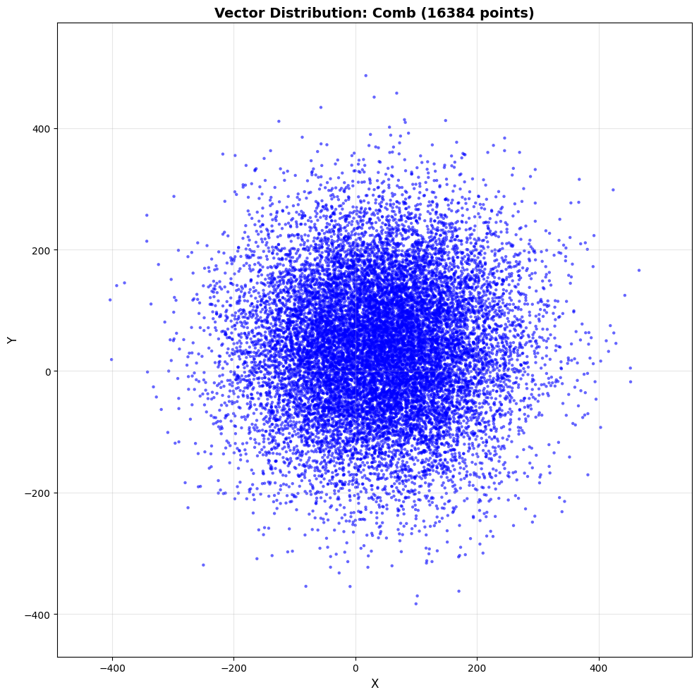

## Understand the workflow and run the baseline

The example workload demonstrates a data-processing pattern. The workflow processes synthetic 2D point data in three steps:

1. Generate two random distributions and add them.
2. Count how many points lie inside a rectangular window.
3. Compute the shortest distance from the origin.

Although this is a toy example, these three steps represent a common pattern in analytics pipelines: generate data, filter data, and reduce data to a metric. You'll find this pattern in real workloads such as geospatial event filtering or scientific simulation.

Open `src/main.cpp` to see this flow:

```cpp
    // STEP 1. Generate a distribution of 2D Points that is the sum of a Gaussian and Uniform distribution

    const Vec1D distribution  = generateDistribution(NUM_POINTS, BASIC_RNG::GAUSSIAN, BASIC_RNG::UNIFORM, meanAndStdDeviationParams, minAndMaxParams);

    // STEP 2. Calculate the number of points that fit within a 2D window

    Rectangle window(10.0,10.0,50.0,50.0);
    int numberOfPoints = window.countPointsInRectangle(distribution);
    std::cout << "Number of Data Points = " << NUM_POINTS 
              << " | Number of Points within Window ( [" 
              << window.bottomLeft[0]  << ", " << window.bottomLeft[1] << "] , ["
              << window.topRight[0]  << ", " << window.topRight[1]
              << "] ) = " << numberOfPoints << std::endl;
    
    
    // STEP 3. Calculate the magnitude of the smallest point within the distribution

    float shortestDistance = min_length(distribution.getData());
    std::cout << "Shortest Distance from Origin = " << shortestDistance << std::endl;
```

Build and run the baseline executable:

```bash
cmake -S . -B build
cmake --build build --target main
./build/src/main
```

The output is similar to: 

```output
Number of Data Points = 16384 | Number of Points within Window ( [10, 10] , [50, 50] ) = 586
Shortest Distance from Origin = 1.88536
```
The example generates 16,384 points on an x and y axis. The distribution is the sum of a Gaussian distribution with a mean and standard deviation of 30 and 50 respectively, and a uniform distribution with a min and max of 10 and 100. For each point, the workload checks whether it lies within a window with bottom-left and top-right coordinates of [10,10] and [50,50] respectively, then finds the point closest to the origin.

To confirm the data distribution is being generated correctly, export the data and render it with a Python script:

```bash
cmake -S . -B build -DBUILD_TESTS=1
cmake --build build --target generate_visualization_baseline
./build/tests/generate_visualization_baseline
```

This writes `vector_data.csv`. Next, create a Python environment and render the plot:

```bash
python3 -m venv venv
source venv/bin/activate
pip3 install -r scripts/requirements.txt
python3 scripts/visualize_vectors.py
```

The script generates an image similar to this:



## What you've accomplished and what's next

In this section, you:
- Reviewed the three-step data-processing workflow: generate, filter, and reduce
- Built and ran the baseline executable to confirm expected output
- Visualized the generated point distribution to verify the data is correct

Next, you'll use Arm Performix Code Hotspots to profile the baseline and identify where CPU cycles are spent.