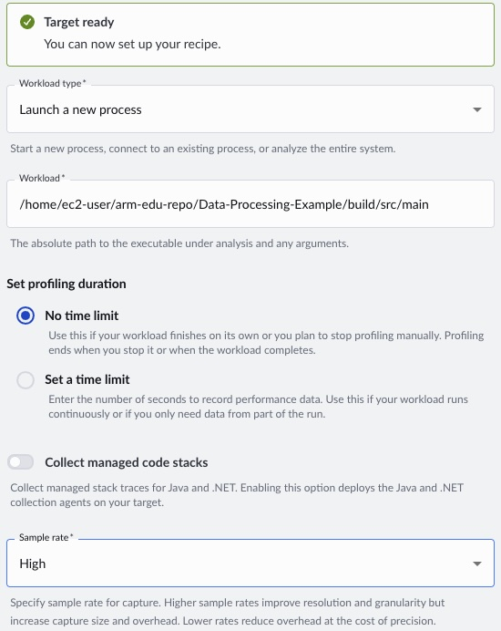

## Profile the baseline with Code Hotspots

Manually timing specific sections of code can help identify bottlenecks, but it requires adding instrumentation and risks overlooking other hotspots that were not explicitly measured. For example, you might wrap `generateDistribution` in `src/main.cpp` in a timer and conclude it's the bottleneck. However, if you don't also measure `min_length`, you might never notice that it is also consuming a significant share of CPU cycles.

Arm Performix Code Hotspots takes a different approach. It profiles the entire program using hardware performance counters and shows you where CPU cycles are actually spent, without any code changes. You get a ranked view of the hottest functions across your whole application. This helps you prioritize optimization work based on evidence instead of guesswork. 

To learn more about flame graphs and sample-based profiling, see the [Find code hotspots with Arm Performix](/learning-paths/servers-and-cloud-computing/cpu_hotspot_performix/) Learning Path.

To start, run the Code Hotspots recipe on the baseline executable: 

1. In the Arm Performix GUI, click **Recipes**. A **Code Hotspots** page opens.

2. For **Workload type**, select **Launch a new process**. 
3. For **Workload**, specify the path to the baseline executable as `/home/ec2-user/Data-Processing-Example/build/src/main`.
4. For **Set profiling duration**, select **No time limit** so the capture runs for the full workload.
5. For **Sample rate**, select **High** for better resolution.
6. To begin profiling, click **Run Recipe**.

<!--  -->
<!-- Configure the recipe with the path to the baseline executable, set the profiling duration to **No time limit** so the capture runs for the full workload, and set the sample rate to **High** for better resolution. Select **Run Recipe** to begin profiling. -->

When the run completes, Performix displays the flame graph:

<!--  -->

The flame graph shows CPU time distribution across the call stack, where wider blocks indicate higher cumulative execution time. The dominant feature is the wide base associated with `generateDistribution(...)`, indicating it is the primary hotspot and consumes the largest share of execution time.

Focusing on that region, most of the work comes from standard library random generation routines, particularly paths involving `std::normal_distribution<float>`. Those stacks are visibly wider than those involving `std::uniform_real_distribution<float>`, indicating that Gaussian (normal) sampling is significantly more expensive in terms of CPU cycles than uniform sampling. The imbalance wouldn't have been clear from higher-level instrumentation, because both operations conceptually generate random numbers but differ in computational cost.

By contrast, functions related to computing properties such as counting points within a rectangle or identifying a minimum point (for example, `min_length`-type operations) occupy relatively narrow regions of the graph. These functions contribute only a small fraction of total runtime and represent no meaningful bottleneck.

## What you've accomplished and what's next

In this section, you:
- Ran the Code Hotspots recipe in Arm Performix against the baseline executable
- Interpreted the flame graph to identify `generateDistribution` as the primary hotspot
- Determined that `std::normal_distribution` is significantly more expensive than `std::uniform_real_distribution`, making Gaussian sampling the optimization target
- Confirmed that other functions such as `min_length` contribute negligible runtime

Next, you'll accelerate random generation by enabling OpenRNG through Arm Performance Libraries.
