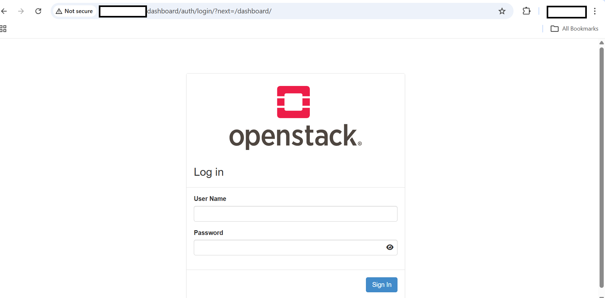

## Deploy OpenStack on Arm using DevStack (Azure Cobalt 100)

{}Use the VM you created in the previous step: a single-NIC D4ps_v6 instance with at least 80 GB of disk. You do not need an extra NIC or data disk for DevStack.{}

{}DevStack and Kolla-Ansible must not run on the same VM at the same time. Use separate VMs for each approach. If you run both on the same host, port conflicts will cause deployment failures.{}

This guide walks you through deploying OpenStack using DevStack on an Arm-based Azure virtual machine running Azure Cobalt 100. DevStack is a script-based installer designed for development and testing. It runs all OpenStack services directly on the host OS and deploys Nova, Keystone, Glance, and Horizon on a single node.

After completing this guide, your environment will:

* Run OpenStack services on your Azure Cobalt 100 VM
* Provide access to the Horizon dashboard
* Support Arm64 (`aarch64`) architecture
* Be accessible via browser and CLI


## Clean previous setup

Before starting, remove any previous DevStack or etcd installation.

```console
sudo rm -rf ~/devstack
sudo rm -rf /opt/stack
sudo rm -rf /var/lib/etcd
sudo rm -f /etc/systemd/system/etcd.service
```

This ensures:

* No leftover configuration conflicts
* Clean environment for deployment
* Avoids service startup failures

## System preparation

Update packages and install required tools.

```console
sudo apt update && sudo apt upgrade -y

sudo apt install -y \
git curl vim net-tools python3-pip
```

These tools are required for:

* Cloning DevStack repository (`git`)
* Downloading dependencies (`curl`)
* Editing configuration (`vim`)
* Network debugging (`net-tools`)

## Configure hostname

Setting a hostname avoids registration issues where OpenStack services identify themselves by hostname. Run:

```console
sudo hostnamectl set-hostname devstack-arm
exec bash
```

## Install etcd (Arm fix)

DevStack uses etcd internally for service coordination. The etcd package included in Ubuntu 24.04 is not built for Arm and is unstable in this environment. Install a known-stable Arm64 binary directly from the etcd GitHub releases instead.

```console
cd /tmp
wget https://github.com/etcd-io/etcd/releases/download/v3.5.13/etcd-v3.5.13-linux-arm64.tar.gz
tar -xvf etcd-v3.5.13-linux-arm64.tar.gz
cd etcd-v3.5.13-linux-arm64
sudo cp etcd etcdctl /usr/local/bin/
```

## Configure etcd service

```console
sudo vi /etc/systemd/system/etcd.service
```

```ini
[Unit]
Description=etcd
After=network.target

[Service]
User=azureuser
ExecStart=/usr/local/bin/etcd \
  --data-dir=/var/lib/etcd
Restart=always

[Install]
WantedBy=multi-user.target
```

This configuration ensures:

* etcd starts automatically on boot
* Data is stored persistently
* Service is managed via systemd

## Start etcd

```console
sudo mkdir -p /var/lib/etcd
sudo chown -R $USER:$USER /var/lib/etcd

sudo systemctl daemon-reload
sudo systemctl enable etcd
sudo systemctl start etcd
```
Verify:

```console
sudo systemctl status etcd
```

The output is similar to:

```output
Active: active (running)
```

This confirms etcd is running correctly.


## Install DevStack

```console
cd ~
git clone https://opendev.org/openstack/devstack
cd devstack
```

This clones the DevStack repository, which contains the scripts that install and configure all OpenStack services.

## Get private IP

DevStack binds OpenStack services to the VM's private IP. Run the following command to find it:

```console
hostname -I
```

If the output shows two addresses, use the first one. The second is typically an Azure secondary IP configuration.

## Configure DevStack

Create a `local.conf` file in the DevStack directory. This file controls which services are installed and how they are configured.

```console
vi local.conf
```

```ini
[[local|localrc]]
ADMIN_PASSWORD=admin
DATABASE_PASSWORD=admin
RABBIT_PASSWORD=admin
SERVICE_PASSWORD=admin

HOST_IP=<Private_IP>
SERVICE_HOST=<Private_IP>

enable_service horizon

disable_service neutron
disable_service q-agt
disable_service q-dhcp
disable_service q-l3
disable_service q-meta
disable_service q-svc
disable_service ovn-controller
disable_service ovs-vswitchd
disable_service ovsdb-server

disable_service etcd3

KEYSTONE_USE_MOD_WSGI=False
ENABLE_HTTPD_MOD_WSGI_SERVICES=False

LIBVIRT_TYPE=qemu

disable_service tempest

GIT_DEPTH=1
```

Replace `<Private_IP>` with the IP address from the previous step.

### Key configuration choices

* **Neutron disabled** — simplifies the deployment by removing advanced networking, which has compatibility issues on Arm Azure VMs
* **etcd3 disabled** — DevStack's built-in etcd setup does not work reliably on Arm; this delegates etcd to the version you installed manually
* **LIBVIRT_TYPE=qemu** — Azure Cobalt 100 VMs do not support nested KVM virtualization, so Nova uses QEMU software emulation instead
* **Horizon enabled** — enables the web dashboard
* **GIT_DEPTH=1** — performs shallow clones to reduce download size and avoid failures on slow or rate-limited connections

## Deploy OpenStack

```console
./stack.sh | tee stack.log
```

This script:

* Installs all OpenStack services
* Configures database and messaging
* Starts services

**Deployment time: ~15–25 minutes**

When the deployment completes successfully, the output is similar to:

```output
This is your host IP address: 10.3.0.5
This is your host IPv6 address: ::1
Horizon is now available at http://10.3.0.5/dashboard
Keystone is serving at http://10.3.0.5/identity/
The default users are: admin and demo
The password: admin

Services are running under systemd unit files.
For more information see: 
https://docs.openstack.org/devstack/latest/systemd.html

DevStack Version: 2026.2
Change: 03ece8f88040be9b0b14dd1cfe93076ad2419a80 Merge "[neutron] Configure ovn-bgp service-plugin" 2026-04-10 12:15:11 +0000
OS Version: Ubuntu 24.04 noble

2026-04-23 16:30:00.225 | stack.sh completed in 464 seconds.
```

## Access Horizon dashboard

Open in browser:

```text
http://<PUBLIC_IP>/dashboard
```

Example:

```text
http://4.186.31.18/dashboard
```



## Login credentials

```text
Username: admin
Password: admin
```

## Azure network fix (critical)

Ensure port 80 is open:

```text
Azure Portal → VM → Networking → Inbound Rules
```

| Port | Protocol | Action |
| ---- | -------- | ------ |
| 80   | TCP      | Allow  |


## Verify via CLI

Activate the admin credentials, then list the registered services and compute services:

```console
source openrc admin admin

openstack service list
openstack compute service list
```

The output is similar to:

```output
+----------------------------------+-------------+----------------+
| ID                               | Name        | Type           |
+----------------------------------+-------------+----------------+
| 0a0554a3a6bf45e8937fa389ab559be3 | glance      | image          |
| 448f4e62b7344cac969c9ec18af4048d | nova        | compute        |
| 5cf7336818784a4383c0a543303ab4d7 | keystone    | identity       |
| 6ebdc6a1d7814f138f59ac5719bb4394 | cinder      | block-storage  |
| b86d2058e0604db6bcc9b12f3d2b16b4 | nova_legacy | compute_legacy |
| fd998beaffe64e2191795082470d03c0 | placement   | placement      |
+----------------------------------+-------------+----------------+

+--------------------------------------+----------------+--------------+----------+---------+-------+----------------------------+
| ID                                   | Binary         | Host         | Zone     | Status  | State | Updated At                 |
+--------------------------------------+----------------+--------------+----------+---------+-------+----------------------------+
| 46946541-a6c1-4b8c-92e3-5d037bb2d577 | nova-scheduler | devstack-arm | internal | enabled | up    | 2026-04-14T08:14:42.000000 |
| e1aa2f20-3f39-4d12-9702-4b144a739f56 | nova-conductor | devstack-arm | internal | enabled | up    | 2026-04-14T08:14:46.000000 |
| caeab24b-a938-420b-9ae0-e335ed8acfea | nova-conductor | devstack-arm | internal | enabled | up    | 2026-04-14T08:15:56.000000 |
| b612363d-b7ad-4c9e-93b8-afd20fb9b863 | nova-compute   | devstack-arm | nova     | enabled | up    | 2026-04-14T08:15:05.000000 |
+--------------------------------------+----------------+--------------+----------+---------+-------+----------------------------+
```

All services should show status `enabled` and state `up`. If you see `import eventlet` lines before the table, these are Python deprecation warnings from older OpenStack libraries and can be ignored.


## What you've learned

You deployed OpenStack using DevStack on an Azure Cobalt 100 Arm64 VM, working through several Arm-specific issues along the way:

* Replaced the Ubuntu etcd package with a stable Arm64 binary
* Disabled Neutron to avoid networking compatibility issues on Arm
* Configured Nova to use QEMU instead of KVM, because nested virtualization is not available on Azure VMs

You verified the deployment using the CLI and accessed the Horizon dashboard via browser.

## Stop DevStack

Before moving on to the Kolla-Ansible deployment, stop all DevStack services to free up the ports and resources they hold:

```console
cd /home/azureuser/devstack && ./unstack.sh 2>&1 | tail -10
```

The Kolla-Ansible deployment runs on a separate VM, so this step is optional if you're done with DevStack. Run it if you want to reuse this VM later or clean up resources.

## Troubleshooting

### Horizon shows "Invalid service catalog: network"

If you see a `ServiceCatalogException: Invalid service catalog: network` error after logging in to Horizon, it means Horizon is trying to look up the Neutron network service in Keystone's service catalog. Because Neutron is disabled in this setup, the service doesn't exist.

To fix this, append a Horizon configuration override and restart Apache:

```bash
sudo tee -a /opt/stack/horizon/openstack_dashboard/local/local_settings.py << 'EOF'

OPENSTACK_NEUTRON_NETWORK = {
    'enable_router': False,
    'enable_quotas': False,
    'enable_distributed_router': False,
    'enable_ha_router': False,
    'enable_fip_topology_check': False,
}
EOF
sudo systemctl restart apache2
```

Reload the dashboard in your browser. The error should no longer appear.

