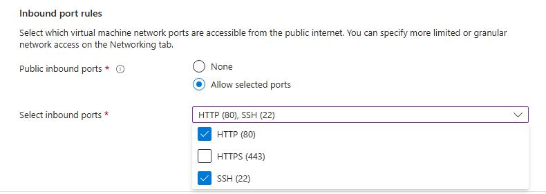
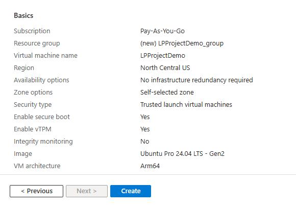

You can create an Arm-based Cobalt 100 virtual machine (VM) in the following ways, depending on your workflow and requirements:

- The Azure portal
- The Azure CLI
- An infrastructure as code (IaC) tool

In this section, you'll use the Azure Portal to create a virtual machine with the Arm-based Azure Cobalt 100 processor.

This Learning Path focuses on general-purpose virtual machines in the Dpsv6 series. For more information, see the [Microsoft Azure guide for the Dpsv6 size series](https://learn.microsoft.com/en-us/azure/virtual-machines/sizes/general-purpose/dpsv6-series).

The steps to create this instance are included here for convenience. For more detailed steps, see the [Deploy a Cobalt 100 virtual machine on Azure Learning Path](/learning-paths/servers-and-cloud-computing/cobalt/).

## Create an Arm-based Azure virtual machine on Azure portal

To create an Azure virtual machine:

1. Open the Azure portal and navigate to **Virtual Machines**.
2. Click **Create**, and click **Virtual Machine** from the drop-down list.
3. Inside the **Basic** tab, fill in the instance details such as **Virtual machine name** and **Region**.
4. Select the image for your virtual machine (for example, Ubuntu Pro 24.04 LTS) and select **Arm64** as the VM architecture.
5. In the **Size** field, select **See all sizes** and select the D-Series v6 family of virtual machines.
6. Select **D4ps_v6** from the list as shown in the following screenshot:

7. For **Authentication type**, select **SSH public key**.

{}
Azure generates an SSH key pair for you and lets you save it for future use. This method is fast, secure, and easy for connecting to your virtual machine.
{}

8. Fill in the **Administrator username** for your VM.
9. Select **Generate new key pair**, and select **RSA SSH Format** as the SSH Key Type.

{}
RSA offers better security with keys longer than 3072 bits.
{}

10. Give your SSH key a key pair name.
11. In the **Inbound port rules**, select **HTTP (80)** and **SSH (22)** as the inbound ports, as shown in the following screenshot:

12. Now select the **Review + Create** tab and review the configuration for your virtual machine. It should look like the following:

13. After reviewing your configuration, click the **Create** button and then the **Download Private key and Create Resource** button.

Your virtual machine should be ready and running in a few minutes. You can SSH into the virtual machine using the private key, along with the public IP details.

{}To learn more about Arm-based virtual machine in Azure, see “Getting Started with Microsoft Azure” in [Get started with Arm-based cloud instances](/learning-paths/servers-and-cloud-computing/csp/azure).{}

## What you've accomplished and what's next

In this section, you created an Azure Cobalt 100 Arm-based virtual machine using Ubuntu Pro 24.04 LTS on a D4ps_v6 instance. This VM is your DevStack deployment target — a single-network interface instance with at least 80 GB of disk.

In the next section, you'll deploy OpenStack on this VM using DevStack. After that, you'll create a second VM with additional networking and storage for the Kolla-Ansible deployment.
