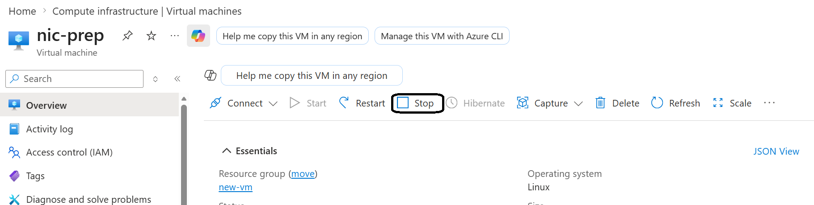
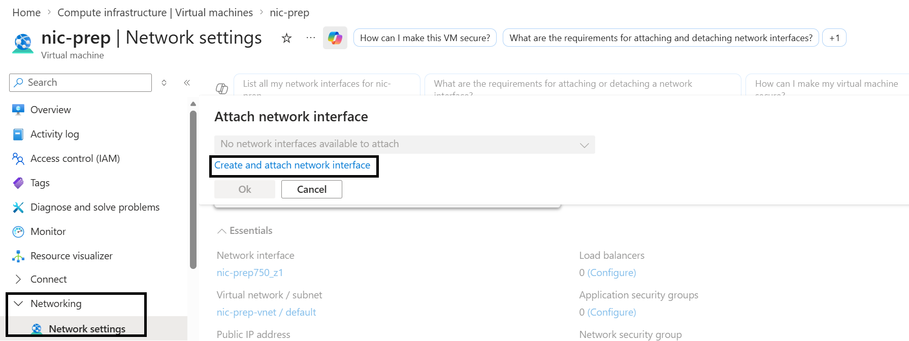
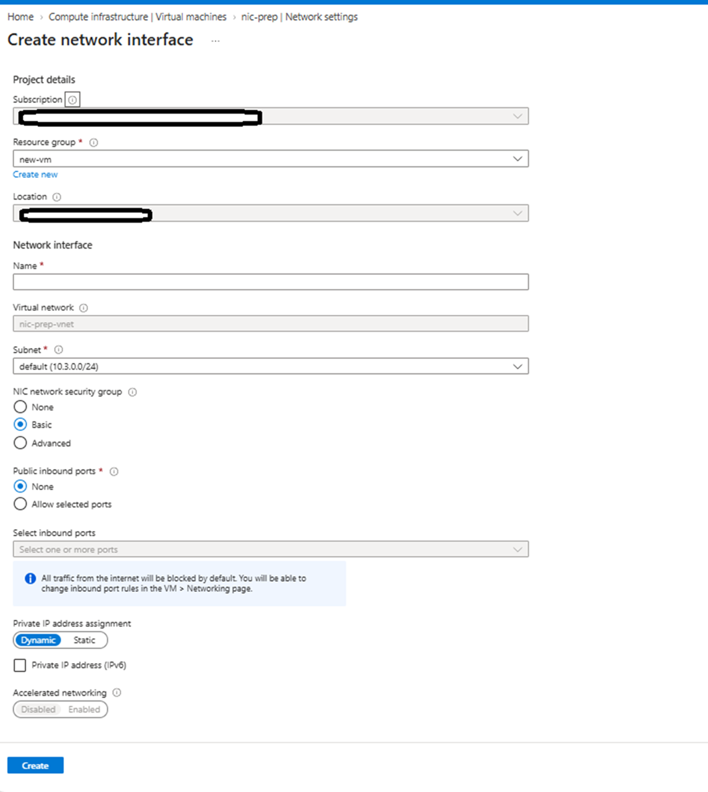
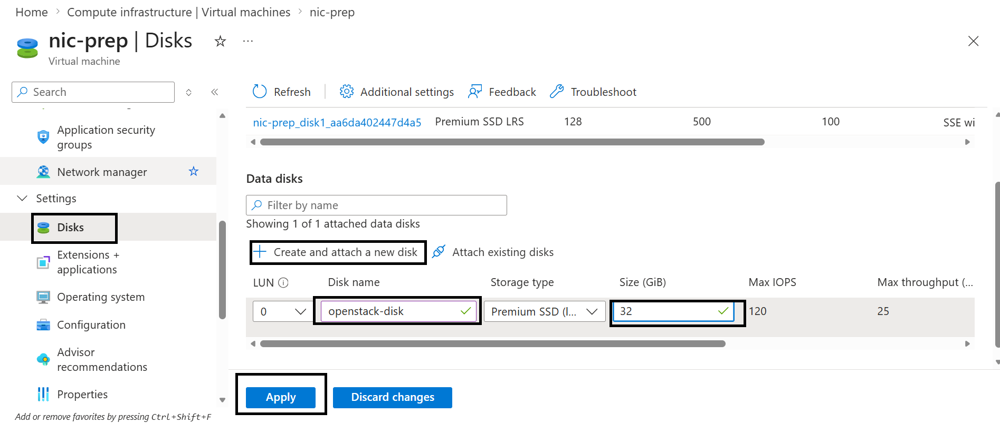

In the previous section, you completed the DevStack deployment on the first VM. The Kolla-Ansible deployment runs on a separate Azure VM with two network interfaces (NICs) and a dedicated data disk.

Create a new VM using the [same base process](/learning-paths/servers-and-cloud-computing/openstack-on-azure/instance/) as the first VM with the following specifications:

| Specification | VM for Kolla-Ansible |
|---------------|----------------------|
| vCPUs | 4 (8 recommended) |
| RAM | 16 GB recommended |
| OS disk | 100 GB |
| Data disk | 32 GB (for Cinder/Docker) |
| NICs | 2 (`eth0` management + `eth1` external) |
| OS | Ubuntu 24.04 |

After the new VM is running, follow these steps to add the required networking and storage.

## Add a second network interface in Azure

Kolla-Ansible requires two NICs: `eth0` and `eth1`. `eth0` is a management network that carries API traffic between OpenStack services. `eth1` is an external/provider network that carries traffic to and from virtual machine instances.

To add a second NIC to the VM, follow these steps:

### Stop the VM

Azure does not allow NIC attachment to a running VM. To add an NIC, you'll need to first stop the VM.

Navigate to **Virtual Machines**, select your VM, and click **Stop**.

### Create and attach a new network interface

After stopping the VM, to attach a new NIC, follow these steps:

1. In the Azure portal, navigate to **Networking** and then **Network settings**
2. Click **Attach network interface**
3. Select **Create new NIC**

4. Enter a **Name** for the NIC
5. For **Virtual Network**, keep the NIC in the same Virtual Network  
6. For **Subnet**, select the same subnet 
7. For **Public inbound ports**, select **None**
8. Click **Create**

## Restart the VM

To restart the VM, go back to the VM overview and then click **Start**.

## Create and attach a data disk in Azure

After restarting the VM, attach a data disk to it by following these steps:

1. In the Azure Portal, navigate to **Virtual Machines**
2. Click **Disks**  
3. Click **Create and attach a new disk**
4. For **Disk name**, enter `openstack-disk`  
5. For **Size**, enter **32 GB**, which is the recommended minimum
6. For **Storage type**, select **Standard SSD**  
7. Click **Apply**

### Why this disk is required

Kolla-Ansible uses a dedicated disk for Cinder and Docker volumes. Cinder provides block storage volumes to OpenStack instances. Docker volumes store container data for all OpenStack services.

Using a separate disk keeps OpenStack data off the OS disk and avoids filling it during deployment.

## What you've accomplished and what's next

In this section, you've configured a second Azure Arm64 VM for Kolla-Ansible. The VM has a second NIC (`eth1`) for OpenStack's provider network, and a dedicated 32 GB data disk for Cinder and Docker volumes.

In the next section, you'll install Kolla-Ansible and deploy OpenStack as containers on this VM.
