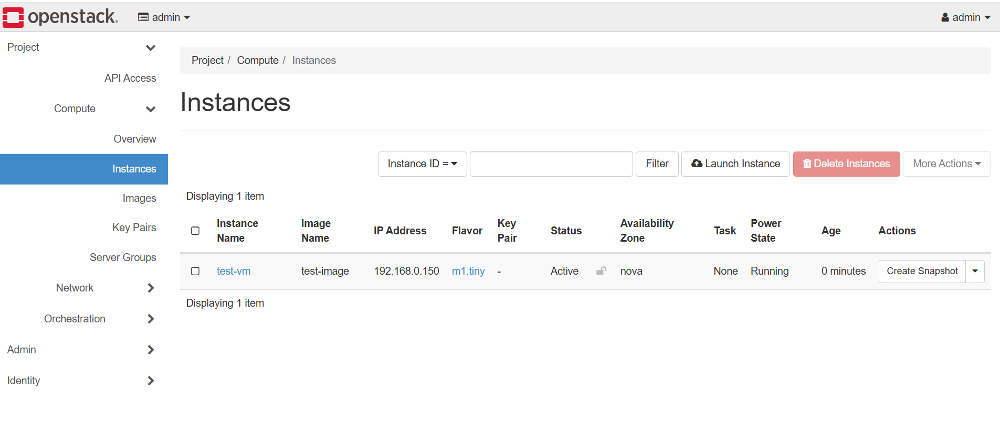

## Validate OpenStack deployment and launch a virtual machine

This section validates the Kolla-Ansible deployment by checking service health, uploading a test image, creating network resources, and launching a virtual machine instance.

If you closed your session since the Kolla-Ansible deployment, reactivate the virtual environment and reload the admin credentials:

```console
source ~/kolla-venv/bin/activate
source /etc/kolla/admin-openrc.sh
```

## Verify services

```console
openstack compute service list
openstack network agent list
```

**Expected result:**

All services should show:

- Status → enabled
- State → up

If any service is down, the deployment is incomplete or misconfigured.

## Bring up Open vSwitch bridges

Kolla-Ansible creates Open vSwitch (OVS) bridges for internal networking. On Arm Azure VMs, these bridges may not come up automatically after deployment, which causes instances to get stuck in `ERROR` state with no IP assignment.

Bring the bridges up manually:

```console
sudo ip link set br-int up
sudo ip link set br-ex up
sudo ip link set br-tun up
```

Verify OVS configuration. Kolla-Ansible runs OVS inside the `openvswitch_vswitchd` container, so use `docker exec` to query it:

```console
docker exec openvswitch_vswitchd ovs-vsctl show
```

The output is similar to:

```output
65e7f7e-0018-4c05-84d6-83db06b812ee
    Manager "ptcp:6640:127.0.0.1"
        is_connected: true
    Bridge br-ex
        Controller "tcp:127.0.0.1:6633"
            is_connected: true
        fail_mode: secure
        datapath_type: system
        Port eth1
            Interface eth1
        Port br-ex
            Interface br-ex
                type: internal
        Port phy-br-ex
            Interface phy-br-ex
                type: patch
                options: {peer=int-br-ex}
    Bridge br-int
        Controller "tcp:127.0.0.1:6633"
            is_connected: true
        fail_mode: secure
        datapath_type: system
        Port patch-tun
            Interface patch-tun
                type: patch
                options: {peer=patch-int}
        Port int-br-ex
            Interface int-br-ex
                type: patch
                options: {peer=phy-br-ex}
        Port br-int
            Interface br-int
                type: internal
    Bridge br-tun
        Controller "tcp:127.0.0.1:6633"
            is_connected: true
        fail_mode: secure
        datapath_type: system
        Port br-tun
            Interface br-tun
                type: internal
        Port patch-int
            Interface patch-int
                type: patch
                options: {peer=patch-tun}
```

All three bridges must show `is_connected: true`. If a bridge is missing or shows `is_connected: false`, re-run the `ip link set` commands above and check that the `neutron-openvswitch-agent` container is running with `docker ps | grep openvswitch`.

## Upload image

Download a Debian Arm64 cloud image:

```console
wget https://cloud.debian.org/images/cloud/bookworm/latest/debian-12-genericcloud-arm64.qcow2
```

Upload it to OpenStack:

```console
openstack image create "test-image" \
  --file debian-12-genericcloud-arm64.qcow2 \
  --disk-format qcow2 \
  --container-format bare \
  --public
```

## Verify image upload

```console
openstack image list
```

The output is similar to:

```output
+--------------------------------------+------------+--------+
| ID                                   | Name       | Status |
+--------------------------------------+------------+--------+
| 4537107d-4c52-4537-a3d2-bd5c5a13de5b | test-image | active |
+--------------------------------------+------------+--------+
```

The image must be in an active state before launching VMs.

## Create network

```console
openstack network create test-net

openstack subnet create test-subnet \
  --network test-net \
  --subnet-range 192.168.0.0/24
```

### Why this is required

OpenStack networking (Neutron) requires:

- Network → logical network
- Subnet → IP range for instances

## Verify network

```console
openstack network list
```

The output is similar to:

```output
+--------------------------------------+----------+--------------------------------------+
| ID                                   | Name     | Subnets                              |
+--------------------------------------+----------+--------------------------------------+
| 1d8b3cc8-a2d3-476c-86d7-4b9533dbefb2 | test-net | a31916fa-783b-4b25-8acb-8694007b9198 |
+--------------------------------------+----------+--------------------------------------+
```

## Verify subnet

```console
openstack subnet list
```

The output is similar to:

```output
+--------------------------------------+-------------+--------------------------------------+----------------+
| ID                                   | Name        | Network                              | Subnet         |
+--------------------------------------+-------------+--------------------------------------+----------------+
| a31916fa-783b-4b25-8acb-8694007b9198 | test-subnet | 1d8b3cc8-a2d3-476c-86d7-4b9533dbefb2 | 192.168.0.0/24 |
+--------------------------------------+-------------+--------------------------------------+----------------+
```

Both should show your created resources.

## Create flavor

A flavor defines the compute resources — vCPUs, RAM, and disk — allocated to a virtual machine instance. OpenStack does not create any default flavors during deployment, so you need to create at least one before you can launch a VM.

The `m1.tiny` flavor used here is a minimal definition suitable for testing: 1 vCPU, 512 MB RAM, and a 5 GB root disk. This is enough to boot a Debian cloud image and confirm the environment is working.

```console
openstack flavor create m1.tiny --ram 512 --disk 5 --vcpus 1
```

## Verify flavor

```console
openstack flavor list
```

The output is similar to:

```output
+--------------------------------------+---------+-----+------+-----------+-------+-----------+
| ID                                   | Name    | RAM | Disk | Ephemeral | VCPUs | Is Public |
+--------------------------------------+---------+-----+------+-----------+-------+-----------+
| 20ea160b-bff7-4c2a-be1e-588a44dc699a | m1.tiny | 512 |    5 |         0 |     1 | True      |
+--------------------------------------+---------+-----+------+-----------+-------+-----------+
```

## Launch VM

```console
openstack server create \
  --flavor m1.tiny \
  --image test-image \
  --network test-net \
  test-vm
```


## Verify VM status

```console
watch -n 2 openstack server list
```

The output is similar to:

```output
+--------------------------------------+---------+--------+------------------------+------------+---------+
| ID                                   | Name    | Status | Networks               | Image      | Flavor  |
+--------------------------------------+---------+--------+------------------------+------------+---------+
| 4f42729c-0635-40e2-9432-ac056e40f781 | test-vm | ACTIVE | test-net=192.168.0.150 | test-image | m1.tiny |
+--------------------------------------+---------+--------+------------------------+------------+---------+
```

If the VM stays in ERROR, check:

- OVS bridges
- compute service status
- image compatibility

## Access Horizon dashboard

Open browser:

```text
http://<VM_PUBLIC_IP>
```

Get password:

```console
cat /etc/kolla/passwords.yml | grep keystone_admin_password
```

Login:

* Username: admin
* Domain: Default

The following image shows a successfully launched instance in the OpenStack Horizon UI.




## What you've learned

You successfully validated your OpenStack deployment and confirmed that all services are operational.

You also:

- Created vSwitch networking specific to Arm + Azure
- Uploaded an Arm-compatible image
- Created network and compute resources
- Launched and verified a virtual machine

Your OpenStack environment is now fully functional and ready for use.
