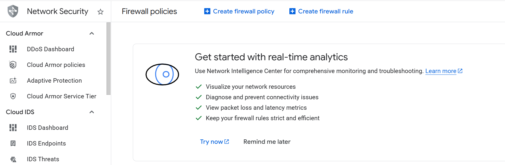
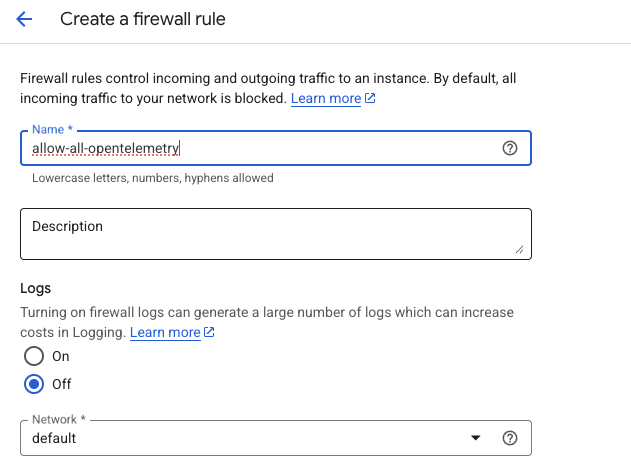
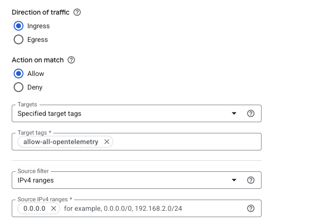
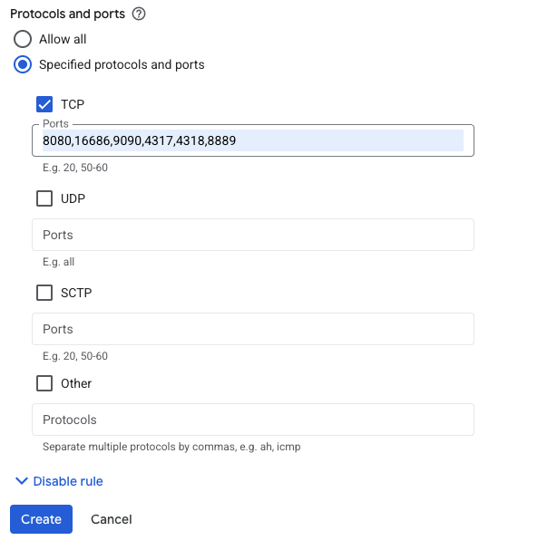

## Configure GCP firewall for OpenTelemetry

To allow inbound traffic for the Flask application and observability components, you must create firewall rules in the Google Cloud Console.

{} For more information about GCP setup, see [Getting started with Google Cloud Platform](/learning-paths/servers-and-cloud-computing/csp/google/).{}

## Required Ports

| Service | Port | Purpose |
|--------|------|---------|
| Flask Application | 8080 | Application traffic |
| Jaeger UI | 16686 | Trace visualization |
| Prometheus UI | 9090 | Metrics dashboard |
| OTLP gRPC | 4317 | Telemetry ingestion |
| OTLP HTTP | 4318 | Telemetry ingestion |
| Collector Metrics | 8889 | Prometheus scrape endpoint |

## Create a Firewall Rule in GCP

To expose the Flask application (port 8080), create a firewall rule.

Navigate to the [Google Cloud Console](https://console.cloud.google.com/), go to **VPC Network > Firewall**, and select **Create firewall rule**.

Next, create the firewall rule that exposes the TCP port 8080.
Set the **Name** of the new rule to "allow-tcp-8080". Select your network that you intend to bind to your VM (default is "autoscaling-net", but your organization might have others).

Set **Direction of traffic** to "Ingress". Set **Allow on match** to "Allow" and **Targets** to "Specified target tags".

Next, enter "allow-tcp-8080" in the **Target tags** text field. Set **Source IPv4 ranges** to "0.0.0.0/0".

Finally, select **Specified protocols and ports** under the **Protocols and ports** section. Select the **TCP** checkbox, enter "8080" in the **Ports" text field, and select **Create**.

{}
The above steps demonstrate how to open port **8080** for the Flask application.

You can repeat the same workflow to create firewall rules for the following OpenTelemetry services:

- **16686** → Jaeger UI  
- **9090** → Prometheus UI  
- **4317** → OTLP gRPC endpoint  
- **4318** → OTLP HTTP endpoint  
- **8889** → Collector metrics endpoint  

Change the rule name and port number accordingly (for example: `allow-tcp-16686`, `allow-tcp-9090`, etc.).
{}

You can now proceed to deploy and validate the OpenTelemetry stack.
