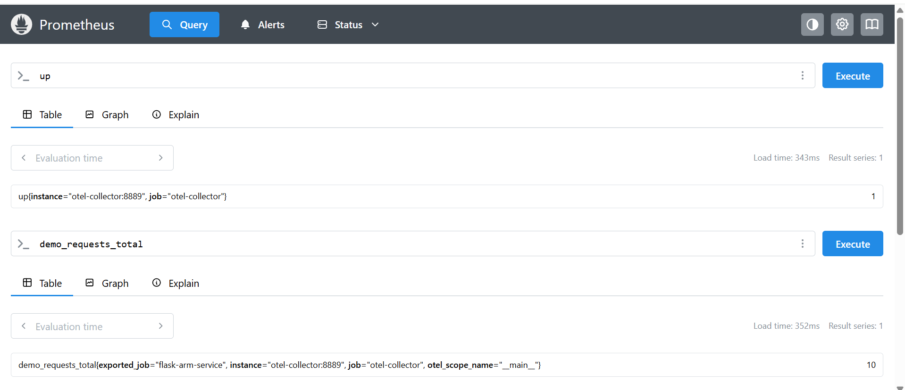
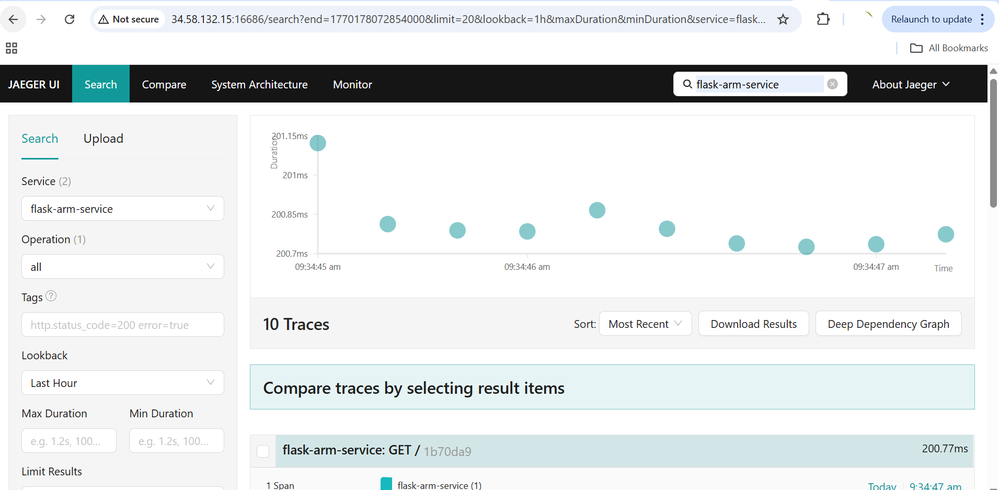

## Overview

In this section, you will deploy and connect the **OpenTelemetry Collector**, **Prometheus**, and **Jaeger** to collect, store, and visualize telemetry data generated by the Flask microservice running on Arm64 infrastructure.

By the end of this part, you will have a complete observability pipeline for metrics and distributed tracing.

## Architecture Overview

```text
Flask Microservice (Arm64)
        |
        | OpenTelemetry SDK
        v
OpenTelemetry Collector
   |            |
Metrics → Prometheus
Traces  → Jaeger
```

The Flask application sends telemetry to the OpenTelemetry Collector, which routes metrics to Prometheus and traces to Jaeger for monitoring and visualization.


## Network & Firewall Requirements

Ensure the following ports are open on your VM firewall:

| Service           | Port  | Purpose                    |
| ----------------- | ----- | -------------------------- |
| Prometheus        | 9090  | Metrics dashboard UI       |
| Jaeger UI         | 16686 | Distributed tracing UI     |
| Collector Metrics | 8889  | Prometheus scrape endpoint |
| OTLP gRPC         | 4317  | Telemetry ingestion (gRPC) |
| OTLP HTTP         | 4318  | Telemetry ingestion (HTTP) |

These ports enable telemetry ingestion and provide web interfaces for monitoring metrics and traces.

## Configure OpenTelemetry Collector

This configuration defines how telemetry data is received from the Flask application and exported to Prometheus and Jaeger.

```bash
nano otel-collector-config.yaml
```

### otel-collector-config.yaml

```yaml
receivers:
  otlp:
    protocols:
      grpc:
        endpoint: 0.0.0.0:4317
      http:
        endpoint: 0.0.0.0:4318

exporters:
  otlp:
    endpoint: jaeger:4317
    tls:
      insecure: true

  prometheus:
    endpoint: 0.0.0.0:8889

service:
  pipelines:
    traces:
      receivers: [otlp]
      exporters: [otlp]

    metrics:
      receivers: [otlp]
      exporters: [prometheus]
```

The Collector now receives OTLP telemetry and routes traces to Jaeger while exposing metrics for Prometheus scraping.


## Configure Prometheus

This configuration instructs Prometheus to scrape metrics from the OpenTelemetry Collector.

```bash
nano prometheus.yml
```

### prometheus.yml

```yaml
global:
  scrape_interval: 5s

scrape_configs:
  - job_name: "otel-collector"
    static_configs:
      - targets: ["otel-collector:8889"]
```

Prometheus will now periodically collect metrics generated by the Flask application via the Collector.

## Create Docker Compose Observability Stack

Docker Compose orchestrates the Flask service, Collector, Prometheus, and Jaeger in a single deployment.

```bash
nano docker-compose.yml
```

### docker-compose.yml

```yaml
services:
  otel-demo-app:
    build: .
    ports:
      - "8080:8080"
    depends_on:
      - otel-collector

  otel-collector:
    image: otel/opentelemetry-collector-contrib:latest
    command: ["--config=/etc/otel-collector-config.yaml"]
    volumes:
      - ./otel-collector-config.yaml:/etc/otel-collector-config.yaml
    ports:
      - "4317:4317"
      - "4318:4318"
      - "8889:8889"

  jaeger:
    image: jaegertracing/all-in-one:latest
    ports:
      - "16686:16686"

  prometheus:
    image: prom/prometheus:latest
    volumes:
      - ./prometheus.yml:/etc/prometheus/prometheus.yml
    command:
      - "--config.file=/etc/prometheus/prometheus.yml"
    ports:
      - "9090:9090"
```

All observability components and the Flask application are now defined for automated deployment.

## Launch the Observability Stack

Build the Flask image and start all services.

```bash
docker compose up --build -d
```

Verify running containers:

```bash
docker ps
```

The output is similar to:
```output
CONTAINER ID   IMAGE                                         COMMAND                  CREATED        STATUS         PORTS                                                                                                                     NAMES
944ce1f16551   otel-demo-otel-demo-app                       "python app.py"          21 hours ago   Up 5 seconds   0.0.0.0:8080->8080/tcp, [::]:8080->8080/tcp                                                                               otel-demo-otel-demo-app-1
6cdc86f7d1a9   prom/prometheus:latest                        "/bin/prometheus --c…"   21 hours ago   Up 5 seconds   0.0.0.0:9090->9090/tcp, [::]:9090->9090/tcp                                                                               otel-demo-prometheus-1
a88d6979db39   otel/opentelemetry-collector-contrib:latest   "/otelcol-contrib --…"   21 hours ago   Up 5 seconds   0.0.0.0:4317-4318->4317-4318/tcp, [::]:4317-4318->4317-4318/tcp, 0.0.0.0:8889->8889/tcp, [::]:8889->8889/tcp, 55679/tcp   otel-demo-otel-collector-1
f4f7776b2201   jaegertracing/all-in-one:latest               "/go/bin/all-in-one-…"   21 hours ago   Up 5 seconds   4317-4318/tcp, 9411/tcp, 14250/tcp, 14268/tcp, 0.0.0.0:16686->16686/tcp, [::]:16686->16686/tcp                            otel-demo-jaeger-1
```

### Expected Services

* otel-demo-app
* otel-collector
* jaeger
* prometheus

The full observability stack is now running in containers on Arm64.

## Generate Application Traffic

Send requests to the Flask service to produce telemetry data.

```bash
curl http://<VM_EXTERNAL_IP>:8080
```

Run a loop to generate more traffic:

```bash
for i in {1..10}; do curl http://<VM_EXTERNAL_IP>:8080; done
```

Each request generates traces and increments custom metrics.

The output is similar to:
```output
gcpuser@otel-suse-arm64:~/otel-demo> for i in {1..10}; do curl http://34.58.132.15:8080; done
Hello OpenTelemetry!Hello OpenTelemetry!Hello OpenTelemetry!Hello OpenTelemetry!Hello OpenTelemetry!Hello OpenTelemetry!Hello OpenTelemetry!Hello OpenTelemetry!Hello OpenTelemetry!Hello OpenTelemetry!gcpuser@otel-suse-arm64:~/otel-demo>
```

## Validate Metrics in Prometheus

Open Prometheus in your browser:

```text
http://<VM_EXTERNAL_IP>:9090
```

### Suggested Queries

* up
* demo_requests_total

Successful query results confirm that metrics are flowing correctly through the pipeline.

#### Prometheus Metrics View



This image confirms that Prometheus is successfully scraping metrics from the OpenTelemetry Collector, including the custom `demo_requests_total` counter generated by the Flask application.


## Validate Traces in Jaeger

Open Jaeger UI:

```text
http://<VM_EXTERNAL_IP>:16686
```

Select the service:

```text
flask-arm-service
```

Click **Find Traces** to view request traces.

You should now see distributed traces generated by the Flask microservice.

#### Jaeger Distributed Tracing View



This image shows distributed traces generated by the Flask microservice and collected via the OpenTelemetry pipeline, visualized in the Jaeger UI.


## What You Have Accomplished

- Flask app accessible on port 8080
- OpenTelemetry Collector receiving telemetry
- Prometheus scraping metrics successfully
- Jaeger displaying distributed traces

You now have a complete OpenTelemetry observability pipeline running on Arm64 infrastructure. 
