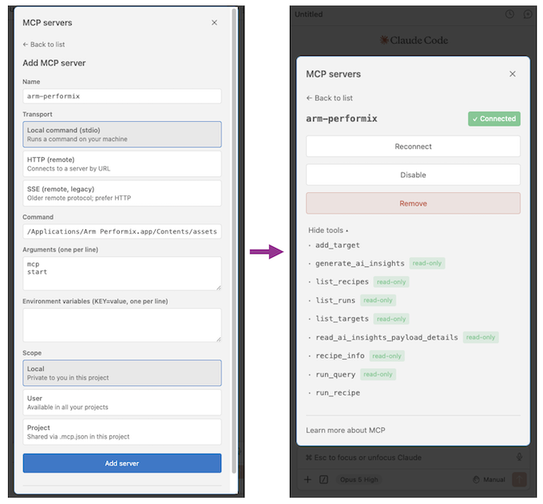

## Choose a configuration method

The Claude Code extension and Claude CLI use the same MCP configuration. Choose one of the following methods:

- Use the Claude Code extension's MCP interface
- Run `claude mcp add` in a terminal

You need to complete only one method. The MCP server is a local standard input and output (STDIO) process started by the `apx` executable.

{}
Configure the server on the host where Claude Code runs. In a local Visual Studio Code (VS Code) session, this is your development computer. In a remote development session, confirm which host runs the Claude Code extension and which Arm Performix data directory it uses.
{}

## Configure the MCP server in the Claude Code extension

To add the MCP server in VS Code:

1. Install the official [Claude Code VSCode extension from Anthropic](https://marketplace.visualstudio.com/items?itemName=anthropic.claude-code) and open the Claude Code panel.
2. Open the command menu by selecting `/` in the prompt box, then select **MCP servers** under **Customize**.
3. Add a user-scoped STDIO server named `arm-performix`.
4. For the command, enter the full path to the Arm Performix `apx` executable.


  
On Linux, the default path is:

```text
/opt/Arm Performix/assets/apx/apx
```
  
  
On Windows, the default path depends on whether you installed Arm Performix for all users or for a single user.

For an all-users installation, use:

```text
C:\Program Files\Arm Performix\assets\apx\apx.exe
```

For a single-user installation, use:

```text
C:\Users\<username>\AppData\Local\Programs\Arm Performix\assets\apx\apx.exe
```
  
  
On macOS, the default path is:

```text
/Applications/Arm Performix.app/Contents/assets/apx/apx
```
  


5. Add `mcp` and `start` as separate arguments.
6. Add the server, then start a new Claude Code session.




## Configure the MCP server with Claude CLI

If the `claude` command is available in your terminal, add the same user-scoped STDIO server from the command line. On macOS, the default install path for `apx` is `/Applications/Arm Performix.app/Contents/assets/apx/apx`. Replace `<path-to-apx>` with the full executable path for your host:

```bash
claude mcp add --scope user --transport stdio arm-performix -- "<path-to-apx>" mcp start
```

For example, on macOS:

```bash
claude mcp add --scope user --transport stdio arm-performix -- \
    "/Applications/Arm Performix.app/Contents/assets/apx/apx" mcp start
```

Claude Code confirms that it added the server:

```output
Added stdio MCP server arm-performix with command: /Applications/Arm Performix.app/Contents/assets/apx/apx mcp start to user config
File modified: /Users/<username>/.claude.json
```

Start a new Claude Code session after the command completes.

## Configure the MCP server in the Claude Code JSON file

You can also configure the user-scoped MCP server directly in `~/.claude.json`. Add the `arm-performix` entry to the existing top-level `mcpServers` object. If `mcpServers` doesn't exist, create it. Preserve all other settings and server entries in the file.

Replace `<path-to-apx>` with the full path to the Arm Performix `apx` executable for your host:

```json
{
  "mcpServers": {
    "arm-performix": {
      "type": "stdio",
      "command": "<path-to-apx>",
      "args": ["mcp", "start"],
      "env": {}
    }
  }
}
```

On Windows, escape each backslash in the JSON path. For example, use `C:\\Program Files\\Arm Performix\\assets\\apx\\apx.exe` for an all-users installation.

Save `~/.claude.json`, then start a new Claude Code session.

## Check that the MCP server is connected

List the configured servers:

```bash
claude mcp list
```

The output includes the `arm-performix` command and connection status:

```output
arm-performix: /Applications/Arm Performix.app/Contents/assets/apx/apx mcp start - ✔ Connected
```

To inspect the configuration in more detail, run:

```bash
claude mcp get arm-performix
```

The output should show a connected, user-scoped STDIO server:

```output
arm-performix:
  Scope: User config (available in all your projects)
  Status: ✔ Connected
  Type: stdio
  Command: /Applications/Arm Performix.app/Contents/assets/apx/apx
  Args: mcp start
  Environment:
```

You can also enter `/mcp` in Claude Code to review the server status.

Configuration alone doesn't prove that the tools can read Performix data. In a new Claude Code chat, enter:

```text
Use the Arm Performix MCP server to list the available recipes and profiling runs. For each run, include its run ID, recipe, target, workload, and creation time when those fields are available.
```

If Claude Code returns Performix recipes or runs, the end-to-end connection works. An empty run list isn't a connection failure if recipes or targets are returned.

Next, ask Claude Code to identify runs that support the insight workflow:

```text
List the Arm Performix Code Hotspots runs that can be used to generate an AI insight. Include the run ID and enough workload and target details for me to choose the correct run.
```

Record the run ID you want to analyze. A run name can be changed and might not be unique, so use the run ID in later prompts.

## Troubleshoot the MCP connection

Use the following checks to diagnose MCP connection issues:

### The Arm Performix MCP server isn't listed

Check whether Claude Code loaded the server configuration:

```bash
claude mcp list
```

Find `arm-performix` in the output. Then confirm:

- The command is the full path to the `apx` executable, including `apx.exe` on Windows
- The arguments are `mcp` and `start`
- The server is enabled
- You started a new Claude Code session after changing the configuration
- You configured the server for the same user account and Claude Code host that runs the extension

### The MCP server fails to start

Run the executable's built-in help from a terminal to separate an `apx` problem from a Claude Code configuration problem. Replace `<path-to-apx>` with the configured path:

```bash
"<path-to-apx>" mcp --help
```

If the help text doesn't appear, check the executable path, file permissions, and installed Arm Performix version. If it does appear, enter `/mcp` in Claude Code and check the server status.

In a remote development session, make sure `apx` is installed on the Claude Code host and that this installation uses the expected Performix configuration and run data.

### Claude Code doesn't use Arm Performix

Name the server and task explicitly:

```text
Use the Arm Performix MCP server to list the available Arm Performix runs.
```

For a specific run:

```text
Use Arm Performix to generate an AI insight for run ID "<run-id>".
```

If you have several MCP servers, an ambiguous prompt such as `give me insights` might not select Arm Performix.

### Code Hotspots runs are missing

Check for the following:

- You created at least one completed Code Hotspots run.
- The MCP server runs as the same user who created or imported the run.
- The GUI, CLI, and MCP server use the same Arm Performix data location.
- The selected run contains enough samples and profile data for analysis.
- A remote Visual Studio Code environment isn't using a different home directory or Performix configuration.

Compare the MCP result with the CLI:

```bash
apx run list
```

If the CLI also returns no run, create or import a run. If the CLI returns the run but Claude Code doesn't, recheck which host, user, and configuration start the MCP server.

## What you've accomplished and what's next

You've now configured and tested the MCP connection.

Next, you'll create a Code Hotspots run if no supported run is available. If you already have a supported run, skip to [Generate Arm Performix AI insights for a Code Hotspots run](/learning-paths/servers-and-cloud-computing/performix-agentic-dynamic-insights-claude/generate_ai_insights/).
