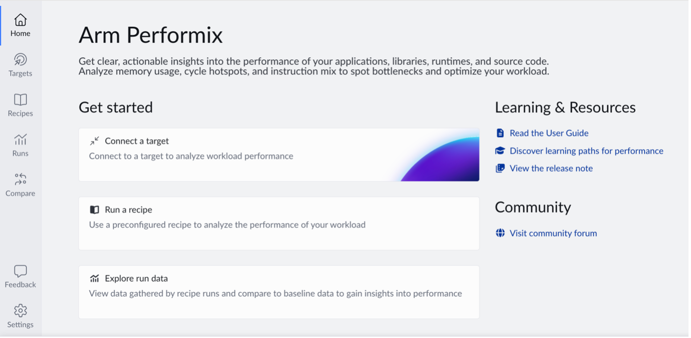
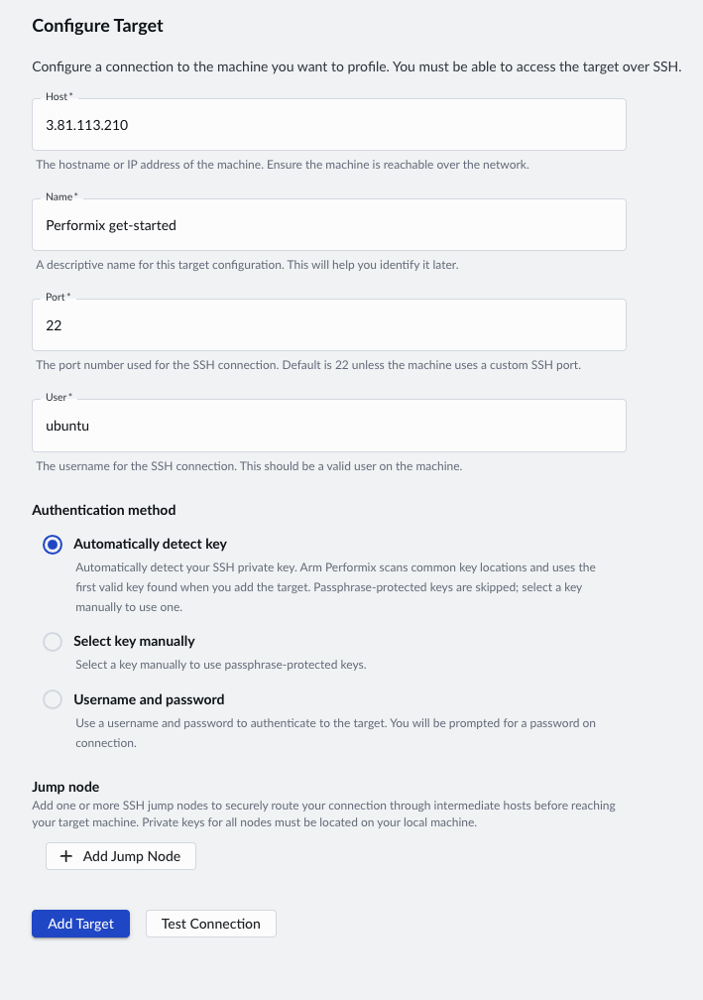

## What Arm Performix is

Arm Performix is a performance analysis toolkit that uses guided recipes to turn hardware performance counter data into actionable insights on Arm-based systems. Unlike command-line tools such as Perf, Performix attributes metrics directly to functions. It applies Arm's standardized performance methodologies, and presents results with context and suggested next steps.

Performix runs on your local machine (Windows, macOS, or Linux). The tool connects over SSH to a remote Arm Linux server, referred to as the target, where it collects performance data.

For a walkthrough of the Performix GUI and setup process, see this video on [getting started with Arm Performix](https://youtu.be/_eX8ZpNT0kc?si=WrQg5daHxUc0MFbR).

In addition to the GUI, you can use Arm Performix through the command line. You can also use the [Model Context Protocol (MCP)](https://modelcontextprotocol.io/) to integrate Performix into AI-assisted workflows with the [Arm MCP Server](https://developer.arm.com/servers-and-cloud-computing/arm-mcp-server).


## Configure SSH key-based authentication

Arm Performix connects to your target over SSH. After installing Performix, to set it up for profiling, configure SSH key-based authentication.

If you don't already have an SSH key pair, generate one on your local machine:

```bash
ssh-keygen -t ed25519
```

Press the **Enter** key to accept the defaults.

Then, copy the public key to your target:

```bash
ssh-copy-id username@your-server
```

Replace `username` with your user on the server and `your-server` with the hostname or IP address of the server.

On your local machine, verify that you can connect to the server without a password prompt:

```bash
ssh username@your-server
```

For more information, see the [SSH install guide](/install-guides/ssh/).

## Enable passwordless sudo on the server

Performix installs profiling tools on the target and requires root privileges.

To avoid interactive prompts during analysis, configure passwordless `sudo` for your user.

On the target, create a sudoers drop-in file for your user, replacing `username` with your username:

```bash
echo "username ALL=(ALL) NOPASSWD:ALL" | sudo tee /etc/sudoers.d/username
sudo chmod 440 /etc/sudoers.d/username
```

Verify it works by running:

```bash
sudo whoami
```

The expected output is:

```output
root
```

## Add a new target in Arm Performix

When you launch Arm Performix, the Welcome screen appears. From this screen, you can connect to a target.



1. Select **Connect a Target** to open the **Targets** view.
1. Select **Add Target**.
1. Fill in the **Configure Target** form with the following details:

   - **Host:** the hostname or IP address of the Arm Linux server
   - **Name:** a descriptive name for the target, such as **dot-product-profile**
   - **Port:** the SSH port number (the default port is 22)
   - **User:** the username for SSH connection, which must be a valid user on the target machine
   - **Authentication method:** select one of the following:
      - **Automatically Detect Key:** let Performix find your private SSH key, stored locally (usually at `~/.ssh/id_rsa` or `~/.ssh/id_ed25519`)
      - **Select Key Manually:** provide the path to a specific private key
      - **Username and password:** be prompted for a password on connection

   - If you need to route your connection through intermediate hosts, select **Add Jump Node** to add one or more jump nodes. Specify them in the order your connection should use them.
1. Select **Test Connection** to verify your target is reachable. If any required tools are missing, Performix installs them for you.
1. After validating the connection, select **Add Target**. The target appears in the list and is ready for profiling.



You should see your target listed in the **Targets** view with a connected status, confirming Performix can reach your server.

## What you've accomplished and what's next

You've set up Arm Performix and prepared your local machine and target for profiling a sample application.

Next, you'll build an example application to profile.
