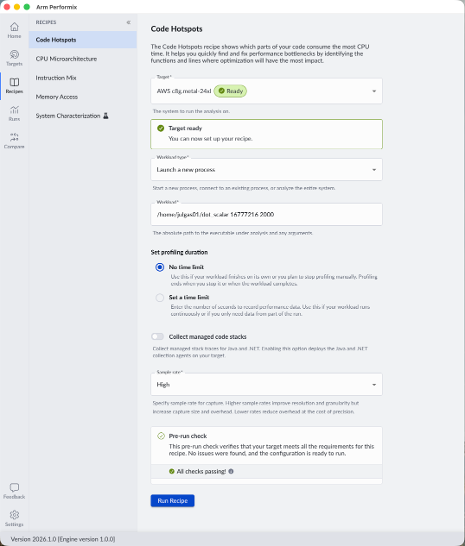
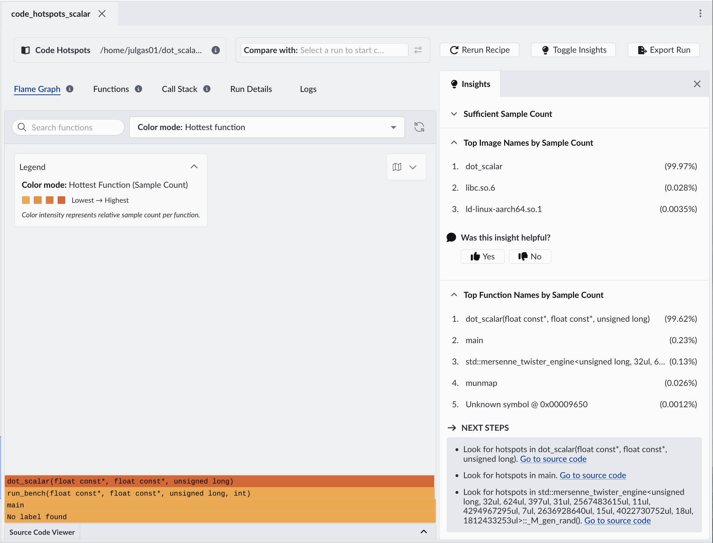
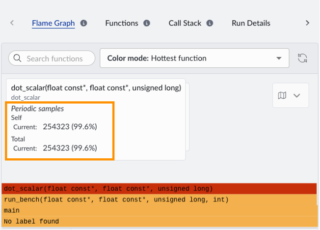
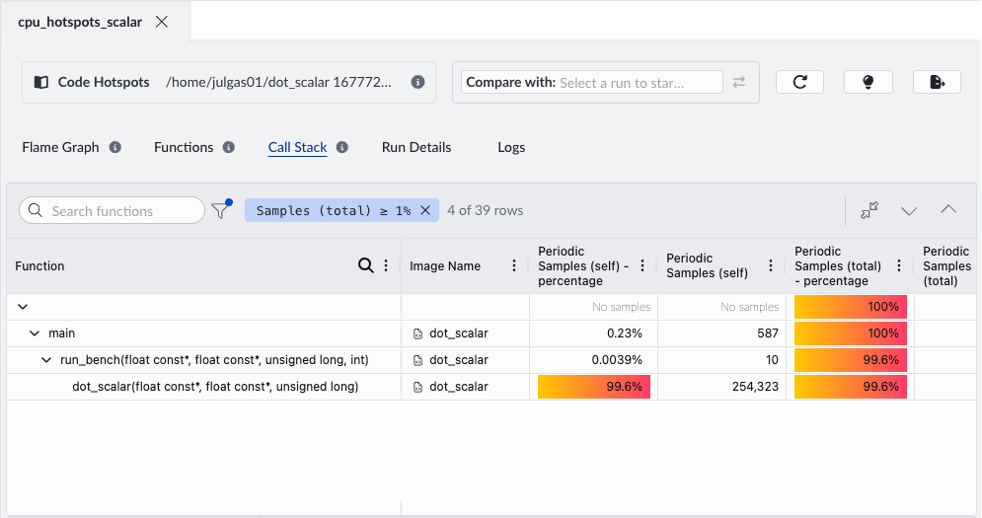
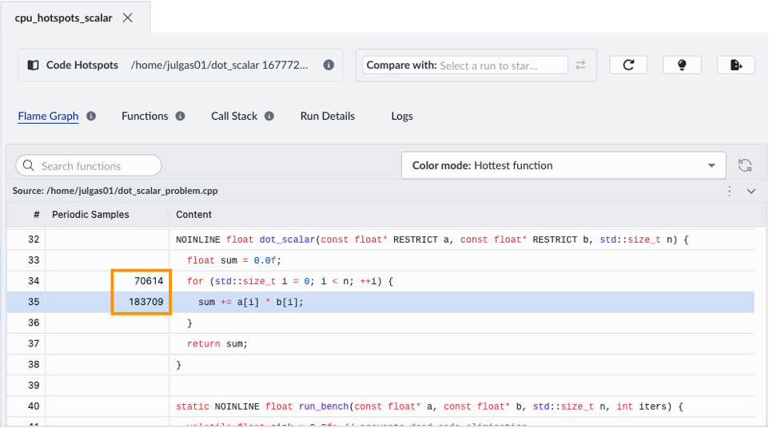

The Code Hotspots recipe in Arm Performix identifies which functions in your application consume the most CPU time. This analysis helps identify areas of code that can benefit from optimization.

## Run the Code Hotspots recipe

1. In Performix, select the **Code Hotspots** recipe from the list of available recipes.

    

1. Specify the path to your compiled binary and any necessary parameters. Performix assumes the home directory as the base path, so use the relative path from `$HOME`. For this example, run the program with 16M floats and an iteration count of 2000 to ensure sufficient runtime for meaningful sampling:

    ```bash
    performix-analysis/dot_scalar 16777216 2000
    ```

    Arm recommends collecting at least 20 seconds of profiling data to ensure statistically meaningful sampling. Adjust the iteration count if needed for your hardware.

1. Select **Run Recipe** to start the analysis. Performix launches the program on the target and collects periodic samples during execution.

## Interpret the results

After the run completes, Performix displays the results, including a flame graph that highlights where the CPU spends most of its time. Each box represents a function, and its width indicates how frequently it appears in the samples. The stacked layout shows call paths, helping you see how each function is reached. You can identify optimization opportunities by focusing on the widest blocks, which represent the most significant contributors to runtime.

The `dot_scalar` function dominates the flame graph, indicating it accounts for a large proportion of total CPU cycles.



The insights panel shows that this function accounts for 99.96% of samples. Hover over the function in the flame graph to see the sample count.



Switch to the Call Stack view to see how the hotspot function is reached and whether its cost comes from the function itself or its callees.



Double-click the hotspot function to open the source code viewer and inspect the exact lines of code associated with high CPU usage. When you open the Source Code Viewer for the first time, you need to specify the root directory of your source code so Performix can map profiling data to the correct files.

{}
The source code viewer runs on your local machine. Copy `scalar_dot_product.cpp` from the target to your local machine so Performix can display annotated source. For example: `scp username@your-server:~/performix-analysis/scalar_dot_product.cpp .`
{}



## What you've accomplished

You identified the `dot_scalar` function as the dominant hotspot in the application. This is expected because it handles all the computation, but knowing it's hot doesn't tell you whether the time is being spent efficiently. The next step is to use the CPU Microarchitecture recipe to understand why this function is a bottleneck.
