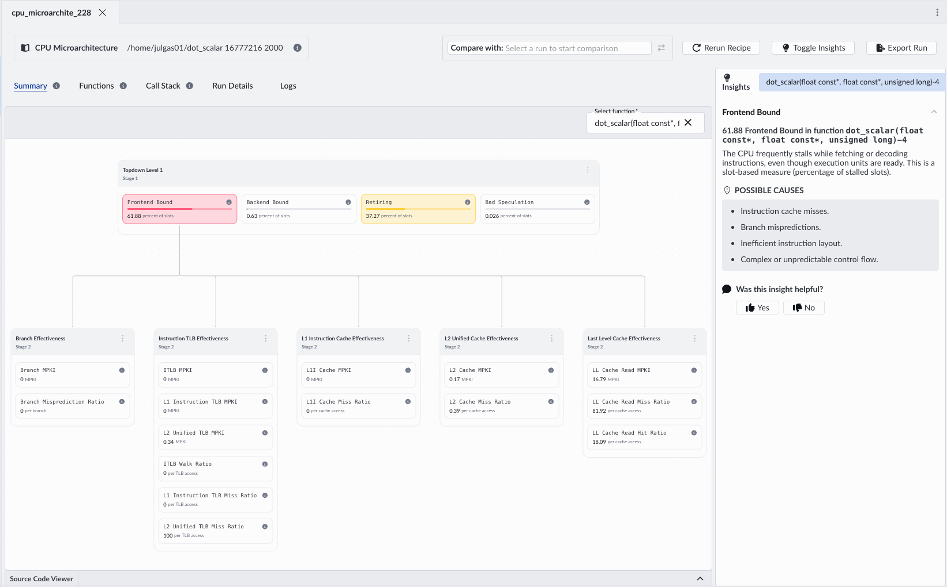
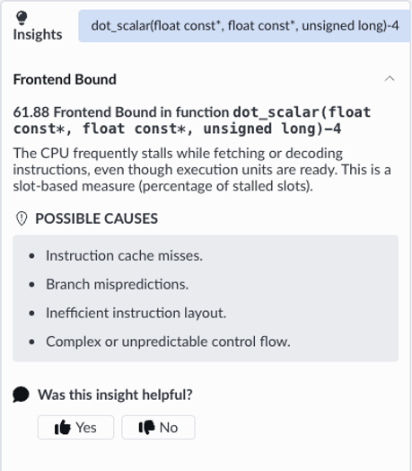

The CPU Microarchitecture recipe in Arm Performix provides a detailed [Topdown analysis](https://developer.arm.com/documentation/109542/0100/Arm-Topdown-methodology) breakdown of how CPU execution capacity is used, helping you identify where performance is lost due to stalls or inefficiencies. This analysis will help you understand whether your workload is limited by frontend, backend, memory, or other CPU pipeline effects.

### Running the CPU Microarchitecture Recipe

1. In Arm Performix, select the CPU Microarchitecture recipe.

2. Specify the path to your compiled workload and run it with the same parameters as before:

```bash
./dot_scalar 16777216 2000
```

3. Start the analysis. Arm Performix will collect data and present the results using Topdown analysis.

    

### Interpreting the Results

In this example, the analysis shows that the workload is over 60% frontend bound, meaning the CPU frequently stalls while fetching or decoding instructions, even though backend resources are available. The CPU isn’t compute-bound, it’s waiting for instructions.

Performix provides immediate guidance in the Insights panel.



But this is where context matters. This is a simple, tight loop. So what’s really going on? Let's dig deeper using the Instruction Mix recipe.
