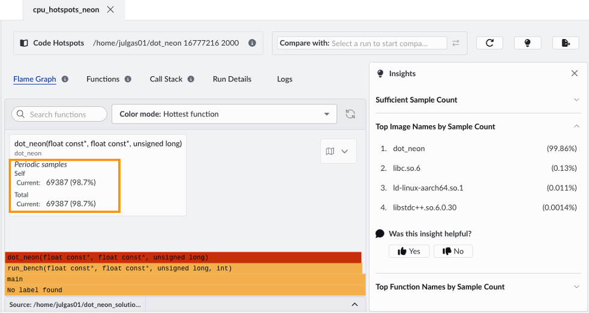
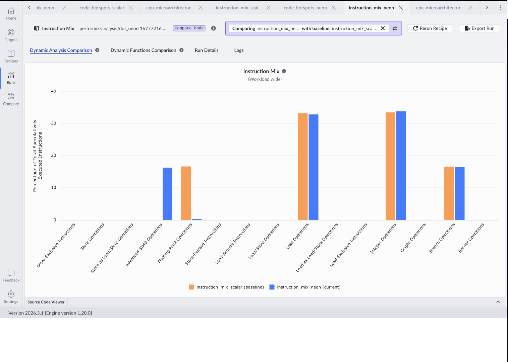
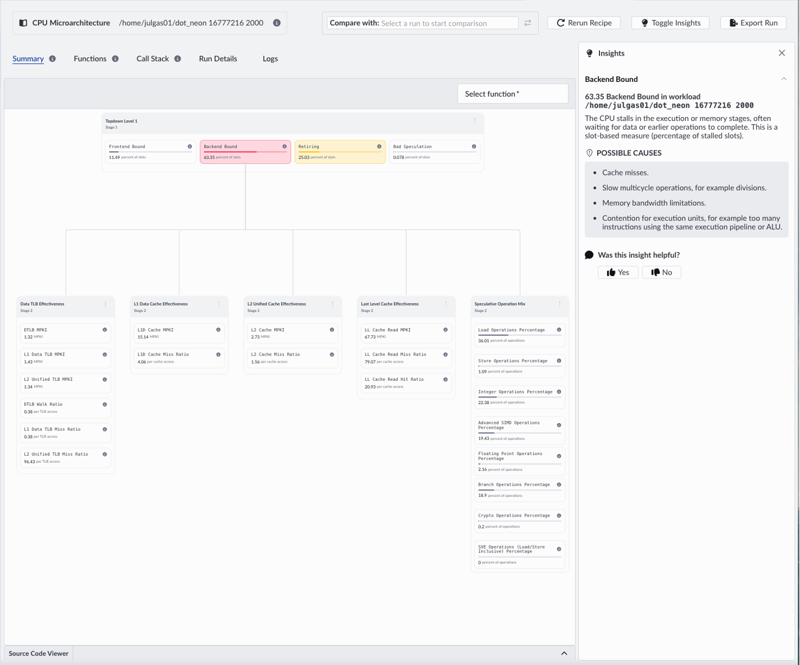

## Run the recipes on the optimized binary

You can now compare the scalar and Neon-optimized versions using Arm Performix to validate changes in runtime, instruction mix, and bottleneck behavior.

To run the recipes:

1. In Performix, select the **Code Hotspots**, **CPU Microarchitecture**, and **Instruction Mix** recipes.

1. Specify the path to the optimized binary and run it with the same parameters as before:

    ```bash
    performix-analysis/dot_neon 16777216 2000
    ```

1. Select **Run Recipe** for each recipe to collect fresh profiling data.

## Compare Code Hotspots results

The most visible improvement is wall-clock time and total cycle count. Processing four elements per loop iteration using SIMD reduces the total number of instructions executed. The flame graph shows the same dominant function (`dot_neon`), but the sample count is significantly lower.



## Compare Instruction Mix results

Select the previous scalar Instruction Mix run to compare it with the optimized version side by side:


The overlay shows Advanced SIMD instructions appearing in the optimized version while scalar operations decrease, confirming more work is done per instruction.



The scalar version is dominated by integer, floating-point, and load operations. The Neon version introduces Advanced SIMD, reducing the number of instructions required per element and directly relieving frontend pressure.

## Compare CPU Microarchitecture results

The CPU Microarchitecture recipe confirms the bottleneck has shifted. After vectorization, frontend stalled cycles drop and backend effects become dominant. 

Frontend stalls drop to zero, while backend stalls increase to ~47%.s



This demonstrates a common pattern in performance optimization: improving one part of the pipeline shifts pressure elsewhere. With the bottleneck moved from the frontend to the backend, the CPU executes more efficiently, and demand shifts to execution units and memory. This iterative cycle of measure, change, and validate is what Performix is designed to support.

## What you've accomplished

You've compared performance between scalar and Neon-optimized versions of a C++ application using Arm Performix.

Now that you've completed a full optimization cycle, you can explore how to integrate Performix into broader development workflows and use these profiling steps for your own applications.
