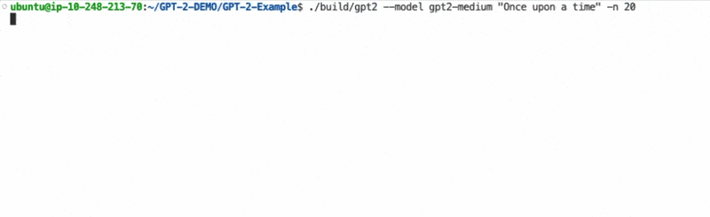

## Prepare the environment

Use an Arm Linux target, such as an Arm Neoverse-based cloud instance. The results in this Learning Path were collected on a Graviton 3-based Amazon EC2 instance running Ubuntu 24.04 LTS.  

If you've not configured Arm Performix yet, complete setup and target connection using the [Arm Performix install guide](/install-guides/performix/).

Install build prerequisites and clone the GPT-2 example repository:

```bash
sudo apt update
sudo apt install -y git g++ cmake python3 python3-venv
git clone --recurse-submodules https://github.com/arm-education/GPT-2-Example.git
cd GPT-2-Example
git checkout tags/v0.0.2
```

## Export GPT-2 model assets

The C++ runtime expects exported model binaries. Create a Python virtual environment, install dependencies, and export GPT-2 Medium weights and vocabulary:

```bash
python3 -m venv venv
source venv/bin/activate
pip install -r src/requirements.txt
python3 src/export_gpt2.py --model gpt2-medium
```

This creates:

- `models/gpt2-medium/weights.bin`
- `models/gpt2-medium/vocab.bin`

The workload uses [openai-community/gpt2-medium on Hugging Face](https://huggingface.co/openai-community/gpt2-medium), which corresponds to the GPT-2 Medium model from the original OpenAI GPT-2 release in 2019. The model has 355 million parameters and runs with unquantized FP32 (32-bit floating-point) weights.

## Review the source code

The `src/gpt2.cpp` file implements the end-to-end GPT-2 inference loop. Each generated token triggers a forward pass over all 24 transformer layers. Inside each layer, `matmul` is called multiple times for the query, key, and value projection, the attention output projection, and both feed-forward layers. It's called once more at the end for `logits` projection over the vocabulary:

```cpp
// Attention QKV projection
matmul(s.qkv.data(), s.xb.data(),
       w.c_attn_w.data()+(size_t)l*3*E*E,
       w.c_attn_b.data()+(size_t)l*3*E, E, 3*E);

// FFN expand
matmul(s.mlp_h.data(), s.xb.data(),
       w.mlp_fc_w.data()+(size_t)l*4*E*E,
       w.mlp_fc_b.data()+(size_t)l*4*E, E, 4*E);

// Logits projection (vocab_size x n_embd)
matmul(s.logits.data(), s.x.data(), w.wte.data(), nullptr, E, cfg.vocab_size);
```

The `matmul` dispatch in `gpt2.cpp` selects a kernel at compile time based on a preprocessor flag:

```cpp
static void matmul(float *out, const float *x, const float *W, const float *b,
                   int n_in, int n_out) {
#if defined(GPT2_KERNEL_NEON)
    kernels::matmul_neon(out, x, W, b, n_in, n_out);
#elif defined(GPT2_KERNEL_SVE)
    kernels::matmul_sve(out, x, W, b, n_in, n_out);
#elif defined(GPT2_KERNEL_USER)
    kernels::matmul_user(out, x, W, b, n_in, n_out);
#else
    kernels::matmul_ref(out, x, W, b, n_in, n_out);
#endif
}
```

The baseline kernel (`src/kernels/matmul_ref.cpp`) is a scalar nested for loop: for each output row, it walks the weight matrix row and accumulates a dot product with the input vector:

```cpp
void matmul_ref(float *out, const float *x, const float *W, const float *b,
                int n_in, int n_out) {
    for (int i = 0; i < n_out; i++) {
        float acc = b ? b[i] : 0.f;
        const float *row = W + (size_t)i * n_in;
        for (int j = 0; j < n_in; j++) acc += row[j] * x[j];
        out[i] = acc;
    }
}
```

This scalar implementation can leave Neon and SVE vector units underused if the compiler can't efficiently autovectorize it. Because `matmul` is called hundreds of times per token, explicitly optimizing this kernel guarantees SIMD execution where most of the available compute is spent.

## Build and run the baseline

Configure and build the project with CMake:

```bash
cmake -S . -B build -DBUILD_USER_MATMUL=ON
cmake --build build --parallel
```
The project uses `-O2 -g`, which keeps optimization enabled while preserving debug symbols for profiling.

Run the scalar baseline binary:

```bash
./build/gpt2 --model gpt2-medium "Once upon a time" -n 20
```

The output is similar to:



## What you've accomplished and what's next

You now have a working baseline binary and model files. 

Next, you'll use the Instruction Mix recipe in Arm Performix to inspect static disassembly and dynamic runtime behavior.
