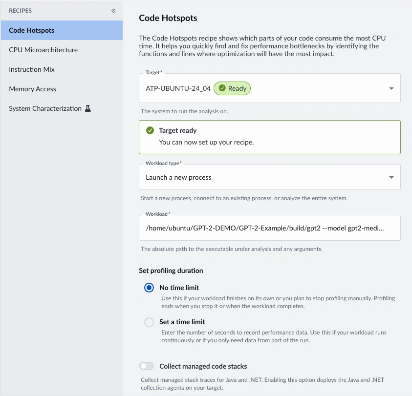
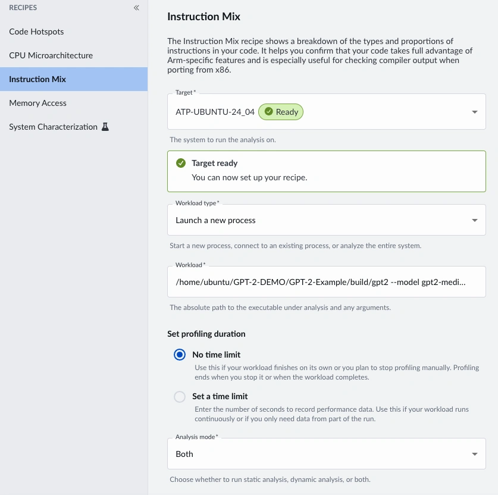

## Find the code hotspot

Before you optimize, identify where the application spends most of its time. Use the Code Hotspots recipe to periodically sample the running application and build a profile of the functions that execute most often.

Open Arm Performix and select the **Code Hotspots** recipe. If this is your first run on the target, complete tool deployment as prompted.

Set the launch command to your baseline binary with the number of tokens (`-n`) set to `150`. This value keeps startup overhead small compared to inference time, so the profile minimizes the time taken to load the model weights.

Copy and paste the following command as the Performix Workload. If your path is different, adjust it to point to `gpt2`:

```console
/home/ubuntu/GPT-2-Example/build/gpt2 --model gpt2-medium "Once upon a time" -n  150
```



The results show that `kernels::matmul_ref()` is the hottest function. Double-click on the function to see which lines of source code are mostly attributed to the accumulate step of `kernels::matmul_ref()`.


This confirms that matrix multiplication is the highest-impact optimization target.

## Assess compiler output

You can use online tools such as [Compiler Explorer](https://godbolt.org/) to conveniently see how this function is being compiled with the `-O2 -g` flags. The following example uses `GCC 12.1.0`. You can check your installed compiler version with the `g++ --version` command and select the corresponding version from the Compiler Explorer drop-down menu. The generated assembly might differ slightly across compiler versions.

{{< godbolt width="100%" height="400px" mode="assembly" opt="-O2 -g" src="void matmul_ref(float *out, const float *x, const float *W, const float *b, int n_in, int n_out)\n{\n  for (int i = 0; i < n_out; i++) {\n    float acc = b ? b[i] : 0.f;\n    const float *row = W + (unsigned long long)i * (unsigned long long)n_in;\n    for (int j = 0; j < n_in; j++) {\n      acc += row[j] * x[j];\n    }\n    out[i] = acc;\n  }\n}" >}}

With this view, you can spot missed vectorization opportunities. In an optimized build, you'd expect the accumulation step to use SIMD instructions, for example `fmla v0.4s, v3.4s, v2.4s` with use of the vector register (`v0->v3`). However, assembly inspection has limitations. 

First, you need familiarity with SIMD mnemonics to recognize vectorized code. Second, this narrow snippet doesn't show whether changing compiler flags introduces regressions in other parts of the codebase. Third, and most importantly, this static view doesn't show which instructions in this function run most often on the CPU.

The Instruction Mix recipe helps fill this gap.

## Configure the Instruction Mix recipe

Open Arm Performix and select the **Instruction Mix** recipe. 

Set the launch command to your baseline binary with the same runtime arguments used for baseline testing:

```console
/home/ubuntu/GPT-2-Example/build/gpt2 --model gpt2-medium "Once upon a time" -n  150
```

Note the number of counters.

Use the same model and prompt arguments as your baseline terminal run so the measurements are comparable.



### Analyze static disassembly

After the run completes, review static disassembly first. This view is ordered by percentage contribution and provides a high-level profile of the application’s generated instruction stream. By reviewing static disassembly, you can identify broad characteristics, such as whether the code is branch-heavy, dominated by memory operations, or making effective use of SIMD instructions.

Use this static view to understand overall code generation patterns rather than to attribute performance to specific functions or source lines. Dynamic analysis is typically more relevant for optimization because it reflects the instructions that are actually executed at runtime.


### Dynamic analysis

Then, inspect dynamic analysis bar chart to see where sampled runtime work is concentrated. Dynamic data is typically more useful for optimization because it reflects actual execution behavior for your input, runtime settings, and call frequencies.


Finally, in dynamic functions, you can break down operation types to individual functions. This is particularly useful when no single function dominates the profile, allowing you to inspect dynamic instruction patterns for specific functions.

## What you've accomplished and what's next

You've now used Instruction Mix to confirm that baseline runtime is dominated by scalar-heavy `matmul` execution. 

Next, you can optionally learn to optimize `matmul` with vector intrinsics and use the Arm MCP Server with Performix. You can also skip to [Compare Neon and SVE with the Arm Performix Instruction Mix recipe](/learning-paths/servers-and-cloud-computing/performix-instruction-mix/how-to-5/) to compare updated Instruction Mix and throughput across scalar, Neon, SVE, and KleidiAI variants.
