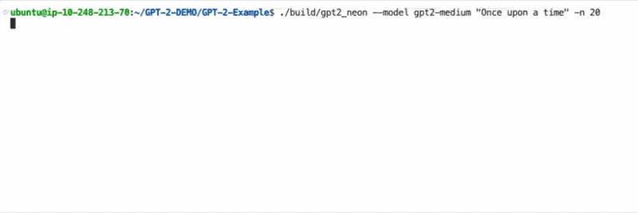
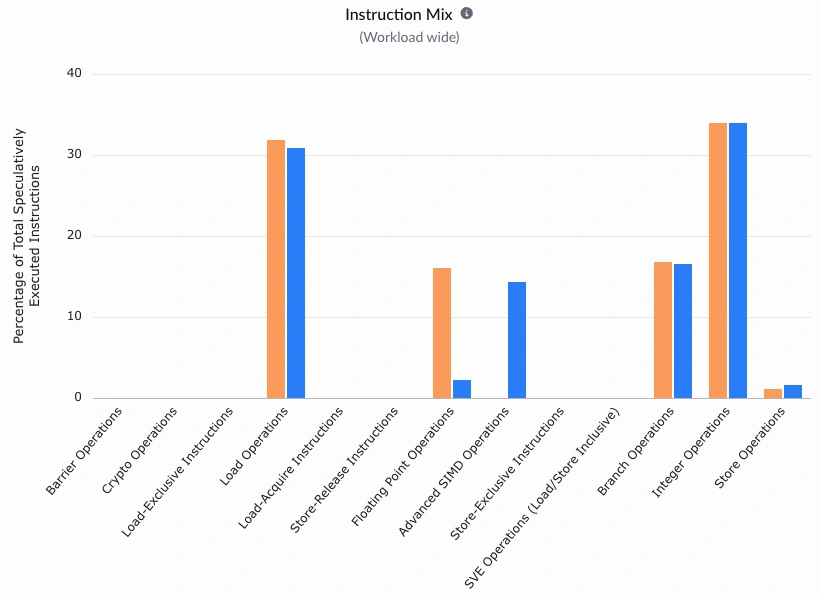
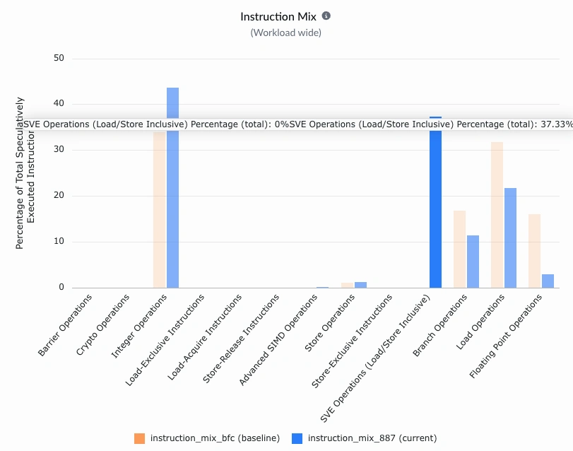

## Confirm instruction-mix changes after vectorization

In the earlier build step, you created `gpt2_neon` and `gpt2_sve`. These binaries use the reference solutions in `matmul_neon.cpp` and `matmul_sve.cpp`, respectively. Run the `gpt2_neon` binary with the following command to observe the speedup. 

```bash
./build/gpt2_neon --model gpt2-medium "Once upon a time" -n 20
```



The Neon implementation delivers a noticeable increase in token generation throughput. To evaluate the SVE implementation, run the same workload using the `gpt2_sve` binary instead of `gpt2_neon`. Performance gains will vary across systems, largely depending on the Scalable Vector Length (SVL) supported by the Arm Linux platform.

Rerun the Instruction Mix recipe with the `gpt2_neon` binary using the same recipe settings and workload arguments as baseline. After the run completes, select both runs and click **Compare** to open a comparison view.

{}

Rename each run with a descriptive name, such as baseline and Neon, so you can identify and compare results quickly.

{}

The baseline profile is mostly scalar instructions. After you add Neon intrinsics, the instruction mix shifts toward Advanced SIMD (Neon) instructions, showing that the code is using Arm Neon hardware more effectively.



You can also compare SVE variants in the same way. The increase in SVE operations shows that this path is now utilizing SVE hardware.



## Compare throughput across kernels

#### Neon kernel

You can also inspect the Neon intrinsic implementation using Compiler Explorer, where the hot accumulation step (`vacc`) runs in ASIMD (Neon) registers such as `v0`:

{{< godbolt width="100%" height="400px" mode="assembly" opt="-O2 -g -march=armv8.2-a+simd" src="#include <arm_neon.h>\n\nvoid matmul_neon(float *out, const float *x, const float *W, const float *b,\n                 int n_in, int n_out) {\n    for (int i = 0; i < n_out; i++) {\n        float acc = b ? b[i] : 0.f;\n        const float *row = W + (unsigned long long)i * (unsigned long long)n_in;\n        int j = 0;\n        float32x4_t vacc = vdupq_n_f32(0.f);\n        for (; j + 4 <= n_in; j += 4) {\n            const float32x4_t vw = vld1q_f32(row + j);\n            const float32x4_t vx = vld1q_f32(x + j);\n            vacc = vfmaq_f32(vacc, vw, vx);\n        }\n        acc += vaddvq_f32(vacc);\n        for (; j < n_in; j++) acc += row[j] * x[j];\n        out[i] = acc;\n    }\n}" >}}


#### SVE kernel

For variable-length vectorization, compare with an explicit SVE implementation that assumes SVE support, where the hot accumulation step (`vacc`) runs in SVE z registers with predicate-controlled loads and multiply-accumulate:

{{< godbolt width="100%" height="400px" mode="assembly" opt="-O2 -g -march=armv8.2-a+sve" src="#include <arm_sve.h>\n#include <stddef.h>\n\nvoid matmul_sve(float *out, const float *x, const float *W, const float *b,\n                int n_in, int n_out) {\n    for (int i = 0; i < n_out; i++) {\n        float acc = b ? b[i] : 0.f;\n        const float *row = W + (size_t)i * n_in;\n        svfloat32_t vacc = svdup_f32(0.f);\n        int j = 0;\n        while (j < n_in) {\n            svbool_t pg = svwhilelt_b32((uint64_t)j, (uint64_t)n_in);\n            svfloat32_t vw = svld1(pg, row + j);\n            svfloat32_t vx = svld1(pg, x + j);\n            vacc = svmla_f32_m(pg, vacc, vw, vx);\n            j += svcntw();\n        }\n        acc += svaddv_f32(svptrue_b32(), vacc);\n        out[i] = acc;\n    }\n}" >}}


For a full-page view, open [Godbolt session with all three matmul kernels](https://godbolt.org/z/E4a7Wxh8K).

## Speed up

Run the provided comparison script to measure tokens per second across all available binaries:

```bash bash { command_line="user@host | 2-30"}
./compare_gpt2_variants.sh
Model: gpt2-medium
Prompt: Once upon a time
Tokens: 20
Runs: 1

== gpt2 ==
run 1: 3.04976 tok/s
avg: 3.049760 tok/s

== gpt2_neon ==
run 1: 11.3649 tok/s
avg: 11.364900 tok/s

== gpt2_sve ==
run 1: 13.907 tok/s
avg: 13.907000 tok/s

== gpt2_user ==
run 1: 3.04859 tok/s
avg: 3.048590 tok/s
```

These results show that intrinsics increase throughput from about 3 tok/s in the scalar baseline to about 13.9 tok/s with SVE. Next, you will use optimized libraries to push performance further.
