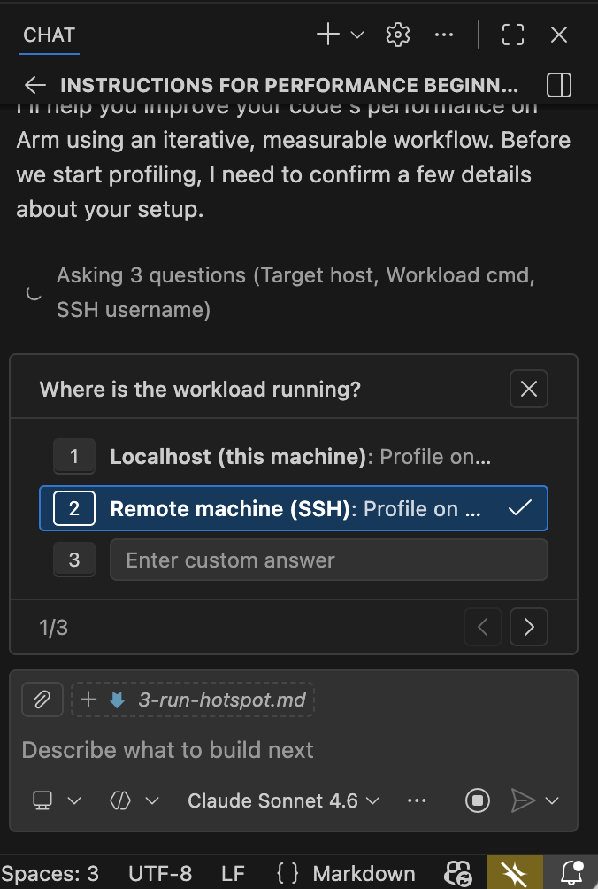
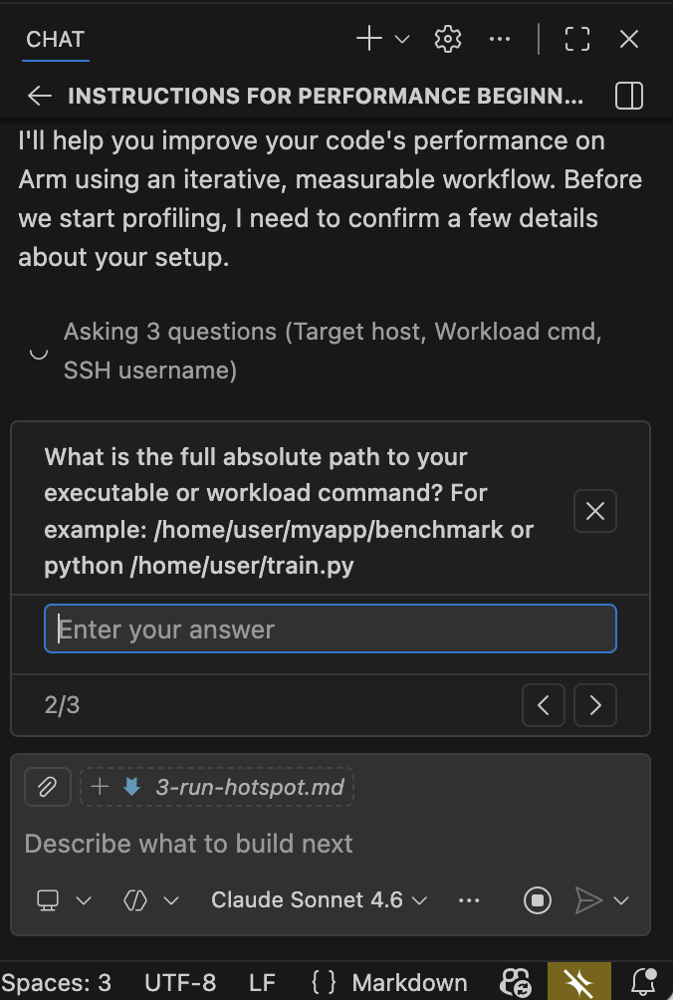
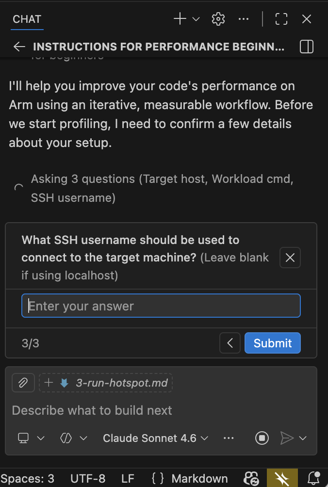
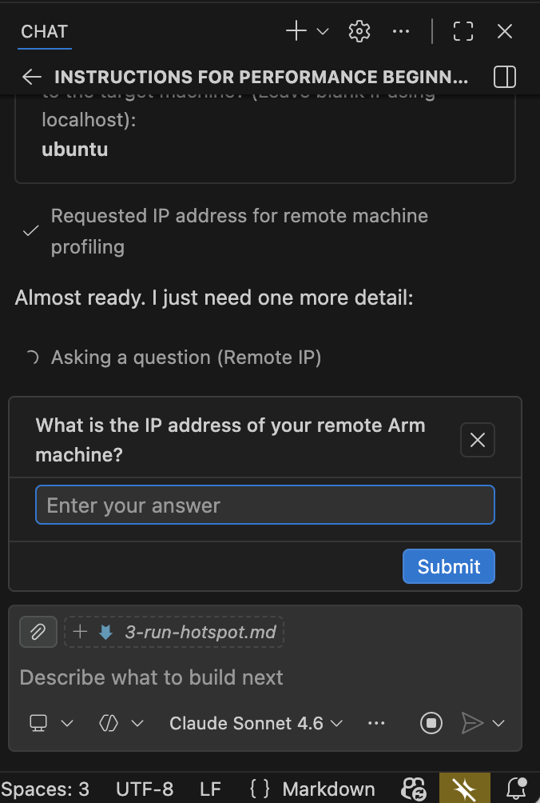

## Execute profiling through the Arm MCP Server

In this section, you'll use a GitHub Copilot prompt file to drive the Code Hotspots recipe through the Arm MCP Server. The agent confirms your target details, runs the recipe autonomously, and returns structured profiling results.

## Use the Arm MCP performance-beginner prompt file

{}
The section uses Visual Studio Code with GitHub Copilot. If you prefer a different AI assistant, see [Configure other AI agents](#configure-other-ai-agents) at the end of this section for equivalent configurations for Kiro and OpenAI Codex.
{}

The Arm MCP Server repository includes a ready-made prompt file called `performance-beginner` that guides an AI agent through the full Code Hotspots workflow: baseline profiling, hotspot identification, targeted code changes, and re-profiling to confirm the improvement. You don't need to write this file yourself, you copy it from the repository.

Open the Mandelbrot-Example repository in Visual Studio Code on your local machine. Create the directory `.github/prompts/` if it doesn't already exist:

```bash
mkdir -p .github/prompts
```

Download the prompt file from the Arm MCP repository and place it in that directory:

```bash
curl -o .github/prompts/performance-beginner.prompt.md \
  https://raw.githubusercontent.com/arm/mcp/main/agent-integrations/vs-code/performance-beginner.prompt.md
```

You can also view the full prompt at [github.com/arm/mcp](https://github.com/arm/mcp/blob/main/agent-integrations/vs-code/performance-beginner.prompt.md). It instructs the agent to confirm the workload command and target details with you before running, follow the loop of baseline profile → one focused code change → re-profile → compare delta, and report results in concrete numbers at each step.

## Invoke the prompt file

With GitHub Copilot connected to the Arm MCP Server, open Copilot Chat in Agent Mode and invoke the prompt with the slash command:

```text
/performance-beginner
```

Copilot reads the prompt file and walks you through a series of confirmation questions before running anything. Answer each question in turn:

**Step 1:** Select where the workload is running — choose **Remote machine (SSH)** for an Arm cloud instance.



**Step 2:** Enter the absolute path to the binary on the remote server.



**Step 3:** Enter the SSH username used to connect to the target machine.



**Step 4:** Enter the IP address or hostname of your remote Arm machine.



Once you've answered all four questions, the agent calls `arm-mcp/apx_recipe_run` to start the Code Hotspots recipe and waits for the Mandelbrot binary to finish. The single-threaded build takes approximately one to two minutes to run.

## Read the agent output

Once the profiling run completes, the agent returns a structured summary. The output looks similar to the following:

```text
Code Hotspots recipe completed. Top functions by sample percentage:

1. Mandelbrot::Mandelbrot::getIterations(double, double)  — 28.5% of samples
   Called from: Mandelbrot::draw → Mandelbrot::getIterations
   The per-pixel Mandelbrot iteration loop. High sample count because every pixel
   calls this function up to MAX_ITERATIONS (1024) times before escaping or exhausting
   the iteration limit.

2. std::__complex_abs  — 18.5% of samples
   Called from: Mandelbrot::getIterations → std::abs → __complex_abs
   Computes the magnitude of a std::complex<double> value. Called on every iteration
   of the inner loop to check the escape condition abs(z) > THRESHOLD.

3. hypotf64  — 14.9% of samples
   Called from: std::__complex_abs → hypotf64
   The sqrt-based hypotenuse function underlying __complex_abs. Together with
   __complex_abs, these two libm symbols account for ~33% of total CPU time — all
   spent computing a square root that only needs to be compared against a threshold.

4. std::complex<double>::__rep()  — 14.6% of samples
   Accessor overhead from the un-inlined std::complex operator chain. Appears
   prominently because the debug build (-O0) prevents inlining of these small methods.

5. std::complex operator+, operator*=, operator*  — ~15% combined
   Arithmetic operator overhead, also un-inlined at -O0.

key observation: the inner loop in getIterations spends more than 60% of total
CPU time in the escape condition check and std::complex arithmetic machinery,
not in the Mandelbrot iteration itself.

knowledge_base_search result for "optimizing hypot libm Arm Neoverse":
  - Arm Performance Libraries vector math functions provide optimized implementations
    for Neoverse targets.
    Link: https://developer.arm.com/documentation/101004/latest

Proposed optimizations (not yet applied):
  1. Replace abs(z) > THRESHOLD with a squared-magnitude check:
     (z.real()*z.real() + z.imag()*z.imag()) > THRESHOLD*THRESHOLD
     This eliminates the sqrt call and removes hypotf64 and __complex_abs
     from the profile entirely.
  2. Replace std::complex<double> with plain double variables zr and zi.
     The iteration z = z*z + c expands to:
       zr_new = zr^2 - zi^2 + x
       zi_new = 2*zr*zi + y
     This removes all std::complex method call overhead from the inner loop.
  3. Build with -O3 rather than -O0 to enable inlining, loop unrolling,
     and auto-vectorization of the tight iteration loop.
```

The agent has surfaced the same hotspots that a manual Performix session would identify — `__complex_abs` and `hypotf64` dominating through the inner loop in `Mandelbrot::getIterations`, plus significant `std::complex` operator overhead from the debug build — without you needing to open the Performix GUI, configure the recipe, or manually inspect the flame graph.

## What you've accomplished and what's next

You've used the Arm MCP `performance-beginner` prompt file — invoked with `/performance-beginner` — to drive the Arm Performix Code Hotspots recipe end-to-end through the Arm MCP Server. The agent confirmed your target details, ran the recipe autonomously, and identified `getIterations` as the dominant hotspot. It found that ~33% of total CPU time is spent inside the sqrt-based escape condition check (`__complex_abs` and `hypotf64`), and noted significant `std::complex` operator overhead from the debug build. It proposed three targeted optimizations: eliminating the sqrt, replacing `std::complex` with raw double arithmetic, and enabling compiler optimizations.

In the next section, you'll apply those optimizations one at a time, rebuilding and re-profiling after each change to confirm the improvement with real data.

---

## Configure other AI agents

The same profiling workflow works with other agentic AI assistants. The core prompt logic is identical across tools; only the file location and invocation format changes.

### Kiro steering document

The Arm MCP repository includes a ready-made Kiro steering document for this workflow. Create the `.kiro/steering/` directory if it doesn't already exist, then download the file:

```bash
mkdir -p .kiro/steering
curl -o .kiro/steering/performance-beginner.md \
  https://raw.githubusercontent.com/arm/mcp/main/agent-integrations/kiro/performance-beginner.md
```

You can view the full steering document at [github.com/arm/mcp](https://github.com/arm/mcp/blob/main/agent-integrations/kiro/performance-beginner.md). It uses `inclusion: always`, so Kiro loads it automatically for every session in the workspace. Reference it explicitly in chat by typing `#performance-beginner`.

### OpenAI Codex prompt file

The Arm MCP repository also includes a ready-made Codex prompt file. Create the prompts directory if it doesn't already exist, then download the file:

```bash
mkdir -p ~/.codex/prompts
curl -o ~/.codex/prompts/performance-beginner.md \
  https://raw.githubusercontent.com/arm/mcp/main/agent-integrations/codex/performance-beginner.md
```

You can view the full prompt at [github.com/arm/mcp](https://github.com/arm/mcp/blob/main/agent-integrations/codex/performance-beginner.md). Invoke it with:

```bash
codex /prompts:performance-beginner
```
