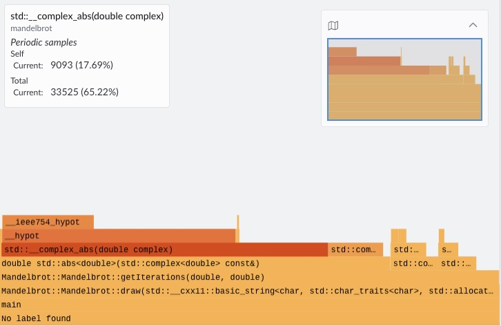

## Execute profiling through the Arm Performix MCP server

You'll keep collection and analysis as separate requests. This lets you confirm the target and workload before remote execution and use the resulting run ID for analysis.

{}
The prompts use natural language instead of internal MCP tool names. This makes them suitable for compatible AI coding assistants that are connected to the dedicated Arm Performix MCP server. For a tested setup, see [Configure the Arm Performix MCP server in Codex](/learning-paths/servers-and-cloud-computing/performix-agentic-dynamic-insights-codex/configure_mcp_codex/).
{}

## Verify the recipe and target

Ask your AI assistant to list the available recipes and configured targets:

```text
Use the Arm Performix MCP server to list the available recipes and configured
targets. Confirm that Code Hotspots is available. For each target, include its
name, connection type, and whether it is the default.
```

Choose the friendly target name that you verified in the previous section. You don't need to provide its SSH username or IP address again because those details belong to the Performix target configuration.

Before collection, ask the assistant to check the recipe against that target:

```text
Use the Arm Performix MCP server to check whether Code Hotspots supports target
"<target-name>". Summarize the recipe parameters and their default values. Do
not start a run.
```

Replace `<target-name>` and continue only when the recipe is available and the target is supported.

## Run the Code Hotspots recipe

Replace `<target-name>` in this prompt, then send it to your AI assistant:

```text
Use Arm Performix to run the Code Hotspots recipe on target "<target-name>"
with workload
"/home/ec2-user/Mandelbrot-Example/build/mandelbrot_single_thread_debug".
Before starting, repeat the target and workload and ask me to confirm them.
When the run completes, return its run ID and collection status.
```

Review the target and workload before approving collection. The dedicated server runs the recipe, waits for it to finish, and returns a stable run ID with the collection status.

{}
The single-threaded workload can take one to two minutes on the example system. Runtime and sample counts vary with the target, workload build, and Performix version.
{}

## Generate an AI insight

Use the returned run ID to request evidence for that exact profile:

```text
Use Arm Performix to generate an AI insight for run ID "<run-id>".
Identify the highest-impact findings, cite the profile evidence that supports them,
and suggest investigation or optimization steps. State any missing
evidence or uncertainty.
```

Replace `<run-id>` with the ID from the completed Code Hotspots run.

After the agent generates the AI insight, it returns a structured summary.

The output is similar to:

```text
Code Hotspots recipe completed. Top functions by sample percentage:

1. Mandelbrot::Mandelbrot::getIterations(double, double)  — 28.5% of samples
   Called from: Mandelbrot::draw → Mandelbrot::getIterations
   The per-pixel Mandelbrot iteration loop. High sample count because every pixel
   calls this function up to MAX_ITERATIONS (1024) times before escaping or exhausting
   the iteration limit.

2. std::__complex_abs  — 18.5% of samples
   Called from: Mandelbrot::getIterations → std::abs → __complex_abs
   Computes the magnitude of a std::complex<double> value. Called on every iteration
   of the inner loop to check the escape condition abs(z) > THRESHOLD.

3. hypotf64  — 14.9% of samples
   Called from: std::__complex_abs → hypotf64
   The sqrt-based hypotenuse function underlying __complex_abs. Together with
   __complex_abs, these two libm symbols account for ~33% of total CPU time — all
   spent computing a square root that only needs to be compared against a threshold.

4. std::complex<double>::__rep()  — 14.6% of samples
   Accessor overhead from the un-inlined std::complex operator chain. Appears
   prominently because the debug build (-O0) prevents inlining of these small methods.

5. std::complex operator+, operator*=, operator*  — ~15% combined
   Arithmetic operator overhead, also un-inlined at -O0.

key observation: the inner loop in getIterations spends more than 60% of total
CPU time in the escape condition check and std::complex arithmetic machinery,
not in the Mandelbrot iteration itself.

Proposed optimizations (not yet applied):
  1. Replace abs(z) > THRESHOLD with a squared-magnitude check:
     (z.real()*z.real() + z.imag()*z.imag()) > THRESHOLD*THRESHOLD
     This eliminates the sqrt call and removes hypotf64 and __complex_abs
     from the profile entirely.
  2. Replace std::complex<double> with plain double variables zr and zi.
     The iteration z = z*z + c expands to:
       zr_new = zr^2 - zi^2 + x
       zi_new = 2*zr*zi + y
     This removes all std::complex method call overhead from the inner loop.
  3. Build with -O3 rather than -O0 to enable inlining, loop unrolling,
     and auto-vectorization of the tight iteration loop.
```

The agent has surfaced the same hotspots that a manual Performix session would identify: `__complex_abs` and `hypotf64` dominating through the inner loop in `Mandelbrot::getIterations`, plus significant `std::complex` operator overhead from the debug build. You don't need to open the Performix GUI, configure the recipe, or manually inspect the flame graph.

The following flame graph from the same single-threaded Mandelbrot workload shows `std::__complex_abs` as the dominant sampled function.



## What you've accomplished and what's next

You've now used the dedicated Arm Performix MCP server to select a configured target, run Code Hotspots, and generate an AI insight for a specific run ID.

The agent identified `getIterations` as the dominant hotspot. It found that ~33% of total CPU time is spent inside the sqrt-based escape condition check (`__complex_abs` and `hypotf64`), and noted significant `std::complex` operator overhead from the debug build. It proposed three targeted optimizations: eliminating the sqrt, replacing `std::complex` with raw double arithmetic, and enabling compiler optimizations.

Next, you'll apply those optimizations one at a time, rebuilding and re-profiling after each change to confirm the improvement with real data.
