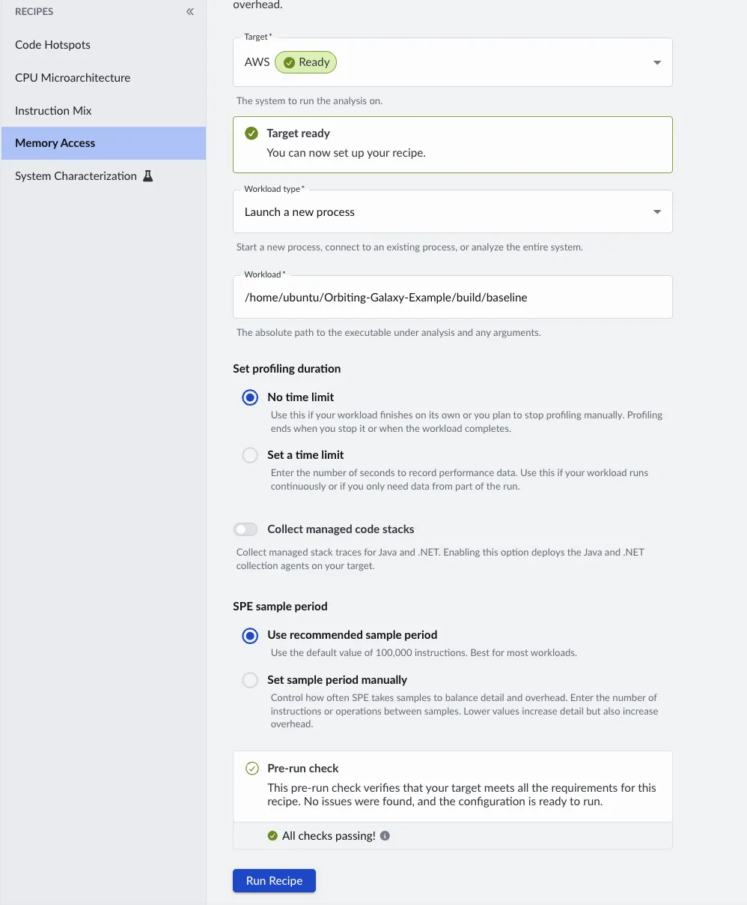
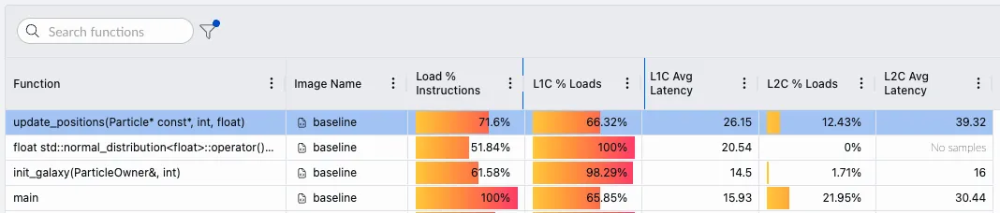
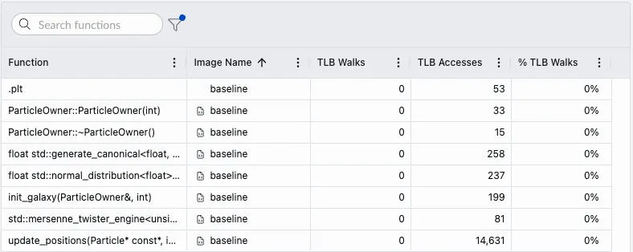
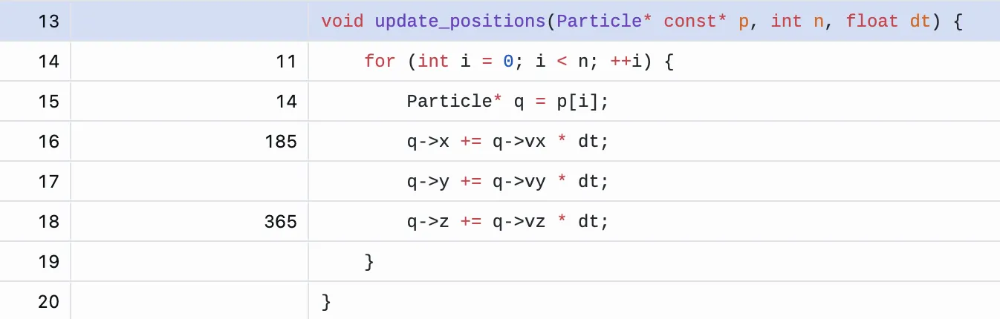

## Inspect the particle data structure

Start by inspecting the baseline particle model in `src/baseline/particle.hpp`.

{}

If you are using an IDE or editor with an LLM-based coding assistant, the `AGENTS.md` file can improve your learning experience. The `AGENTS.md` file provides the repository context and helps guide the agent to give more useful assistance.


{}

The baseline implementation stores every property for one particle in a single structure:

```cpp
struct Particle {
    float x, y, z;                   // position      (12 bytes)
    float vx, vy, vz;                // velocity      (12 bytes)
    float mass, charge, temperature; // properties    (12 bytes)
    float pressure, energy, density; //               (12 bytes)
    float spin_x, spin_y, spin_z;    //               (12 bytes)
    float pad;                       // padding        (4 bytes)
};
```

The ownership container in the same file is:

```cpp
class ParticleOwner {
    // Stores particle references used by the simulation.
    std::vector<Particle*> particles_;
};
```

The update loop in `src/baseline/baseline.cpp` repeatedly updates particle positions:

```cpp
for (int iter = 0; iter < iters; ++iter) {
    update_positions(particles.data(), NUM_PARTICLES, dt);
}
```

This baseline design can create avoidable memory overhead:

- `ParticleOwner` stores pointers to separately allocated `Particle` objects, so the hot loop must follow an extra level of indirection.
- Each `Particle` is 64 bytes, but the position update uses only `x`, `y`, `z`, `vx`, `vy`, and `vz`.
- Loading whole particle objects can waste cache capacity and memory bandwidth when the loop needs only a subset of fields.

Before you optimize anything, profile and measure.

## Run the Performix Memory Access recipe

Open the Performix GUI on your local machine and select the **Memory Access** recipe.

Configure the recipe to launch the baseline workload on your remote Arm target:

1. Select the configured remote target.
2. Set **Workload type** to **Launch a new process**.
3. Set **Workload** to the baseline executable:

```output
~/Orbiting-Galaxy-Example/build/baseline
```

Keep the default profiling duration so Performix records until the workload exits.



Start the recipe and wait for the results to load.

## Assess performance



Look at the memory access results for the baseline binary. Most samples are associated with the `update_positions()` function. The `L1C % Loads` value shows that only about two-thirds of loads hit in L1 cache, and the average L1 cache load latency is about 26 cycles. A cache-friendly hot loop should have a much higher L1 hit rate and lower average latency.

To investigate further, check the TLB walk data. As described in the background section, the TLB caches virtual-to-physical address translations. As per the following image, the `TLB Walk Breakdown` tab shows no significant TLB walks. That means address translation is not the main issue.



In summary:

- Average load latency is about 26 cycles, indicating frequent accesses beyond L1 cache.
- SPE samples are concentrated in `update_positions()`, confirming this loop dominates execution.
- TLB misses are not significant, so page walks are not the source of the slowdown.

Double-click the `update_positions()` row to open the source code view. The source view shows that the samples concentrate on the per-particle position updates.



The majority of samples are associated with accessing the `Particle` data structure, and the samples fall back to L2 cache approximately one-third of the time. Considering this, to improve the execution time of the example, you'll need to focus on more efficient ways, if any, of accessing the `Particle` member variables. For example, there might be an alternative data structure that has better cache utilization.

## What you've accomplished and what's next

You've now used Arm Performix to assess the memory performance of the orbiting galaxy particle simulator application using the Memory Access recipe. 

Next, you'll use these performance results to guide optimization of the application.
