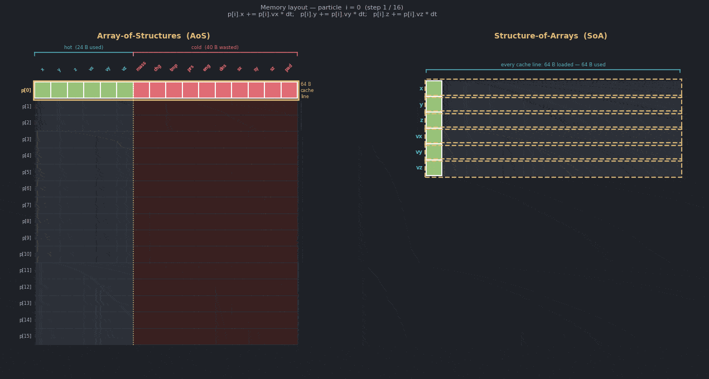
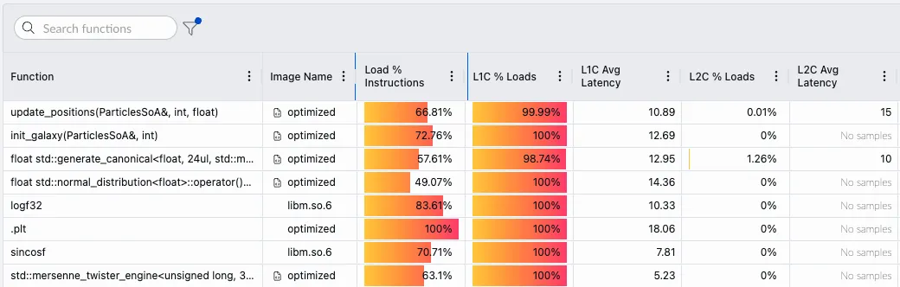

## Manually optimize the application

The `src/users_solution/` directory is an editable copy of `src/baseline`. Using the data collected from Performix, refactor the `Particle` data structure and associated function signatures and call sites to improve the L1 cache hit rate. The baseline result showed that `update_positions()` dominated the samples, had a low L1 cache hit rate, and did not show significant TLB walks.

{}

Consider how the `Particle` data structure maps to a 64-byte cache line. Also consider which member variables in the `Particle` struct are used in the hot loop.

{}

After you make changes in `src/users_solution/`, rebuild the binary with the following commands:

```bash
cd ~/Orbiting-Galaxy-Example/build
cmake --build . --parallel
```

Use the Performix GUI to assess performance changes for the `~/Orbiting-Galaxy-Example/build/users_solution` binary. A reference solution is available in `src/optimized`.

To measure wall time and compare it against the baseline, run:

```bash
/usr/bin/time -v ~/Orbiting-Galaxy-Example/build/users_solution
```

The hot loop is instrumented with `scopedTimer`, so you'll also see the loop duration printed directly to the terminal. Compare it with the baseline result of 571 milliseconds shown at the end of the section.

## Optimize with an AI agent and the Arm Performix MCP server

Arm Performix includes a local Model Context Protocol (MCP) server that you can use with an MCP-compatible coding assistant. The server can list Performix targets and runs, run recipes, and make profiling evidence available to the assistant. The following example shows how to connect the Arm Performix MCP server to OpenAI Codex. For other supported coding assistants, see [Configure the Arm Performix MCP server](https://developer.arm.com/documentation/110163/latest/Gather-performance-insights-with-AI-coding-agents/Configure-the-Arm-Performix-MCP-server).

{}

You need an OpenAI account to use the Codex CLI.

{}

Arm Performix is already installed from the setup earlier in this Learning Path. Configure Codex to start the local MCP server through the Arm Performix `apx` executable. Add the following to `~/.codex/config.toml`, replacing `<path-to-apx>` with the full path for your host operating system:

```toml
[mcp_servers.arm-performix]
command = "<path-to-apx>"
args = ["mcp", "start"]
```

For default `apx` paths and configuration through the Codex interface, see [Configure the Arm Performix MCP server in Codex](/learning-paths/servers-and-cloud-computing/performix-agentic-dynamic-insights-codex/configure_mcp_codex/).

The MCP server uses the targets configured in Arm Performix. For remote Linux targets, configure key-based SSH access and make sure your `known_hosts` file contains the target host key.

Restart Codex and ask it to inspect the Memory Access recipe before running it on the configured target. Replace the target name and workload path in this example:

```text
Use the Arm Performix MCP server to inspect the parameters and target support
for the Memory Access recipe. Run the recipe on target "<target-name>" with
workload "/home/<username>/Orbiting-Galaxy-Example/build/baseline". Before
starting, repeat the target and workload and ask me to confirm them. When the
run completes, return its run ID and summarize the measured L1 cache, latency,
and TLB evidence.
```

{}
Dynamic Insights aren't available for Memory Access runs. The MCP server can still run the recipe and query its measured data. Validate the L1 cache, latency, and TLB findings in the Performix GUI.
{}

The Arm Performix MCP server manages targets, recipes, and run data. It doesn't provide remote source-file access by itself. To use Codex for the code changes, make the `Orbiting-Galaxy-Example` checkout available in the Codex workspace.

After the run completes, replace `<run-id>` and ask Codex to connect the measurements to the source before proposing a change:

```text
Use the Arm Performix MCP server to query Memory Access run "<run-id>". Report
the L1C load hit rate, average L1C load latency, L2C load percentage, and TLB
walk evidence for update_positions(). Then inspect src/users_solution in the
current workspace and propose a minimal data-layout optimization based on the
measurements and source. Do not edit any files until I approve the proposal.
```

After you approve the proposal, ask Codex to update `src/users_solution`. Rebuild the binary on the target, rerun Memory Access against `build/users_solution`, and compare the same metrics with the baseline run. If Codex can't access the target checkout, apply the proposed patch on the target and continue to use the MCP server for collection and analysis.

For more prompt patterns, see [Example prompts for dynamic agentic insights](https://developer.arm.com/documentation/110163/latest/Gather-performance-insights-with-AI-coding-agents/Example-prompts-for-dynamic-agentic-insights).

## Review the optimized solution

A reference solution is available in the `src/optimized` directory of the repository. The baseline stores a vector of `Particle*` values, where each `Particle` is allocated separately and contains all particle fields in one 64-byte structure. The hot loop needs only `x`, `y`, `z`, `vx`, `vy`, and `vz`, but the baseline layout still steps through whole particle objects and performs unnecessary pointer chasing.

The optimized version changes the layout to a Structure of Arrays (SoA). Each field is stored in its own contiguous `std::vector<float>`:

```cpp
struct ParticlesSoA {
    std::vector<float> x, y, z;
    std::vector<float> vx, vy, vz;
    std::vector<float> mass, charge, temperature;
    std::vector<float> pressure, energy, density;
    std::vector<float> spin_x, spin_y, spin_z;
};
```

The `update_positions()` function then walks the hot position and velocity arrays directly:

```cpp
void update_positions(ParticlesSoA& p, int n, float dt) {
    for (int i = 0; i < n; ++i) {
        p.x[i] += p.vx[i] * dt;
        p.y[i] += p.vy[i] * dt;
        p.z[i] += p.vz[i] * dt;
    }
}
```

This removes `Particle*` indirection and improves cache-line utilization because the hot loop streams through only the data it uses.

The following diagram compares the baseline and optimized layouts. Even though each particle is padded to a 64-byte cache line, many struct members are not read or written in the hot loop, so they remain cold. With a structure-of-arrays layout, all particles are still owned together, but cache lines contain more of the data that the loop actually touches.



## Confirm with Performix

To see what fully optimized results look like, run the Performix Memory Access recipe against the pre-built reference binary. In the Performix GUI, rerun the recipe and change the binary path from `~/Orbiting-Galaxy-Example/build/baseline` to `~/Orbiting-Galaxy-Example/build/optimized`.



The optimized result shows much stronger L1 cache behavior. The hot update path now has `100%` L1C loads in the captured result and a lower average L1C latency than the baseline. This confirms that the data layout change improved locality, not just wall-clock time.

## Measure wall time and memory usage

Run the binaries directly on the remote machine without Performix to compare both wall time and memory usage:

```bash
/usr/bin/time -v ~/Orbiting-Galaxy-Example/build/baseline
/usr/bin/time -v ~/Orbiting-Galaxy-Example/build/optimized
```

The hot loop is also instrumented with `scopedTimer`, so you can directly observe the speedup from the change.

The output is similar to:

```output
Baseline took 571 milliseconds
        Command being timed: "./build/baseline"
        User time (seconds): 0.66
        System time (seconds): 0.02
        Percent of CPU this job got: 99%
        Elapsed (wall clock) time (h:mm:ss or m:ss): 0:00.69
        Average shared text size (kbytes): 0
        Average unshared data size (kbytes): 0
        Average stack size (kbytes): 0
        Average total size (kbytes): 0
        Maximum resident set size (kbytes): 92720
        Average resident set size (kbytes): 0
        Major (requiring I/O) page faults: 0
        Minor (reclaiming a frame) page faults: 22655
...
Optimized took 279 milliseconds
        Command being timed: "./build/optimized"
        User time (seconds): 0.35
        System time (seconds): 0.02
        Percent of CPU this job got: 100%
        Elapsed (wall clock) time (h:mm:ss or m:ss): 0:00.37
        Average shared text size (kbytes): 0
        Average unshared data size (kbytes): 0
        Average stack size (kbytes): 0
        Average total size (kbytes): 0
        Maximum resident set size (kbytes): 64044
        Average resident set size (kbytes): 0
        Major (requiring I/O) page faults: 0
        Minor (reclaiming a frame) page faults: 15500
```


| Metric                | Baseline      | Optimized     | Explanation                                                                                 |
|-----------------------|--------------|--------------|---------------------------------------------------------------------------------------------|
| Wall time (ms)        | 571          | 279          | The optimized layout improves cache usage and removes pointer chasing, roughly halving execution time. |
| Max RSS (KB)          | 92,720       | 64,044       | Structure of Arrays reduces memory footprint by removing per-object overhead and cold fields.   |
| Minor page faults     | 22,655       | 15,500       | Fewer pages are touched due to more compact, contiguous storage of only needed data fields.  |
| L1 cache hit rate (%) | 66.32        | 99.99        | Hot data is now accessed in a cache-friendly pattern, maximizing L1 cache effectiveness.      |
| L1 avg latency (cycles)| 26.15        | 10.89        | Each L1 load takes fewer cycles because pointer chasing is removed. |


## What you've accomplished

You used Arm Performix manually and through the Arm Performix MCP server to identify a memory access bottleneck in a C++ particle simulation. You then connected the profile data to source code, found that the hot loop suffered from poor data layout and unnecessary pointer chasing, and improved the implementation with a Structure of Arrays layout. You validated the change with direct wall-time measurements and a second Performix run.

This approach combines measurement tools, code context, and focused prompts to iterate on real bottlenecks.
