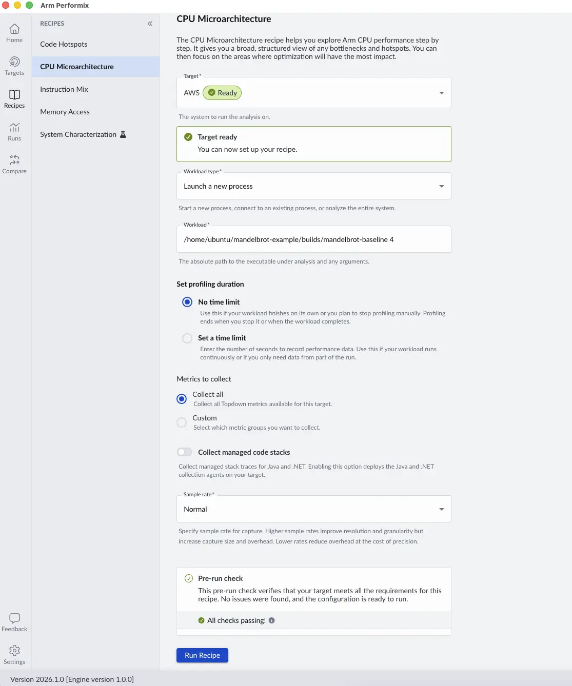
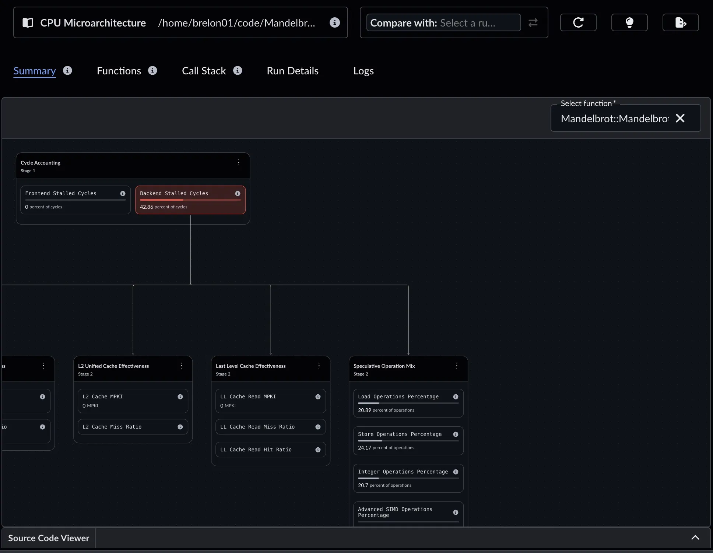
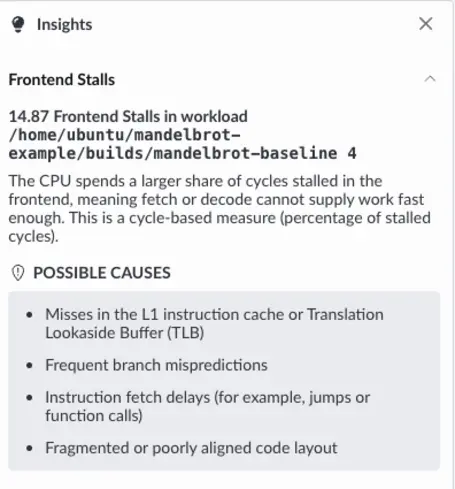

## Run the CPU Microarchitecture recipe

To identify performance bottlenecks, run the CPU Microarchitecture recipe in Arm Performix. Arm Performix uses microarchitectural sampling to show which instruction pipeline stages dominate program latency, and then highlights ways to improve those bottlenecks.

Start by reviewing the code in `main.cpp`, the program generates a 1920×1080 bitmap image of the fractal.

```cpp
#include "Mandelbrot.h"
#include <iostream>

using namespace std;

int main(int argc, char* argv[]){

    const int NUM_THREADS = std::stoi(argv[1]);
    std::cout << "Number of Threads = " << NUM_THREADS << std::endl;

    Mandelbrot::Mandelbrot myplot(1920, 1080, NUM_THREADS);
    myplot.draw("/home/ec2-user/Mandelbrot-final/Mandelbrot-Example/images/Green-Parallel-512.bmp", Mandelbrot::Mandelbrot::GREEN);

    return 0;
}
```

When Arm Performix launches the executable on the target machine, it does so from a temporary agent directory, `/tmp/atperf/tools/atperf-agent`. If your code uses a relative path to save the image, the image is written to that temporary folder and might be deleted. 

To prevent this, edit the `myplot.draw()` line in `main.cpp` to use the absolute path to your project's image folder (for example, `/home/ubuntu/Mandelbrot-Example/images/Green-Parallel-512.bmp`), and then rebuild the application.

In the Arm Performix application on your host machine, select the **CPU Microarchitecture** recipe.



Select the target you configured in the setup section. If this is your first run on this target, you might need to select **Install Tools** to copy the collection tools to the target. After the tools are installed, you see the target is now ready.

Next, select the **Workload type** and select **Launch a new process**.

Enter the absolute path to your executable in the **Workload** field. For example, `/home/ubuntu/Mandelbrot-Example/builds/mandelbrot-parallel`. Make sure to add the number of threads argument.

{}
Use the full path to your executable because the **Workload** field doesn't currently support shell-style path expansion.
{}

Before starting the analysis, you can customize the configuration. For instance, you can set a time limit for the workload or choose specific metrics to investigate. You can also adjust the sampling rate (High, Normal, or Low) to balance collection overhead against sampling granularity. Because this Mandelbrot example is a native C++ application, you can ignore the **Collect managed code stacks** toggle, which is used for Java or .NET workloads.

When your configuration is ready, select **Run Recipe** to launch the workload and collect the performance data.

## View the run results

Arm Performix generates a high-level instruction pipeline view, highlighting where the most time is spent.



In this breakdown, Backend Stalls dominate the samples. Within that category, work is split between Load Operations and integer and floating-point operations.
There is no measured SIMD activity, even though this workload is highly parallelizable.

The **Insights** panel highlights ALU contention as a likely improvement opportunity:



To inspect executed instruction types in more detail, use the Instruction Mix recipe in the next step.

## What you've learned and what's next

In this section:
- You ran the CPU Microarchitecture recipe on the Mandelbrot application.
- You identified that the application spends most of its time in Backend Stalls without using SIMD operations.

Next, you'll run the Instruction Mix recipe to confirm where optimization opportunities exist and implement vectorization.