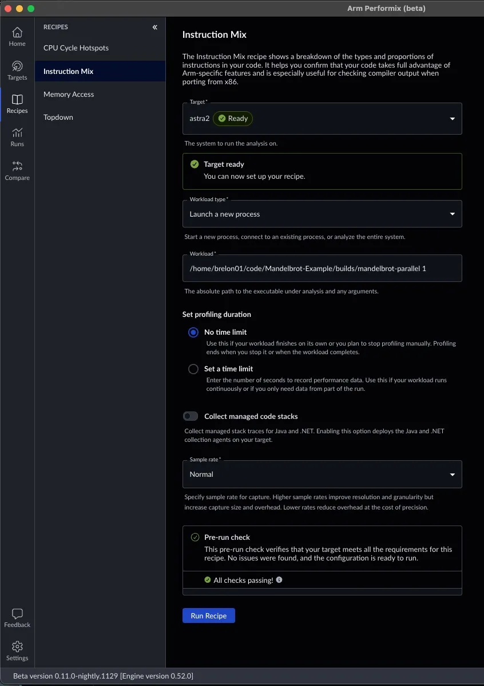
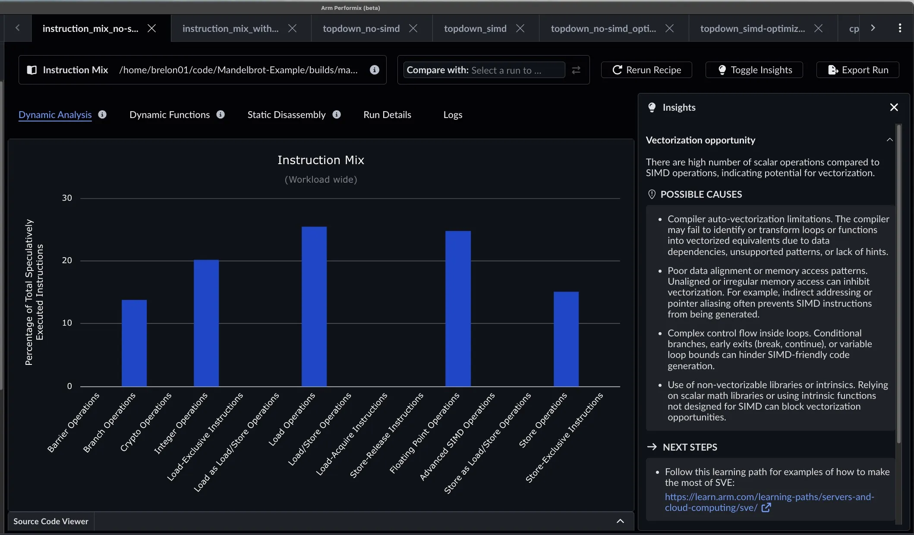
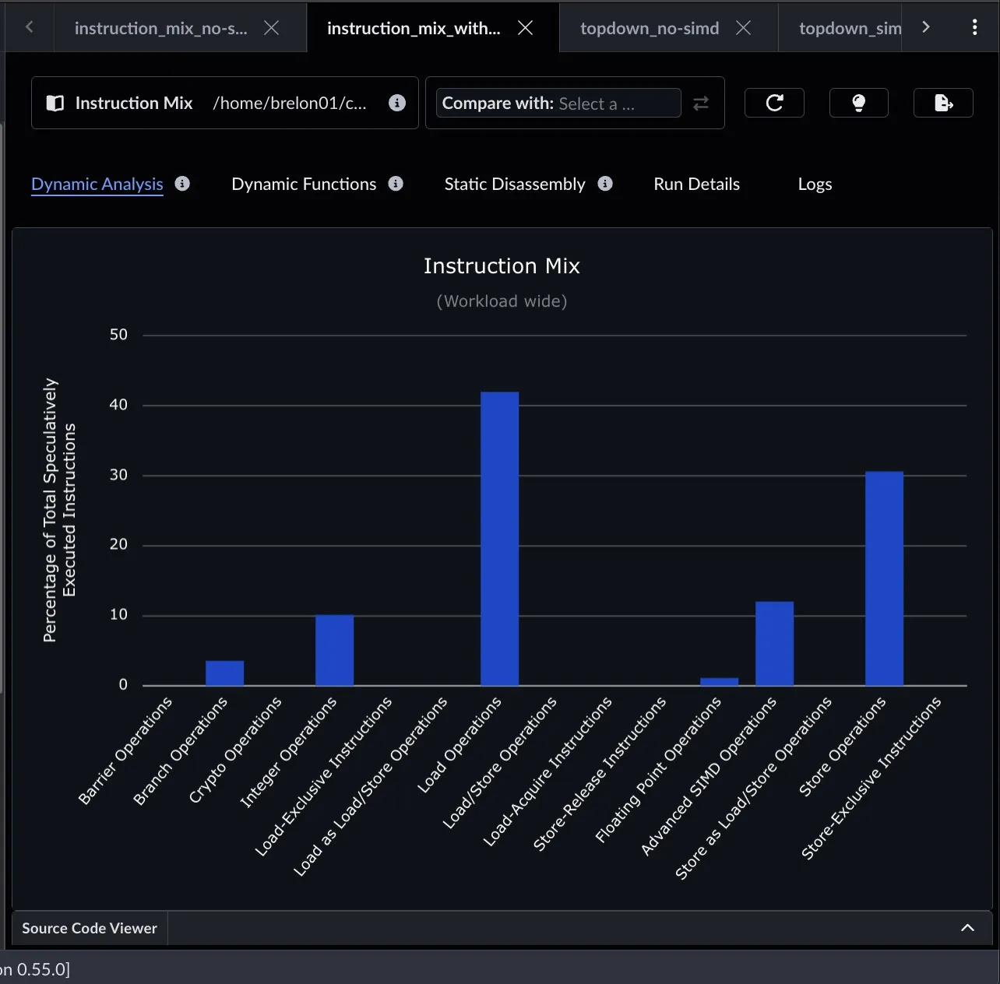
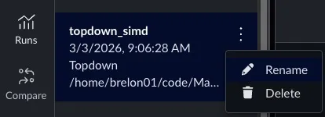
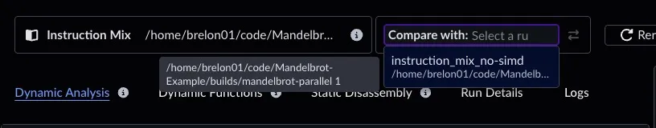
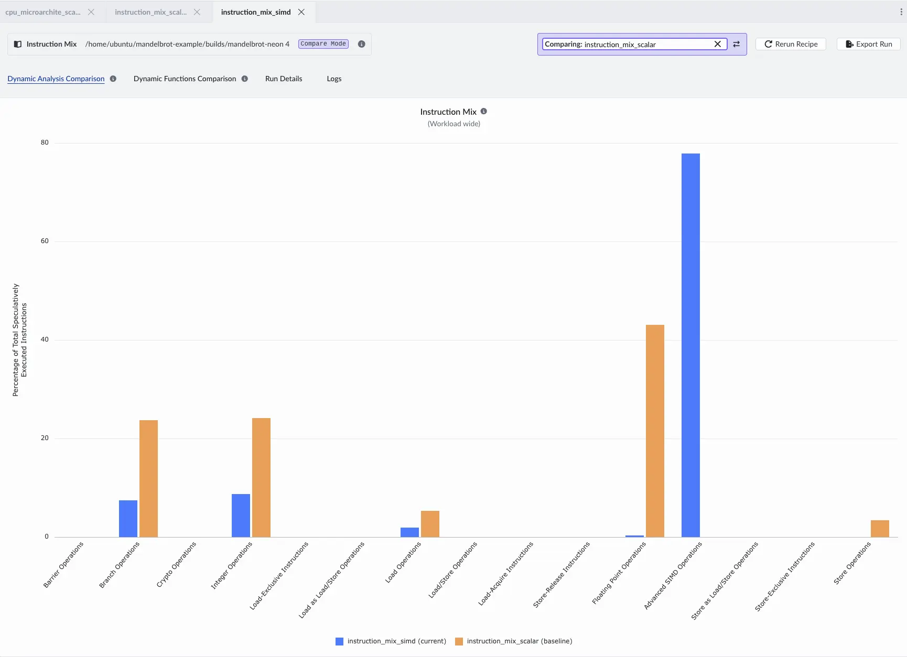
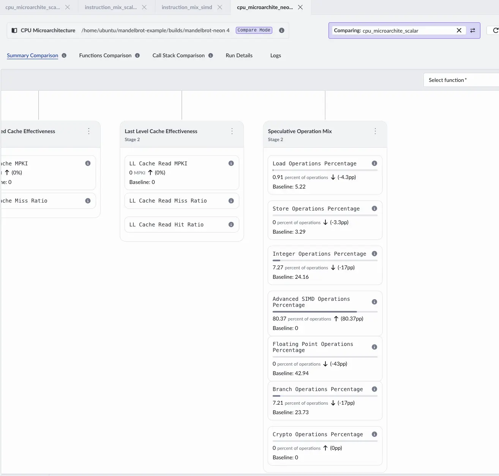
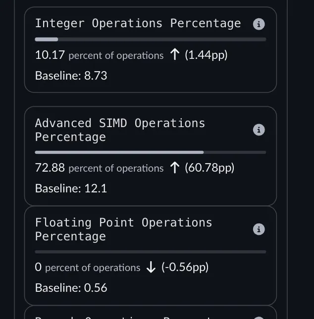
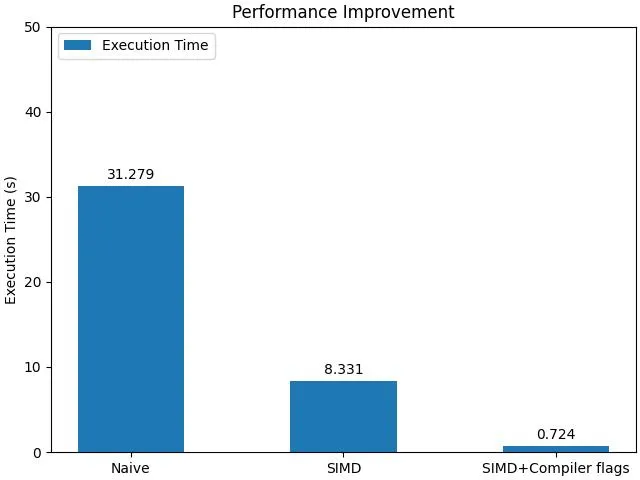

## Run the Instruction Mix recipe

The previous CPU Microarchitecture analysis showed that the sample application used no single instruction, multiple data (SIMD) operations, which points to an optimization opportunity. Run the Instruction Mix recipe to learn more. The Instruction Mix launch panel is similar to CPU Microarchitecture, but it does not include options to choose metrics. Again, enter the full path to the workload. 

Select **Dynamic** f for the **Analysis Mode**. 



The results below confirm a high number of integer and floating-point operations, with no SIMD operations. The **Insights** panel suggests vectorization as a path forward, lists possible root causes, and links to related Learning Paths.



## Vectorize the application

To address the lack of SIMD operations, you can vectorize the application's most intensive functions. For the Mandelbrot application, `Mandelbrot::draw` and its inner `Mandelbrot::getIterations` function consume most of the runtime. A vectorized version is available in the [instruction-mix branch](https://github.com/arm-education/Mandelbrot-Example/tree/instruction-mix). This branch uses Neon operations, which run on any Neoverse system. Your system might support alternatives such as SVE or SVE2 which can also be used.

Connect to your target machine using SSH and navigate to your project directory. Because you modified `main.cpp` earlier, you must stash your changes before switching to the `instruction-mix` branch. Then, rebuild the application:

```bash
cd $HOME/Mandelbrot-Example
git stash
git checkout instruction-mix
./build.sh
```

After you rebuild the application and run the Instruction Mix recipe again, integer and floating-point operations are greatly reduced and replaced by a smaller set of SIMD instructions.



## Assess the performance improvements

Because you are running multiple experiments, give each run a meaningful nickname to keep results organized.


Use the **Compare** feature at the top right of an entry in the **Runs** view to select another run of the same recipe for comparison.



This selection box lets you choose any run of the same recipe type. The ⇄ arrows swap which run is treated as the baseline and which is current.

After you select two runs, Arm Performix overlays them so you can review category changes in one view. In the new run, note that 


Compared to the baseline, floating-point operations, branch operations, and some integer operations have been traded for loads, stores, and SIMD operations.
Execution time also improves significantly, making this run nearly four times faster.

```bash { command_line="root@localhost | 2-6" }
time builds/mandelbrot-parallel-no-simd 1
Number of Threads = 1

real    0m31.326s
user    0m31.279s
sys     0m0.011s
```

```bash { command_line="root@localhost | 2-6" }
time builds/mandelbrot-parallel 1
Number of Threads = 1

real    0m8.362s
user    0m8.331s
sys     0m0.016s
```

## Compare the CPU Microarchitecture results

The CPU Microarchitecture recipe also supports a **Compare** view that shows percentage-point changes in each stage and instruction type.


You can now see that Load and Store operations account for about 70% of execution time. **Insights** offers several explanations because multiple issues can contribute to the root cause.
```
The CPU spends a larger share of cycles stalled in the backend, meaning execution or memory resources cannot complete work fast enough. This is a cycle-based measure (percentage of stalled cycles).

POSSIBLE CAUSES

- Slow memory access, for example, L2 cache misses or Dynamic Random-Access Memory (DRAM) misses
- Contention in execution pipelines, for example, the Arithmetic Logic Unit (ALU) or load/store units
- Poor data locality
- Excessive branching
- Instruction dependencies that create pipeline bubbles
```

## Apply compiler optimizations for loop unrolling

To address the new load and store bottlenecks, add optimization flags to the compiler to enable more aggressive loop unrolling. Edit the `build.sh` script to include these flags in the `CXXFLAGS` array:
```bash
    # build.sh
    CXXFLAGS=(
        --std=c++11
        -O3
        -mcpu=neoverse-n1+crc+crypto
        -ffast-math
        -funroll-loops
        -flto
        -DNDEBUG
    )
```

After saving the file, run `./build.sh` to compile the application with the new flags.

Runtime improves again, with an additional 11x speedup over the SIMD build that used the default compiler flags.


```bash { command_line="root@localhost | 2-6" }
time ./builds/mandelbrot-parallel 1
Number of Threads = 1

real    0m0.743s
user    0m0.724s
sys     0m0.014s
```

Another CPU Microarchitecture measurement shows that Load and Store bottlenecks are almost eliminated. SIMD floating-point operations now dominate execution, which indicates the application is better tuned to feed floating-point execution units.


The program still generates the same output, and runtime drops from 31 s to less than 1 s, a 43x speedup.



## What you've accomplished and what's next

In this section:
- You used the Instruction Mix recipe to confirm a lack of SIMD operations.
- You vectorized the sample application and verified the shift toward SIMD execution.
- You applied compiler loop unrolling to relieve backend load/store bottlenecks, achieving over 40x speedup.

You are now ready to analyze and optimize your own native C/C++ applications on Arm Neoverse using Arm Performix. Review the next steps to continue your learning journey.