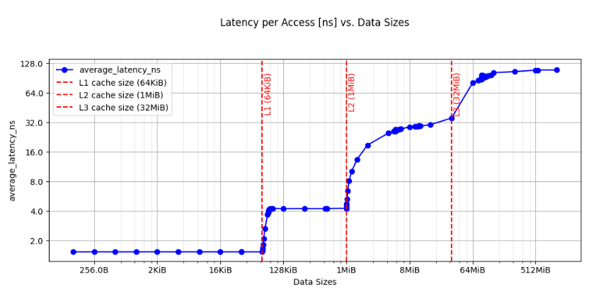

## Understand the System Characterization recipe

The System Characterization recipe runs a set of low-level benchmarks, diagnostic scripts, and system tests to analyze performance on Arm-based platforms. It evaluates key hardware characteristics, including memory latency and bandwidth, and is especially useful for platform bring-up, system tuning, and architectural comparisons. It helps developers and system architects gather early, repeatable insight into performance-critical subsystems.

The latency sweep plot below shows one of the benchmarks that System Characterization provides: the average latency of memory accesses across varying working-set sizes, revealing the latency of each cache level in the memory hierarchy.



## Before you begin

Make sure Arm Performix is installed on your host machine. The host machine is your local computer where the Arm Performix GUI runs, and it can be a Windows, macOS, or Linux machine. The target machine is the Linux server you wish to benchmark and characterize.

If you do not have Arm Performix installed, see the [Arm Performix install guide](/install-guides/performix/).

From the host machine, open Arm Performix and navigate to the **Targets** tab. Set up an SSH connection to the target you want to benchmark, and test the connection.

The System Characterization recipe requires Python and the `numactl` utility on the target machine. Connect to your target machine via SSH and install these required packages.

For Ubuntu and other Debian-based distributions, run the following command:

```bash
sudo apt-get update
sudo apt install python3 python3-venv python3-pip python-is-python3 gcc make numactl fio linux-tools-generic linux-tools-$(uname -r) -y
```

## What you've learned and what's next

In this section:
- You set up the target machine and established an SSH connection.
- You installed the packages required to run the System Characterization recipe.

Next, you'll run the recipe and inspect how your hardware platform performs.
