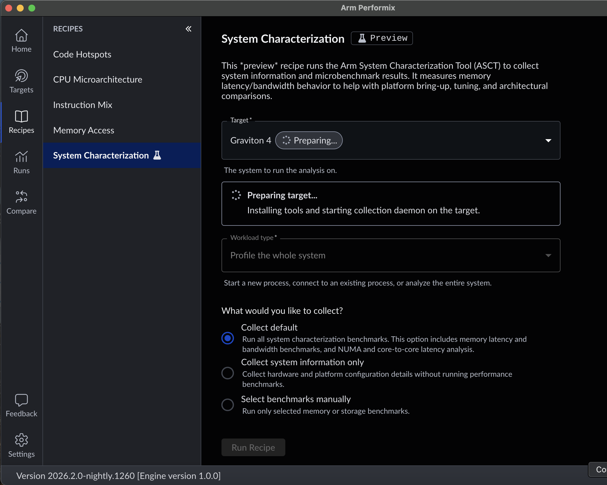
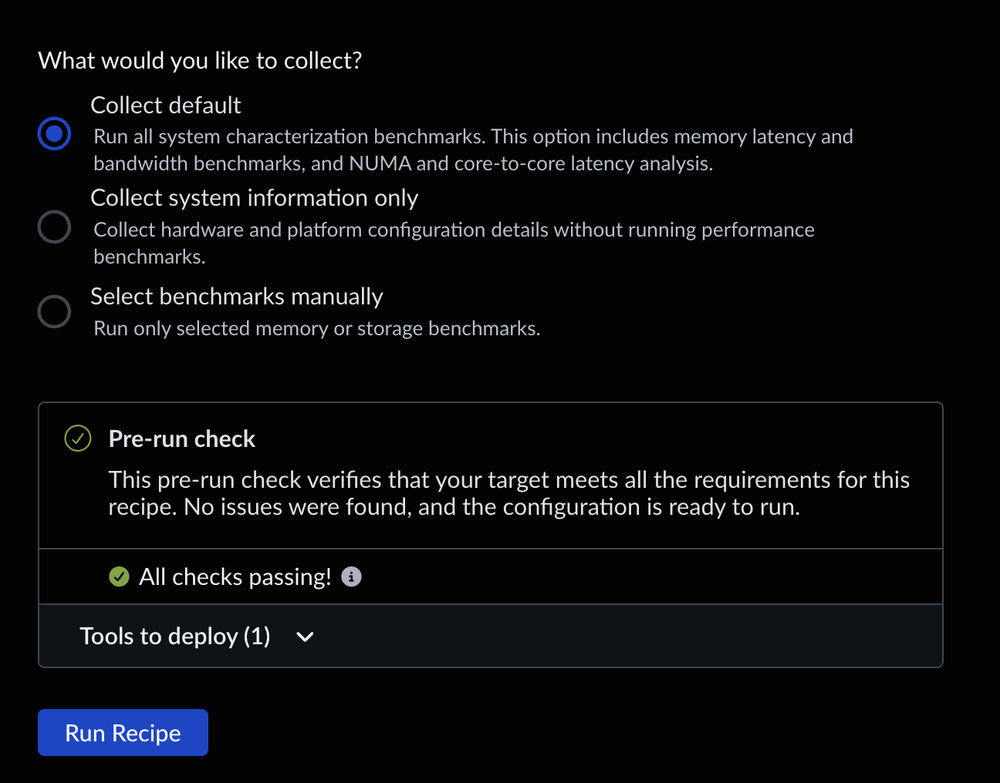
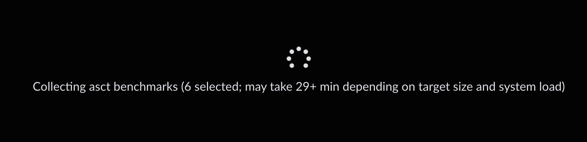
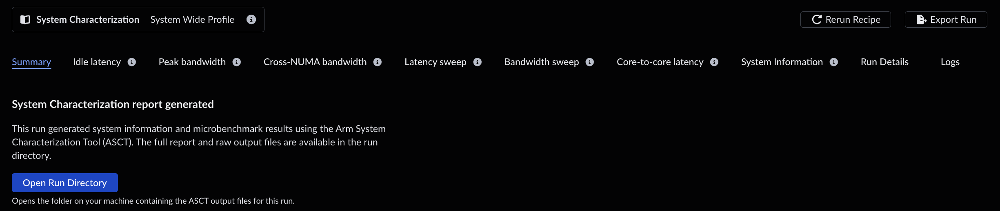

## Run the System Characterization recipe

To understand your platform's memory performance in its current configuration, run the System Characterization recipe in Arm Performix.

You can collect the default benchmark set, gather only static system configuration details, or select individual benchmarks to run.

Select the target you configured in the setup section. If this is your first run on this target, you might need to select **Install Tools** to copy the collection tools to the target. After the tools are installed, the target status changes to ready.

The **Workload type** field is fixed at **Profile the whole system**. System Characterization examines the full platform; it does not profile an individual application or workload.

At the bottom of the recipe configuration page, Arm Performix runs a pre-run check to confirm that required packages such as `numactl` are installed.

When the configuration is complete, select **Run Recipe** to launch the workload and collect performance data. Arm Performix shows a progress indicator with an estimated completion time. If you manually select many benchmarks, the run can take around 30 minutes.

{}
Ensure you have passwordless `sudo` configured for the user account you are using to SSH. See the [Arm Performix User Guide](https://developer.arm.com/documentation/110163/2026-2-1/Prepare-your-target-for-Arm-Performix-connections/Configure-SSH-access-and-privileges-on-Linux-targets/Set-up-passwordless-sudo-access-on-Linux) for details on preparing your target for Arm Performix connections.
{}

## View the run results

The System Characterization recipe generates several result views. Arm Performix presents tabular data in views such as **Idle Latency** and **Peak Bandwidth**. Raw data, `.csv` files, and plots are available through the **Open Run Directory** button on the **Summary** tab. The following pages walk through several of these result views.

## What you've learned and what's next

In this section:
- You ran the System Characterization recipe on your target machine.
- You viewed the results generated for the run.

Next, you'll examine benchmark data collected from the individual tests.
