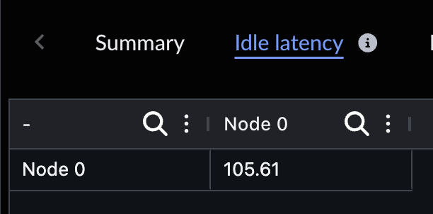
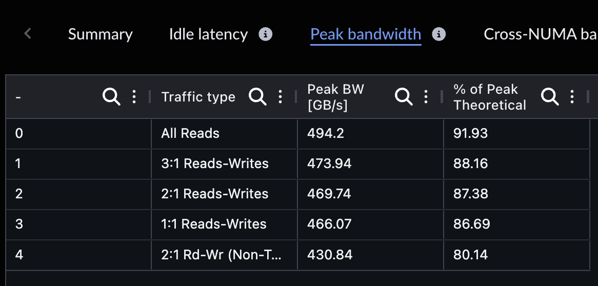
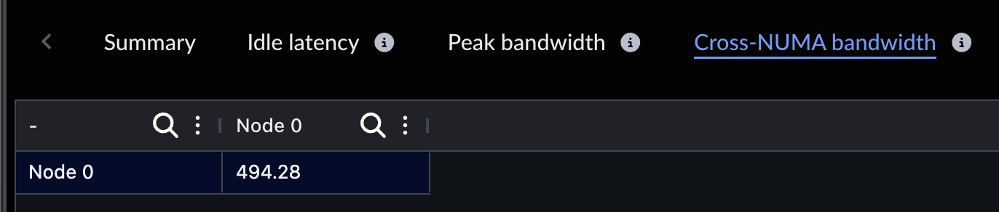
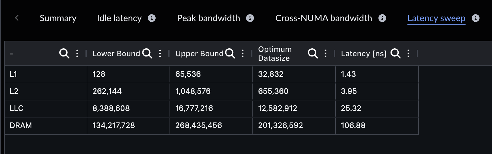
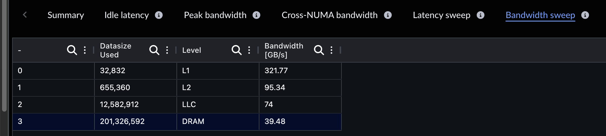
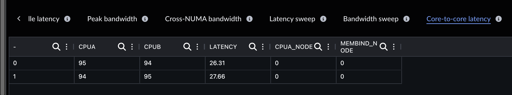
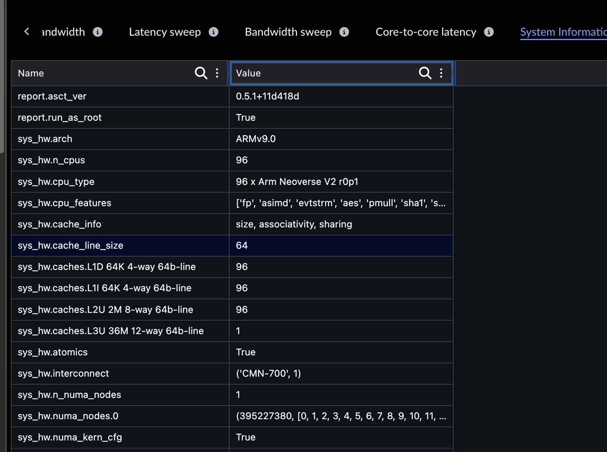

## View the run results in the Performix GUI

Because the System Characterization recipe uses the standalone Arm System Characterization Tool (ASCT), it creates an output directory for all ASCT results and imports a subset of those results into the GUI. At the time of writing, Performix presents the data in tabular form and links to the output directory for plots and raw data.

### Idle Latency

In **Idle Latency**, ASCT reports memory latency for each non-uniform memory access (NUMA) node while the system is idle. You can use this view to spot bottlenecks caused by workload placement and to identify which nodes are closest to memory resources.

### Peak Bandwidth

**Peak Bandwidth** shows the maximum measured memory bandwidth for different read and write patterns, and compares those results with the theoretical peak bandwidth of the system.

### Cross-NUMA Bandwidth

**Cross-NUMA Bandwidth** shows the bandwidth achieved when memory requests cross NUMA node boundaries.

### Latency Sweep

The latency sweep benchmark measures latency by data size to map the cache hierarchy and identify appropriate data sizes for other benchmarks. It highlights the performance characteristics of each level of the cache and memory hierarchy.

### Bandwidth Sweep

The bandwidth sweep benchmark varies the data size used to generate memory accesses and measures the bandwidth delivered by each level of the memory hierarchy.

### Core-to-Core Latency

The core-to-core latency benchmark measures the latency of moving data from one core to another. Because the number of core pairs grows quickly, this benchmark runs on only a subset of system cores by default.

### System Information

This table shows the system information collected by ASCT, including CPU, memory, and storage details.

## What you've learned and what's next

In this section:
- You viewed benchmark results from ASCT in the Arm Performix results view.

Next, you'll inspect plots from the ASCT output directory that are not yet displayed directly in the Performix UI.
