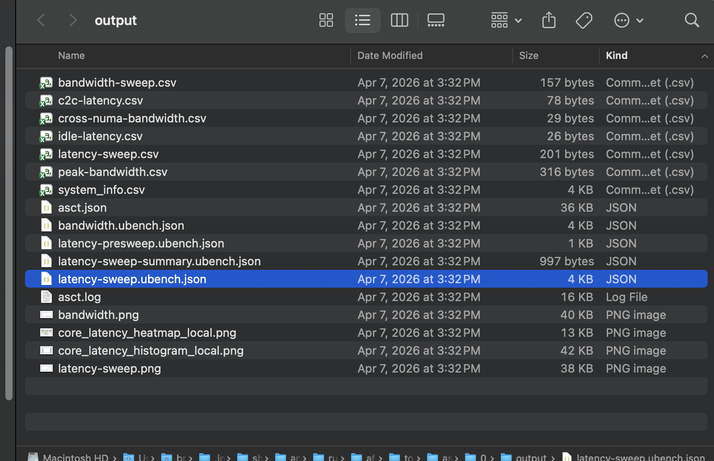
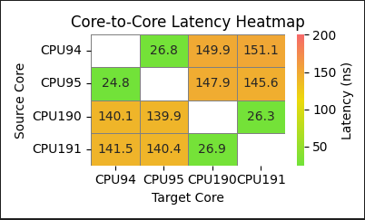

## Open the System Characterization results directory

Arm Performix also provides a link to the underlying Arm System Characterization Tool run directory. By following this link, you can inspect plots that are not yet available in the GUI. You can also access the underlying `.json` data files for integration with other tools.

Select the **Open Run Directory** button on the **Summary** page of your run.

This opens a file browser that contains `.png` and `.json` files for the various benchmarks.

## Inspect the generated plots

### Latency sweep

The latency sweep plot shows how the size of a memory access pattern affects memory latency. Red bars indicate the points at which different cache levels become active.

### Bandwidth sweep

The bandwidth sweep plot shows how certain memory access sizes can significantly affect system memory bandwidth. The results are saved in `bandwidth.png`.

### Core-to-core latency

The `core_latency_heatmap_local.png` plot shows a color-coded heatmap of which core combinations incur higher latency.

## What you've learned

You've viewed the plots and raw data files generated by the Arm System Characterization Tool.

You're now ready to analyze and optimize your own platform with Arm Performix and the Arm System Characterization Tool recipe.
