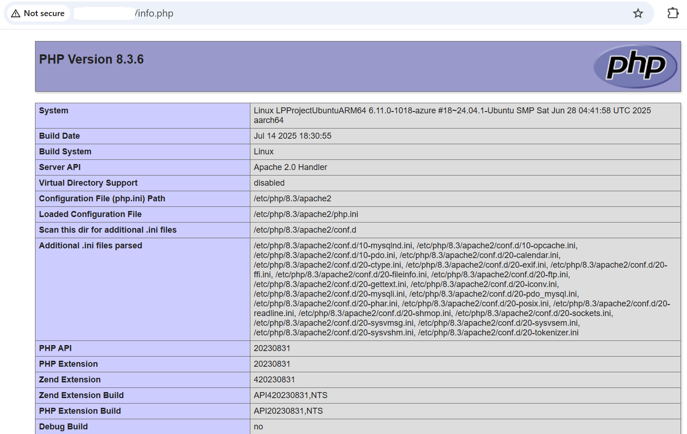

## Baseline Setup for PHP-FPM
In this section, you’ll configure PHP-FPM (FastCGI Process Manager) on a SUSE Linux Arm-based Google Cloud Axion C4A virtual machine. You’ll set up the PHP-FPM pool, verify FastCGI configuration, connect PHP-FPM to Apache, and confirm that your Arm server is ready for dynamic PHP workloads.

### Configure the PHP-FPM Pool

PHP-FPM (FastCGI Process Manager) runs PHP scripts in dedicated worker processes, independent of the web server. This design improves performance, security, and fault isolation—especially on multi-core Arm-based processors like Google Cloud Axion C4A VMs.

A pool is a group of PHP worker processes that serve FastCGI requests. You can use separate pools for different applications or virtual hosts to control resources more effectively.

### Copy the Default Configuration (if missing)

If your PHP-FPM configuration files don't exist yet (for example, after a minimal installation in this Learning Path), copy the defaults into place using the commands below:

```console
sudo cp /etc/php8/fpm/php-fpm.d/www.conf.default /etc/php8/fpm/php-fpm.d/www.conf
sudo cp /etc/php8/fpm/php-fpm.conf.default /etc/php8/fpm/php-fpm.conf
```
These commands:
- Create a default pool configuration (`www.conf`) to control how PHP-FPM spawns and manages worker processes.
- Restore the main FPM service configuration (`php-fpm.conf`) if it’s missing.

### Edit the Configuration

Open the PHP-FPM pool configuration file in a text editor:

```console
sudo vi /etc/php8/fpm/php-fpm.d/www.conf
```

Locate the following line:

```output
listen = 127.0.0.1:9000
```
Replace it with the following configuration to use a Unix socket instead of a TCP port:

```console
listen = /run/php-fpm/www.sock
listen.owner = wwwrun
listen.group = www
listen.mode = 0660
```

Explanation of each directive:
| Directive                                             | Description                                                                                                                                                                   |
| ----------------------------------------------------- | ----------------------------------------------------------------------------------------------------------------------------------------------------------------------------- |
| listen = /run/php-fpm/[www.sock](http://www.sock) | Configures PHP-FPM to communicate with Apache using a local Unix socket instead of a TCP port (`127.0.0.1:9000`). This reduces network overhead and improves performance. |
| listen.owner = wwwrun                             | Sets the owner of the socket file to `wwwrun`, which is the default user that Apache runs as on SUSE systems. This ensures Apache has access to the socket.               |
| listen.group = www                                | Assigns the group ownership of the socket to `www`, aligning with Apache’s default process group for proper access control.                                               |
| listen.mode = 0660                                | Defines file permissions so that both the owner (`wwwrun`) and group (`www`) can read and write to the socket. This enables smooth communication between Apache and PHP-FPM.  |


### Start and Enable PHP-FPM

After updating the configuration, restart the PHP-FPM service so it picks up the new settings:

```console
sudo systemctl restart php-fpm
```
Then, verify that PHP-FPM is running:

```console
sudo systemctl status php-fpm
```

You should see output similar to:

```output
● php-fpm.service - The PHP FastCGI Process Manager
     Loaded: loaded (/usr/lib/systemd/system/php-fpm.service; disabled; vendor preset: disabled)
     Active: active (running) since Thu 2025-10-16 13:56:44 UTC; 7s ago
   Main PID: 19606 (php-fpm)
     Status: "Ready to handle connections"
      Tasks: 3
        CPU: 29ms
     CGroup: /system.slice/php-fpm.service
             ├─ 19606 "php-fpm: master process (/etc/php8/fpm/php-fpm.conf)" "" "" "" "" "" "" "" "" "" "" "" "" "" "" "" "" "" "" ""
             ├─ 19607 "php-fpm: pool www" "" "" "" "" "" "" "" "" "" "" "" "" "" "" "" "" "" "" "" "" "" "" "" "" "" "" "" "" "" "" "" "" "" "" "" "" "" "" "" "">
             └─ 19608 "php-fpm: pool www" "" "" "" "" "" "" "" "" "" "" "" "" "" "" "" "" "" "" "" "" "" "" "" "" "" "" "" "" "" "" "" "" "" "" "" "" "" "" "" "">

Oct 16 13:56:44 pareena-php-test systemd[1]: Starting The PHP FastCGI Process Manager...
Oct 16 13:56:44 pareena-php-test systemd[1]: Started The PHP FastCGI Process Manager.
```
PHP-FPM is now active and ready to process requests via its Unix socket (`/run/php-fpm/www.sock`).
Next, you’ll configure Apache to communicate with PHP-FPM, allowing your Arm server to process and serve dynamic PHP pages.

## Install the Apache PHP8 module
If you want Apache to handle PHP execution directly (instead of using PHP-FPM), install the Apache PHP 8 module, which integrates PHP into Apache using the `mod_php` interface:

```console
sudo zypper install apache2-mod_php8
```
Once the module is installed, restart Apache to load the new configuration:

```console
sudo systemctl restart apache2
```
Next, you’ll test PHP execution by creating a simple PHP page and verifying that Apache can correctly render dynamic content.

## Test PHP
Now that PHP and Apache are installed, you can verify that everything is working correctly on your Arm-based VM.

### Create a Test Page
Create a simple PHP file that displays detailed information about your PHP installation:

```console
echo "<?php phpinfo(); ?>" | sudo tee /srv/www/htdocs/info.php
```
This creates a file named `info.php` inside Apache’s web root directory (`/srv/www/htdocs/`). When you open this file in a browser, it displays the PHP configuration page.

### Test from Inside the VM
You can verify that PHP and Apache are communicating correctly by testing the web server locally using curl:

```console
curl http://localhost/info.php
```
- `curl` fetches the page from the local Apache server.
- If PHP is working, you’ll see a large block of HTML code as output. This is the rendered output of the `phpinfo()` function.
- This confirms that Apache successfully passed the request to the PHP interpreter and returned the generated HTML response.

You should see output similar to:

```output
<!DOCTYPE html PUBLIC "-//W3C//DTD XHTML 1.0 Transitional//EN" "DTD/xhtml1-transitional.dtd">
<html xmlns="http://www.w3.org/1999/xhtml"><head>
<style type="text/css">
body {background-color: #fff; color: #222; font-family: sans-serif;}
pre {margin: 0; font-family: monospace;}
a:link {color: #009; text-decoration: none; background-color: #fff;}
a:hover {text-decoration: underline;}
table {border-collapse: collapse; border: 0; width: 934px; box-shadow: 1px 2px 3px rgba(0, 0, 0, 0.2);}
.center {text-align: center;}
.center table {margin: 1em auto; text-align: left;}
.center th {text-align: center !important;}
td, th {border: 1px solid #666; font-size: 75%; vertical-align: baseline; padding: 4px 5px;}
th {position: sticky; top: 0; background: inherit;}
h1 {font-size: 150%;}
h2 {font-size: 125%;}
h2 a:link, h2 a:visited{color: inherit; background: inherit;}
```
This long HTML output represents the PHP configuration page content.

### Test from Your Browser
Now, verify that your PHP setup works correctly from outside the VM.
Open a web browser on your local machine (such as Chrome, Firefox, or Edge) and enter the following URL in the address bar:

```console
http://<YOUR_VM_PUBLIC_IP>/info.php
```
- Replace `<YOUR_VM_PUBLIC_IP>` with the public IP of your Google Cloud Axion C4A Arm VM.

If everything is set up correctly, you’ll see a PHP Info page in your browser. It looks like this:



Successfully loading the PHP Info page in your browser confirms that your PHP and Apache environment on Google Cloud Axion C4A Arm is configured and functioning properly.

You’ve validated your PHP baseline setup on an Arm-based Google Cloud VM. You’re ready to move on to benchmarking and performance testing for your PHP workloads on Arm.
