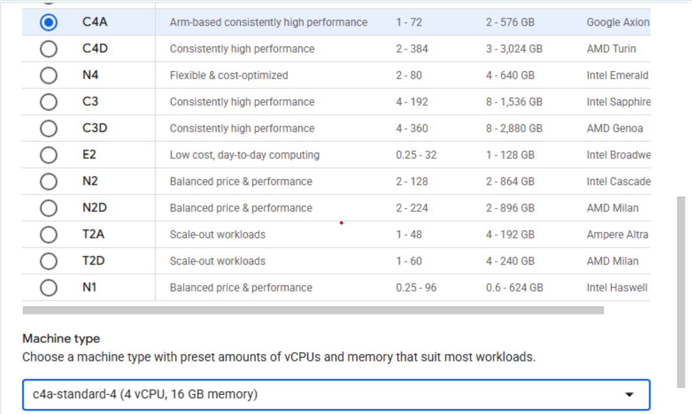

## Overview

In this section, you will learn how to provision a Google Axion C4A Arm virtual machine on Google Cloud Platform (GCP) using the `c4a-standard-4` (4 vCPUs, 16 GB memory) machine type in the Google Cloud Console.  

{}
For support on GCP setup, see the Learning Path [Getting started with Google Cloud Platform](https://learn.arm.com/learning-paths/servers-and-cloud-computing/csp/google/).
{}

## Provision a Google Axion C4A Arm VM in Google Cloud Console

To create a virtual machine based on the C4A instance type:
- Navigate to the [Google Cloud Console](https://console.cloud.google.com/).
- Go to **Compute Engine** > **VM Instances** and select **Create Instance**. 
- Under Machine configuration:
   - Populate fields such as **Instance name**, **Region**, and **Zone**.
   - Set **Series** to `C4A`.
   - Select `c4a-standard-4` for machine type.

   

- Under **OS and Storage**, select **Change**, then select an Arm64-based OS image. For this Learning Path, select **SUSE Linux Enterprise Server**. Select the preferred version for your operating system. Ensure you select the **Arm image** variant. Click **Select**.
- Under **Networking**, enable **Allow HTTP traffic**.
- Click **Create** to launch the instance.
