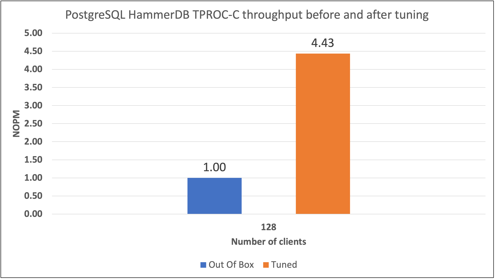

## About performance tuning

Performance tuning is most useful when you treat it as a measurement process, not a fixed checklist. You can tune by changing one parameter at a time, running a designed experiment, comparing profiles, or using automation and AI-assisted tools to explore a larger configuration space.

There isn't a universal set of tuning parameters that works best for every PostgreSQL deployment. The right settings depend on the workload, data size, memory capacity, storage performance, network behavior, PostgreSQL version, system architecture, operating system, and other application-specific factors.

Whatever method you use, keep the measurements repeatable. Record the system configuration, workload, software versions, and tuning parameters so you can identify which changes improved performance and which changes had little effect.

## Why tune PostgreSQL

PostgreSQL performance can be limited by memory use, storage I/O, connection handling, write-ahead logging, concurrency, or synchronization overhead. By tuning PostgreSQL, you can use the available compute, memory, and storage resources more efficiently.

Improved performance can give you higher throughput, lower latency, or better cost efficiency. A tuned configuration can increase capacity on the same system or help you meet the same performance target with fewer compute resources.

## Example benchmark result

The following example shows PostgreSQL throughput with HammerDB TPROC-C before and after tuning on an Arm Neoverse V3 system. The throughput metric, NOPM, stands for New Orders Per Minute. The bars show normalized NOPM, with the out-of-box configuration set to `1.00`.

This benchmark result is an example, not a guaranteed improvement for every workload. Your results depend on the PostgreSQL version, database size, storage device, memory capacity, client concurrency, and SQL statements used in the test. Record those details with your own results so you can interpret and reproduce the comparison.

## What you've learned and what's next

You've learned why PostgreSQL tuning benefits from a measurement-driven approach and reviewed an example of throughput improvement after tuning.

Next, you'll examine the system-level settings that can affect PostgreSQL performance.
