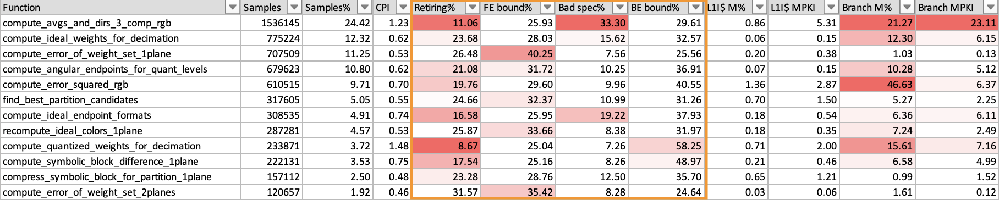
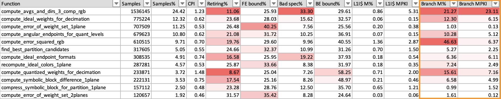

## Example report

Let's look at an example functions report generated on a system with Arm Neoverse V1 CPUs. The list of functions is ordered with the most significant function first.

1. The _Retiring%_, _FE bound%_, _Bad spec%_ and _BE bound%_ metrics show a breakdown of how the slot capacity was used.

    

    In this example, you can see that for the first function the retiring metric is quite low, only 11%, and is colored red to indicate a problem. A low retiring metric means that the software is not making efficient use of the available processing resources. You must look  deeper at the other metrics to discover why.

    You can see that bad speculation is responsible for 33% of the slot capacity used by this function. This means that some of the available issue capacity is wasted on cycles that are used either recovering from mispredicted branches, or executing speculative micro-ops that were subsequently cancelled.

1. To investigate further, you can look at the branch mispredict metrics, _Branch M%_ and _Branch MPKI_.

    

    The branch mispredict rate is around 21%, which means that 21% of branches are mispredicted. The _Branch MPKI_ metric shows that there are 23 mispredictions for every 1000 instructions in the sample.

    This is significant enough to mean that improving branches is worth considering.

    In some cases, even though branches are not predicting well, you must decide whether optimizing will bring significant improvements because branches might only be a small proportion of the instruction mix.

{}
To reduce the effect of bad speculation, aim to improve the predictability of branches, or convert unpredictable branches into conditional select instructions.
{}
