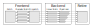
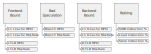

## Understanding performance

The processing core of a modern Arm CPU is represented in this methodology as an abstract model consisting of three major phases:

* Frontend.
* Backend. 
* Retire.

You can define the available performance of the core using the maximum number of micro-operations (micro-ops) that can be issued to the backend of each clock
cycle. This execution width is known as the issue slot count of the processor.

The main goal of this performance analysis methodology is to attribute unused or redundant slot issues to specific causes - giving you feedback about what is causing your software to run slowly.

### Frontend

The frontend phase represents instruction fetch, decode, and dispatch. This phase handles fetching instructions from the instruction cache, decoding those instructions, and adding the resulting micro-ops to the backend execution queues.

Each CPU frontend microarchitecture exposes a fixed number of decode slots that can decode instructions into micro-ops each cycle. The main goal of the frontend is to keep these decode slots busy decoding instructions, unless there is back-pressure from the backend queues because the backend is unable
to accept new micro-ops.

The frontend also implements support for branch prediction and speculative execution. Predicting where program control flow goes next allows the frontend to keep the backend queues filled with work when execution is uncertain. However, incorrect predictions cause the cancellation of issued micro-ops on the wrong path, and the pipeline might take time to refill with new micro-ops.

### Backend

The backend phase represents the execution of micro-ops by the processing pipelines inside the core. There are multiple pipeline types, each of which can process a subset of the instruction set, and be fed by their own issue queues.

An application has uneven loading on the backend queues. Queue load depends on the instruction mix in the part of the code that is currently running. When optimizing your application, try to prioritize changes that will relieve pressure on the most heavily-loaded queue.

### Retire

The retire phase represents the resolution of micro-ops that are architecturally complete. Measuring the number of retired instructions generates a metric showing the amount of useful work completed by the processor.

Not all issued instructions retire. Speculatively-issued micro-ops are cancelled if they are shown to be on the wrong code path and are therefore not required.

## Performance counters

Arm CPUs include a Performance Monitoring Unit (PMU) that measures instances of low-level execution events occurring in the hardware. These measurements have several uses:

* Counting instructions or cycles is useful for sizing a workload.
* Counting SIMD vector instructions is useful for identifying whether a
  workload is taking advantage of the available hardware acceleration.
* Counting branch mispredictions or cache misses is useful for identifying
  whether a workload is triggering specific performance pathologies.

To make performance analysis easier, Arm has defined a standardized performance analysis methodology for the Neoverse CPUs. This methodology defines a common set of hardware performance counters, and how to use them to derive the higher-level metrics that enable you to optimize your applications.

### The top-down methodology

The top-down methodology provides a systematic way to use performance counter data to identify performance problems in an application.

The methodology describes performance using a simple hierarchical tree of performance metrics. The basic metrics described for the abstract model provide the root nodes of the tree. Additional levels of hierarchy below each node provide a more detailed breakdown for causal analysis.

This hierarchical approach, with clear causal metrics, provides an intuitive way to find and understand the microarchitecture-sensitive performance issues that your software triggers. Using this information, you can target the problem with specific corrective actions to improve performance.

One of the major usability benefits of the top-down methodology for software developers is that the first few levels of the top-down tree do not require any knowledge of the specific CPU you are running on. You can profile on any of the Neoverse CPUs and get the same metrics, despite differences in the underlying hardware design. This lets you focus on your software and improving performance, instead of worrying about which event to capture on a specific
CPU.

The deeper levels of the tree become increasingly hardware-specific, which is useful for developers who want to optimize very deeply for a specific microarchitecture. For most common software optimizations, these levels are not necessary.

## Arm Statistical Profiling Extension

Arm CPUs can support the Statistical Profiling Extension (SPE), which adds support for hardware-based instruction sampling.

When using SPE, the hardware triggers a sample after a configurable number of micro-ops. It writes the sample data directly into a memory buffer without any software involvement. This sampling is not invasive to the running program, until software is needed to process a full memory buffer.

Each sample contains the program counter (PC) of the sampled operation, and additional operation-specific event data. This event data provides additional feedback about the execution of that operation. For example:

* For branch samples, the event data indicates if the branch was mispredicted.
* For load samples, the event data indicates which cache returned the data.

SPE provides a complementary technology to the traditional performance counters, and the best results can be achieved by using both together.
