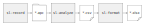
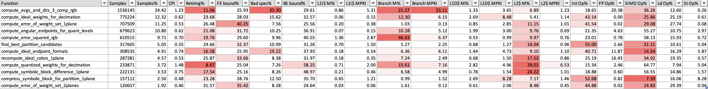

## Capture a performance profile with Streamline CLI tools

Profiling with the Streamline CLI tools is a three-step process:

* Use `sl-record` to capture the raw sampled data for the profile.
* Use `sl-analyze` to pre-process the raw sampled data to create a set of
  function-attributed counters and metrics.
* Use `sl-format.py` to pretty-print the function-attributed metrics in a more
  human-readable form.



### Before you begin {.section}

Before you can capture a software profile you must build your application with debug information. This enables the profiler to map instruction addresses back to specific functions in your source code. For C and C++ you do this by passing the `-g` option to the compiler.

Arm recommends that you profile an optimized release build of your application, as this ensures you are profiling a realistic code workload. For C and C++ you do this by passing the `-O2` or `-O3` option to the compiler. However, it is also recommended that you disable invasive optimization techniques, such as link-time optimization (LTO), because they heavily restructure the code and make the profile difficult to understand.

### Procedure {.section}

1. Use the download utility script to download the latest version of the tool and extract it to the current working directory on your Arm server:

    ```sh
    wget https://artifacts.tools.arm.com/arm-performance-studio/Streamline_CLI_Tools/get-streamline-cli.py

    python3 get-streamline-cli.py install
    ```

    The script can also be used to download a specific version, or install to a user-specified directory. Refer to the [Install Guide](/install-guides/streamline-cli/) for details on all the script options.

    {}
    Follow the instructions in the [Install Guide](/install-guides/streamline-cli/) to ensure you have everything set up correctly. Arm recommends that you apply the kernel patch as described in this guide, to improve support for capturing function-attributed top-down metrics on Arm systems.
    {}

1. Use `sl-record` to capture a raw profile of your application and save the data to a directory on the filesystem.

    Arm recommends making a profile of at least 20 seconds in duration, which ensures that the profiler can capture a statistically significant number of samples for all of the metrics.

    ```sh
    sl-record -C workflow_topdown_basic -o <output.apc> -A <your app command-line>
    ```

    * The `-C workflow_topdown_basic` option selects a predefined group of counters and metrics, and provides a good baseline to start with. Alternatively, you can provide a comma-separated list of specific counters and metrics to capture. To list all of the available counters and metrics for the current machine, use the command `sl-record --print counters`.

    * The `-o` option provides the output directory for the capture data. The directory must not already exist because it is created by the tool when profiling starts.
  
    * The `-A` option provides the command-line for the user application. This option must be the last option provided to `sl-record` because all subsequent arguments are passed to the user application.

    * Optionally, to enable SPE, add the `-X workflow_spe` option. Enabling SPE significantly increases the amount of data captured and the `sl-analyze` processing time, so only use this option if you need this data.

    {}
    Captures are highly customizable, with many different options that allow you to choose how to profile your application. Use the `--help` option to see the full list of options for customizing your captures.
    {}

1. Use `sl-analyze` to process the raw profile of your application and save the analysis output as several CSV files on the filesystem.

    ```sh
    sl-analyze --collect-images -o <output_dir> <input_dir.apc>
    ```

    * The `-collect-images` option instructs the tool to assemble all of the referenced binaries and split debug files required for analysis. The files are copied and stored inside the .apc directory, making them ready for analysis.
  
    * The `-o` option provides the output directory for the generated CSV files.
  
    * The positional argument `input_dir.apc` is the raw profile directory created by `sl-record`.

    The function profile CSV files generated by `sl-analyze` contain all the enabled events and metrics, for all functions that were sampled in the profile:

    | Filename                           | Description                       |
    | ---------------------------------- | --------------------------------- |
    | `Functions-<filename>.csv`         | A flat list of functions, sorted by cost, showing per-function metrics.   |
    | `callpaths-<filename>.csv`         | A hierarchical list of function call paths in the application, showing per-function metrics for each function per call path location.  |
    | `<filename>-bt.csv`                | Results from the analysis of the software-sampled performance counter data, which can include back-traces for each sample.  |
    | `<filename>-spe.csv`               | Results from the analysis of the hardware-sampled Statistical Profiling Extension (SPE) data. SPE data does not include call back-trace information.   |

1. Use the `sl-format.py` script to generate a simpler pretty-printed XLSX spreadsheet from the CSV files generated in the previous step, using `sl-analyze`. The script formats the metrics columns to make the data more readable, and to add colors to highlight bad values.

    ```sh
    python3 sl-format.py -o <output.xlsx> <input.csv>
    ```

    * The `-o` option provides the output file path to save the XLSX file to.
    * The positional argument is the `functions-*.csv` file created by `sl-analyze`.

    Refer to the [Streamline CLI Tools user guide](https://developer.arm.com/documentation/109847/latest) to learn how you can create and specify custom format definitions that are used to change the pretty-printed data visualization.

1. View your report in Excel or other compatible application. In functions reports, problem areas are indicated in red, to help you focus on the main problems.

  

  See our [example report](/learning-paths/servers-and-cloud-computing/profiling-for-neoverse/example) to learn more about how to interpret the results.

## Capturing a system-wide profile

To capture a system-wide profile, which captures all processes and threads, run `sl-record` with the `-S yes` option and omit the `-A` application-specific option and following arguments.

In systems without the kernel patches, system-wide profiles can capture the top-down metrics. To keep the captures to a usable size, it may be necessary to limit the duration of the profiles to less than 5 minutes.

## Capturing top-down metrics without the kernel patches

To capture top-down metrics in a system without the kernel patches, there are three options available:

* To capture a system-wide profile, which captures all processes and threads, run with the `-S yes` option and omit the `-A` application-specific option and following arguments. To keep the captures to a usable size, it may be necessary to limit the duration of the profiles to less than 5 minutes.

* To reliably capture single-threaded application profile, add the `--inherit no` option to the command line. However, in this mode metrics are only captured for the first thread in the application process and any child threads or processes are ignored.

* For multi-threaded applications, the tool provides an experimental option, `--inherit poll`, which uses polling to spot new child threads and inject the instrumentation. This allows metrics to be captured for a multi-threaded application, but has some limitations:

* Short-lived threads may not be detected by the polling.
* Attaching perf to new threads without inherit support requires many new file descriptors to be created per thread. This can result in the application failing to open files due to the process hitting its inode limit.

## Minimizing profiling application impact

The `sl-record` application requires some portion of the available processor time to capture the data and prepare it for storage. When profiling a system with a high number of CPU cores, Arm recommends that you leave a small number of cores free so that the profiler can run in parallel without impacting the application. You can achieve this in two different ways:

* Running an application with fewer threads than the number of cores available.
* Running the application under `taskset` to limit the number of cores that the application can use. You must only `taskset` the application, not `sl-record`, for example:

  ```sh
  sl-record -C … -o … -A taskset <core_mask> <your app command-line>
  ```

{}
The number of samples made is independent of the number of counters and metrics that you enable. Enabling more counters reduces the effective sample rate per counter, and does not significantly increase the performance impact that capturing has on the running application.
{}
