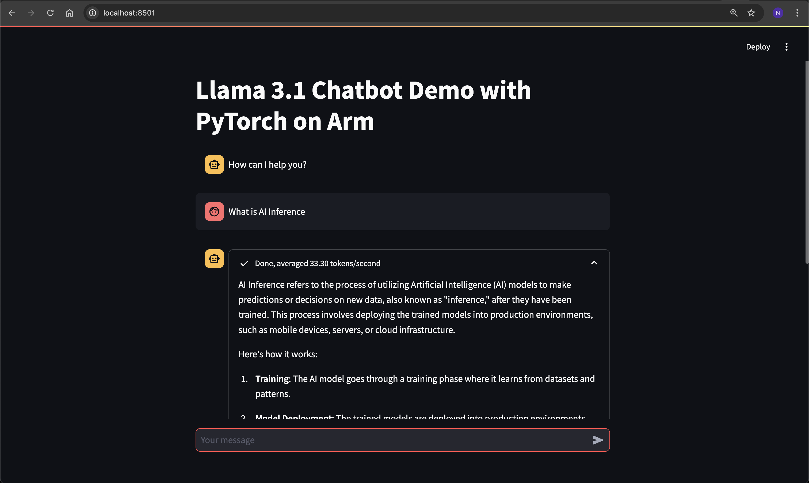

In this section, you will learn how to configure and run the chatbot server as a backend service and create a Streamlit-based frontend. This setup enables communication with the chatbot through a web interface accessible in your browser.

### Activate the Virtual Environment to install dependencies
Activate the Python virtual environment you have used in the previous section, in case it is deactivated:

```sh
source torch_env/bin/activate
```

### Install Additional Tools
Install the additional packages:

```sh
pip3 install openai==1.45.0
```

### Running LLM Inference Backend Server
Start the LLM Inference Backend Server in a new terminal window:

```sh
cd torchchat
LD_PRELOAD=/usr/lib/aarch64-linux-gnu/libtcmalloc.so.4 TORCHINDUCTOR_CPP_WRAPPER=1 TORCHINDUCTOR_FREEZING=1 OMP_NUM_THREADS=16 python3 torchchat.py server llama3.1 --dso-path exportedModels/llama3.1.so
```

The output while the backend server starts looks like this:

```output
Using device=cpu 
Loading model...
Time to load model: 0.13 seconds
-----------------------------------------------------------
 * Serving Flask app 'server'
 * Debug mode: off
WARNING: This is a development server. Do not use it in a production deployment. Use a production WSGI server instead.
 * Running on http://127.0.0.1:5000
Press CTRL+C to quit
```

### Running Streamlit frontend server
Within you activated `venv`, start the Streamlit frontend server:

```sh
cd torchchat
streamlit run browser/browser.py
```

The output while the streamlit frontend server starts looks like this:

```output
Collecting usage statistics. To deactivate, set browser.gatherUsageStats to false.

  You can now view your Streamlit app in your browser.

  Local URL: http://localhost:8501
  Network URL: http://10.0.2.29:8501
  External URL: http://3.86.224.131:8501
```

### Accessing the Streamlit frontend using browser

Open the local URL from the link above in a browser and you should see the chatbot running:


