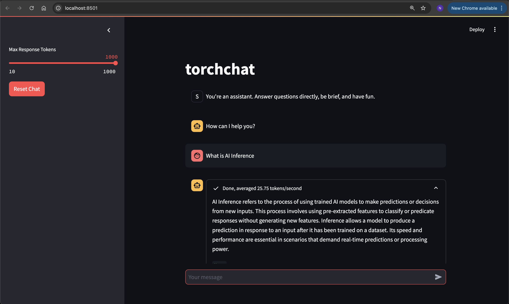

In this section, you will learn how to configure and run the chatbot server as a backend service and create a Streamlit-based frontend. This setup will enable you to communicate with the chatbot via a web interface accessible in your browser.

### Activate the Virtual Environment to install dependencies
Activate the Python virtual environment you have used in the previous section, incase if its deactivated.

```sh
source torch_env/bin/activate
```

### Install Additional Tools
Following are the additional libraries to install:

```sh
pip3 install streamlit
pip3 install openai
```

### Running LLM Inference Backend Server
Start the LLM Inference Backend Server in a new terminal window.

```sh
cd torchchat
LD_PRELOAD=/usr/lib/aarch64-linux-gnu/libtcmalloc.so.4 TORCHINDUCTOR_CPP_WRAPPER=1 TORCHINDUCTOR_FREEZING=1 OMP_NUM_THREADS=16 python3 torchchat.py server llama3.1 --dso-path exportedModels/llama3.1.so
```

The output while the backend server starts will look like:

```output
Using device=cpu 
Loading model...
Time to load model: 0.13 seconds
-----------------------------------------------------------
 * Serving Flask app 'server'
 * Debug mode: off
WARNING: This is a development server. Do not use it in a production deployment. Use a production WSGI server instead.
 * Running on http://127.0.0.1:5000
Press CTRL+C to quit
```

### Streamlit Frontend Server File
Create a `browser.py` file in your `torchchat` directory

```sh
cd torchchat
vim browser.py
```

Add the following Streamlit code in `browser.py` file:
```code
import streamlit as st
import time
from openai import OpenAI

st.title("ARM PyTorch Demo")
response_max_tokens = 1024
start_state = [
    {"role": "assistant", "content": "How can I help you?"},
]

if "messages" not in st.session_state:
    st.session_state["messages"] = start_state

for msg in st.session_state.messages:
    st.chat_message(msg["role"]).write(msg["content"])

if prompt := st.chat_input():
    client = OpenAI(
        base_url="http://127.0.0.1:5000/v1",
        api_key="813",  # The OpenAI API requires an API key. This can be any non-empty string.
    )

    st.session_state.messages.append({"role": "user", "content": prompt})
    st.chat_message("user").write(prompt)

    with st.chat_message("assistant"), st.status(
        "Generating...", expanded=True
    ) as status:

        def get_streamed_completion(completion_generator):
            start = time.time()
            tokcount = 0
            for chunk in completion_generator:
                tokcount += 1
                yield chunk.choices[0].delta.content

            status.update(
                label="Done, averaged {:.2f} tokens/second".format(
                    tokcount / (time.time() - start)
                ),
                state="complete",
            )

        response = st.write_stream(
            get_streamed_completion(
                client.chat.completions.create(
                    model="llama3.1",
                    messages=st.session_state.messages,
                    max_tokens=response_max_tokens,
                    stream=True,
                )
            )
        )[0]

    st.session_state.messages.append({"role": "assistant", "content": response})
```

### Running Streamlit Frontend Server
Open a new terminal window and start the Streamlit Frontend Server:

```sh
cd torchchat
streamlit run browser.py
```

The output while the streamlit frontend server starts will look like:

```output
Collecting usage statistics. To deactivate, set browser.gatherUsageStats to false.

  You can now view your Streamlit app in your browser.

  Local URL: http://localhost:8501
  Network URL: http://10.0.2.29:8501
  External URL: http://3.86.224.131:8501
```

### Accessing the Streamlit Frontend using Browser
