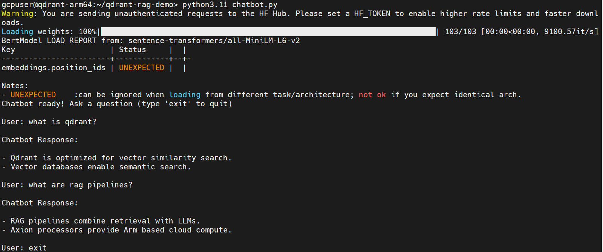

## Create a knowledge retrieval chatbot

In this section, you build a simple **chatbot-style knowledge retrieval system** using the Qdrant vector database running on Google Axion Arm-based infrastructure.

The chatbot retrieves relevant knowledge by performing **semantic similarity search** against stored vector embeddings.

The architecture represents the **retrieval component of Retrieval-Augmented Generation (RAG) systems**, commonly used in modern AI assistants and enterprise knowledge platforms.

The chatbot uses:

- **Sentence Transformers** to generate embeddings
- **Qdrant** to store and retrieve vector data
- **Python** to implement an interactive chatbot interface

## Architecture overview

The chatbot workflow retrieves relevant information using vector similarity search.

```text
User Question
      |
      v
Sentence Transformer Model
      |
      v
Query Embedding Vector
      |
      v
Qdrant Vector Database
      |
      v
Similarity Search
      |
      v
Top Matching Knowledge
      |
      v
Chatbot Response
```


## Navigate to project directory

Move to the project directory created earlier.

```bash
cd ~/qdrant-rag-demo
```

**Verify files:**

```bash
ls
```

The output is similar to: 
```output
ingest.py
search.py
```

These scripts were created in earlier sections to generate embeddings and perform vector searches.

## Load knowledge into Qdrant

The ingestion script converts documents into embeddings and stores them in Qdrant.

**Run the ingestion script:**

```bash
python ingest.py
```

The output is similar to: 
```output
Documents indexed successfully in Qdrant!
```

**Verify the collection:**

```bash
curl http://localhost:6333/collections
```

The output is similar to: 
```output

 "result": {
  "collections":[{"name":"axion_demo"}]
 }
}
```

The output confirms the vector collection has been created successfully.

## Create chatbot script

Create a Python file that allows users to interactively query the vector database.

```bash
vi chatbot.py
```

Add the following code.

```python
from qdrant_client import QdrantClient
from sentence_transformers import SentenceTransformer

client = QdrantClient(url="http://localhost:6333")

model = SentenceTransformer("sentence-transformers/all-MiniLM-L6-v2")

print("Chatbot ready! Ask a question (type 'exit' to quit).")

while True:

    query = input("\nUser: ")

    if query.lower() == "exit":
        break

    query_vector = model.encode(query).tolist()

    results = client.query_points(
        collection_name="axion_demo",
        query=query_vector,
        limit=2
    )

    print("\nChatbot Response:\n")

    for point in results.points:
        print("-", point.payload["text"])
```

## Run the chatbot

Start the chatbot application.

```bash
python chatbot.py
```

The output is similar to: 
```output
Chatbot ready! Ask a question (type 'exit' to quit)

User:
```

## Test the chatbot

Example interaction:

```bash
User: What is Qdrant?
```

The output is similar to: 
```output
Chatbot Response:

- Qdrant is optimized for vector similarity search.
- Vector databases enable semantic search.
```


**Another example:**

```bash
User: what are rag pipelines?
```

The output is similar to: 
```output
Chatbot Response:

- RAG pipelines combine retrieval with LLMs.
- Axion processors provide Arm based cloud compute.
```

**Exit the chatbot:**

```bash
exit
```
## Example chatbot interaction

The following image shows the chatbot running on the Axion VM and retrieving relevant results from the Qdrant vector database.



## How the chatbot works

1. The user asks a question.
2. The system converts the question into a vector embedding.
3. Qdrant performs a similarity search.
4. The chatbot returns the most relevant knowledge documents.
5. This enables semantic search instead of simple keyword matching.


## Retrieval-Augmented Generation (RAG)

In modern AI systems, this retrieval step is typically combined with a large language model.

The full RAG workflow looks like:

```text
User Question
      |
      v
Embedding Model
      |
      v
Qdrant Vector Database
      |
      v
Relevant Context Retrieved
      |
      v
Large Language Model (LLM)
      |
      v
Generated Answer
```

Qdrant provides the **high-performance retrieval layer** for this architecture.

## Real-world applications

This architecture is widely used in:

- Customer support chatbots
- Enterprise knowledge assistants
- AI documentation search tools
- Technical support bots
- RAG-based AI assistants

## What you've learned and what's next

In this section, you learned how to:

- Build a chatbot-style knowledge retrieval system
- Convert user queries into vector embeddings
- Perform semantic similarity search with Qdrant
- Retrieve relevant information using vector search

In the next section, you will explore the system architecture behind vector search workloads on Axion infrastructure, including how Qdrant enables scalable AI retrieval pipelines.
