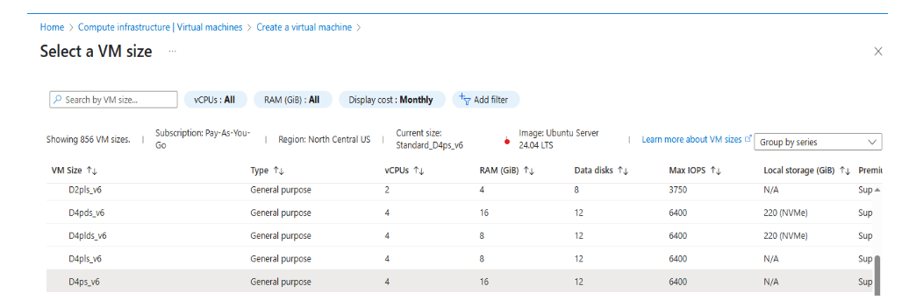

## Introduction

There are several ways to create an Arm-based Cobalt 100 virtual machine: the Microsoft Azure console, the Azure CLI tool, or using your choice of IaC (Infrastructure as Code). This guide will use the Azure console to create a virtual machine with Arm-based Cobalt 100 Processor. 

This learning path focuses on the general-purpose virtual machine of the D series. Please read the guide on [Dpsv6 size series](https://learn.microsoft.com/en-us/azure/virtual-machines/sizes/general-purpose/dpsv6-series) offered by Microsoft Azure.  

## Provision the virtual machine

Creating a Cobalt 100 virtual machine follows the same process as creating any other Azure virtual machine. Launch the Azure portal and navigate to **Virtual Machines**.

Select **Create**, then select **Virtual Machine** from the drop-down list.
2. Inside the "Basic" tab, fill in the Instance details such as "Virtual machine name" and "Region".
3. Choose the image for your virtual machine (for example, Ubuntu Pro 24.04 LTS) and select “Arm64” as the VM architecture.
4. In the “Size” field, click on “See all sizes” and select the D-Series v6 family of virtual machines. Select “D4ps_v6” from the list.

Select **SSH public key** as the authentication type. Azure automatically generates an SSH key pair and stores it for future use, providing a fast and secure way to connect to your virtual machine.

Fill in the administrator username for your VM.

Select **Generate new key pair**, then select **RSA SSH Format** as the SSH Key Type. RSA offers better security with keys longer than 3072 bits. Provide a name for your SSH key pair.

In the **Inbound port rules** section, select HTTP (80) and SSH (22) as the inbound ports.

Select the **Review + Create** tab and review the configuration for your virtual machine. The configuration is similar to:

When you're satisfied with your configuration, select the Create button, then select Download Private Key and Create Resources.

Your virtual machine deploys within a few minutes. SSH into the virtual machine using the downloaded private key and the public IP address.

{}

To learn more about Arm-based virtual machines in Azure, refer to “Getting Started with Microsoft Azure” in [Get started with Arm-based cloud instances](/learning-paths/servers-and-cloud-computing/csp/azure).

{}
