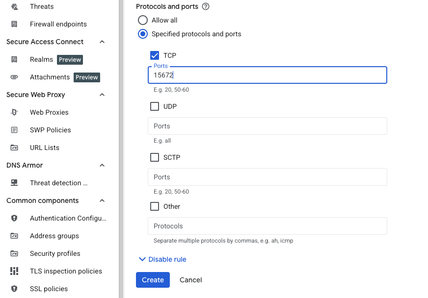

## Overview

In this section, you create a firewall rule within Google Cloud Console to expose TCP port 15672.

{}
For support on GCP setup, see the Learning Path [Getting started with Google Cloud Platform](/learning-paths/servers-and-cloud-computing/csp/google/).
{}

## Create a firewall rule in GCP

To expose TCP port 15672, create a firewall rule.

Navigate to the [Google Cloud Console](https://console.cloud.google.com/), go to **VPC Network > Firewall**, and select **Create firewall rule**.

Next, create the firewall rule that exposes TCP port 15672.
Set the **Name** of the new rule to "allow-tcp-15672". Select your network that you intend to bind to your VM (default is "autoscaling-net" but your organization might have others).

Set **Direction of traffic** to "Ingress". Set **Allow on match** to "Allow" and **Targets** to "Specified target tags". Enter "allow-tcp-15672" in the **Target tags** text field. Set **Source IPv4 ranges** to your IP address so that only you can access the application.

Finally, select **Specified protocols and ports** under the **Protocols and ports** section. Select the **TCP** checkbox, enter "15672" in the **Ports** text field, and select **Create**.

## What you've accomplished and what's next

You've successfully created a firewall rule to allow TCP traffic on port 15672 for the RabbitMQ management interface. This firewall rule will be applied to your virtual machine using network tags. Next, you'll provision the Google Axion C4A Arm virtual machine.