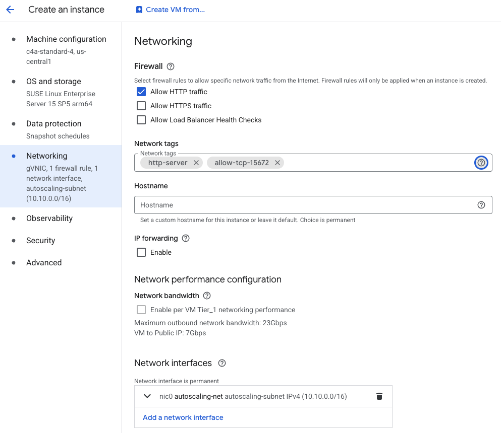

## Overview

In this section, you'll provision a Google Axion C4A Arm virtual machine on Google Cloud Platform (GCP) using the `c4a-standard-4` (4 vCPUs, 16 GB memory) machine type in the Google Cloud Console. You will then use this GCP VM to execute a few RabbitMQ use cases.

{}
For support on GCP setup, see the Learning Path [Getting started with Google Cloud Platform](/learning-paths/servers-and-cloud-computing/csp/google/).
{}

## Provision a Google Axion C4A Arm VM in Google Cloud Console

To create a virtual machine based on the C4A instance type, navigate to the [Google Cloud Console](https://console.cloud.google.com/) and go to **Compute Engine > VM Instances**. Select **Create Instance**.

Under **Machine configuration**, populate fields such as **Instance name**, **Region**, and **Zone**. Set **Series** to `C4A` and select `c4a-standard-4` for machine type.

   

Under **OS and Storage**, select **Change**, then choose an Arm64-based OS image. For this Learning Path, use **SUSE Linux Enterprise Server**. Select **Pay As You Go** for the license type and select **Select**.

Under **Networking**, enable **Allow HTTP traffic** and add "allow-tcp-15672" as a network tag in the **Network tags** text field.

Select **Create** to launch the instance. After the instance is created, the **SSH** option and public IP address appear in the VM instances list. Save the public IP address for later use. Select the **SSH** option to open an SSH shell to your VM instance.

A browser window opens with a shell session to your VM instance.

