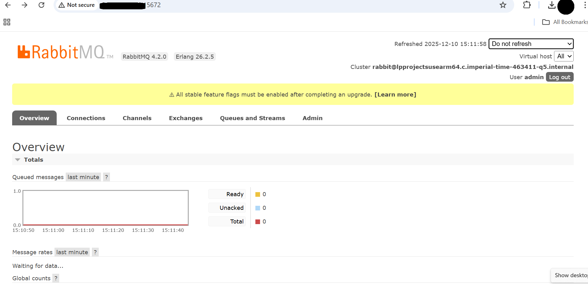

## Install RabbitMQ on GCP SUSE Arm64 VM

In this section you'll install RabbitMQ on a Google Cloud Platform SUSE Linux Arm64 virtual machine using RPM packages for both Erlang and RabbitMQ Server.

RabbitMQ needs Erlang to be installed before setting up the server.


### Prerequisites

- GCP SUSE Linux Enterprise Server (Arm64)
- Root or sudo privileges
- Outbound internet access

### Refresh system repositories
Update the system's package list to get the latest available software from repositories.

```console
sudo zypper refresh
```

### Install required system utilities
Install the basic tools needed to download and manage packages.

```console
sudo zypper install -y curl wget gnupg tar socat logrotate
```

### Download Erlang RPM (Arm64)
RabbitMQ depends on Erlang. Download the Erlang RPM compatible with the Arm64 architecture.

```console
wget https://github.com/rabbitmq/erlang-rpm/releases/download/v26.2.5/erlang-26.2.5-1.el8.aarch64.rpm
sudo rpm -Uvh erlang-26.2.5-1.el8.aarch64.rpm
```

### Verify Erlang installation
Confirm that Erlang is installed correctly:

```console
erl -eval 'io:format("~s~n", [erlang:system_info(system_version)]), halt().' -noshell
```

The output is similar to:

```output
Erlang/OTP 26 [erts-14.2.5] [source] [64-bit] [smp:4:4] [ds:4:4:10] [async-threads:1] [jit]
```

### Download RabbitMQ server RPM
Download the RabbitMQ Server RPM package.

```console
wget https://github.com/rabbitmq/rabbitmq-server/releases/download/v4.2.0/rabbitmq-server-4.2.0-1.el8.noarch.rpm
sudo rpm -Uvh rabbitmq-server-4.2.0-1.el8.noarch.rpm
```

{}
RabbitMQ version 3.11.0 introduced significant performance enhancements for Arm-based architectures. This version needs Erlang 25.0 or later, which brings Just-In-Time (JIT) compilation and modern flame graph profiling tooling to both x86 and Arm64 CPUs. These features result in improved performance on Arm64 architectures.

View the [release notes](https://github.com/rabbitmq/rabbitmq-server/blob/main/release-notes/3.11.0.md) for more information.

The [Arm Ecosystem Dashboard](https://developer.arm.com/ecosystem-dashboard/) recommends RabbitMQ version 3.11.0, the minimum recommended on Arm platforms.
{}

### Enable and start RabbitMQ service
Enable RabbitMQ to start automatically on boot and start the service immediately.

```console
sudo systemctl enable rabbitmq-server --now
```

### Verify RabbitMQ service status
Check the status of the RabbitMQ service.

```console
sudo systemctl status rabbitmq-server
```

The service should be in an active (running) state.

```output
● rabbitmq-server.service - Open source RabbitMQ server
     Loaded: loaded (/usr/lib/systemd/system/rabbitmq-server.service; enabled; vendor preset: disabled)
     Active: active (running) since Fri 2026-01-09 14:50:52 UTC; 3s ago
   Main PID: 3953 (beam.smp)
      Tasks: 53
        CPU: 2.432s
     CGroup: /system.slice/rabbitmq-server.service
             ├─ 3953 /usr/lib64/erlang/erts-14.2.5/bin/beam.smp -W w -MBas ageffcbf -MHas ageffcbf -MBlmbcs 512 -MHlmbcs 512 -MMmcs 30 -pc unicode -P 1048576 -t 5000000 -stbt db -zdbbl >
             ├─ 3967 erl_child_setup 32768
             ├─ 4014 /usr/lib64/erlang/erts-14.2.5/bin/inet_gethost 4
             ├─ 4015 /usr/lib64/erlang/erts-14.2.5/bin/inet_gethost 4
             ├─ 4024 /usr/lib64/erlang/erts-14.2.5/bin/epmd -daemon
             └─ 4077 /bin/sh -s rabbit_disk_monitor
```

### Enable RabbitMQ management plugin
Enable the RabbitMQ management plugin to access the web-based dashboard.

```console
sudo rabbitmq-plugins enable rabbitmq_management
```

### Restart RabbitMQ
Restart RabbitMQ to apply plugin changes.

```console
sudo systemctl restart rabbitmq-server
```

### Verify RabbitMQ version
Confirm the installed RabbitMQ version:

```console
sudo rabbitmqctl version
```

The output is similar to:

```output
4.2.0
```

### Access RabbitMQ management UI
Create a new RabbitMQ user for remote access.

Create a new `admin` user by running these commands on the VM:

```console
sudo rabbitmqctl add_user admin StrongPassword123
sudo rabbitmqctl set_user_tags admin administrator
sudo rabbitmqctl set_permissions -p / admin ".*" ".*" ".*"
```

{}
Replace `StrongPassword123` with a strong, unique password. For production environments, use environment variables or a secrets management system instead of hardcoding passwords.
{}

**Log in to Management UI**

Now, test it from outside the VM. Open a web browser on your local machine (Chrome, Firefox, Edge, etc.) and enter the following URL and credentials in the address bar:

- **URL**: http://<VM_IP>:15672
- **Username**: admin
- **Password**: StrongPassword123

Replace `<VM_IP>` with the public IP of your GCP VM.

If everything is configured correctly, you see a RabbitMQ login page in your browser that looks like this:



## What you've accomplished and what's next

You've successfully installed RabbitMQ on your Google Cloud Arm64 VM with:
- Erlang and RabbitMQ Server installed via RPM packages
- RabbitMQ Management UI enabled and accessible
- Administrative user configured for UI access

Next, you'll validate your RabbitMQ installation and verify it's functioning correctly.

This confirms that your RabbitMQ management dashboard is operational.

## What you've accomplished and what's next

You've successfully installed RabbitMQ on a Google Cloud SUSE Arm64 virtual machine, enabled the management plugin, created an admin user, and verified access to the web-based management interface. Next, you'll validate the RabbitMQ installation with baseline messaging tests to ensure all components are functioning correctly.