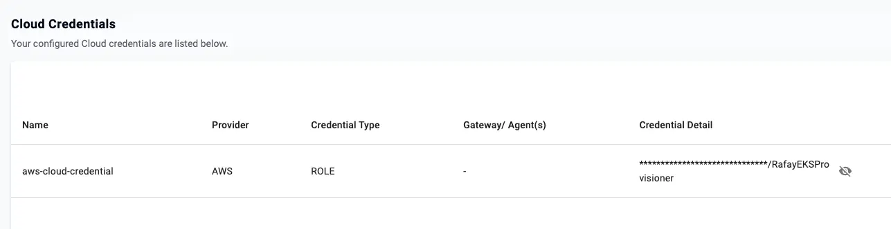

## Before you begin

[Rafay](https://rafay.co) is a Kubernetes operations platform that provisions, secures, and manages the full cluster lifecycle across public cloud, private, and hybrid environments. It provides a single control plane for fleet-wide operations including automated provisioning, upgrades, and governance. In this Learning Path, you'll use Rafay to provision an Amazon EKS cluster with an AWS Graviton-based node group and deploy a workload to verify the setup.

You need the following accounts and tools before starting this Learning Path:

- An [AWS account](https://aws.amazon.com/) with sufficient IAM permissions to create roles, EKS clusters, EC2 instances, CloudFormation stacks, and related resources.
- A [Rafay account](https://console.rafay.dev). You can [sign up](https://console.rafay.dev/#/signup) if you do not have an account.
- The AWS CLI installed and configured with credentials that have the required permissions. For setup instructions, see the [AWS CLI](/install-guides/aws-cli/) and the [AWS Credentials](/install-guides/aws_access_keys/) install guides.

Confirm your AWS CLI is working by running the following command, which prints your account and user information:

```console
aws sts get-caller-identity
```

## Install kubectl

Install the Kubernetes command-line tool, by following the [kubectl install guide](/install-guides/kubectl/).

Confirm the installation:

```console
kubectl version --client
```

The output is similar to:

```output
Client Version: v1.32.1
Kustomize Version: v5.5.0
```

## Install RCTL

RCTL is the Rafay CLI. You'll use it to submit cluster manifests, check cluster status, download kubeconfig files, and delete clusters.

To download RCTL, log in to the Rafay console, navigate to **My Tools** > **Download CLI**, and download the binary for your operating system.

The downloads are `.tar.bz2` files.

On macOS with Apple Silicon, extract the file with:

```console
tar xvf rctl-darwin-arm64.tar.bz2
```

On Arm Linux, use the filename:

```console
tar xvf rctl-linux-arm64.tar.bz2
```

{}
RCTL is also available for x86_64 Linux and Windows. Modify the filename to match your platform as needed.
{}

Move the binary to a directory in your search path:

```console
sudo mv rctl /usr/local/bin/
```

## Configure RCTL

Download the RCTL configuration file from the Rafay console. Navigate to **My Tools** > **Download CLI Config** and save the file.

The file name is formatted for your user information. 

Copy the downloaded file to a known location and initialize `rctl` with it:

```console
cp ~/Downloads/<filename>.json ~/rafay-config.json
rctl config init ~/rafay-config.json
```

The config command doesn't have any output. 

Verify the installation:

```console
rctl version
```

The output is similar to:

```output
VERSION: r4.2.0
BUILD: r4.2.0-1
BUILD-TIME: Thu 04 Jun 2026 07:17:05 AM UTC
ARCH: darwin/arm64
```

Confirm that `rctl` can reach the Rafay platform:

```console
rctl config show
```

The output lists your account information, including the endpoints, keys, project, and organization information.

## Create an AWS IAM role for Rafay

Rafay provisions EKS resources in your AWS account using a cross-account IAM role. You need two values from the Rafay console before running the script:

1. Log in to the Rafay console
2. Select **defaultproject** (or another project) from the project selector in the top navigation bar
3. Navigate to **Infrastructure** > **Cloud Credentials** > **New Credential**.
4. Select **AWS** as the provider select **ROLE**. Copy the **Rafay Account ID** and **External ID** displayed on the screen. You will pass these values to the script that follows.

Save the following script as `create-rafay-role.sh`:

```bash
#!/bin/bash
set -euo pipefail

read -rp "Enter Rafay Account ID: " RAFAY_ACCOUNT_ID
read -rp "Enter External ID:       " EXTERNAL_ID

ROLE_NAME="RafayEKSProvisioner"
REGION="us-east-1"

TRUST_POLICY=$(cat <<EOF
{
  "Version": "2012-10-17",
  "Statement": [
    {
      "Effect": "Allow",
      "Principal": {
        "AWS": "arn:aws:iam::${RAFAY_ACCOUNT_ID}:root"
      },
      "Action": "sts:AssumeRole",
      "Condition": {
        "StringEquals": {
          "sts:ExternalId": "${EXTERNAL_ID}"
        }
      }
    }
  ]
}
EOF
)

echo "Creating IAM role: ${ROLE_NAME}"
aws iam create-role \
  --role-name "${ROLE_NAME}" \
  --assume-role-policy-document "${TRUST_POLICY}" \
  --region "${REGION}"

INLINE_POLICY=$(cat <<'POLICY'
{
    "Version": "2012-10-17",
    "Statement": [
        {
            "Effect": "Allow",
            "Action": [
                "iam:CreateInstanceProfile",
                "iam:CreateOpenIDConnectProvider",
                "iam:DeleteOpenIDConnectProvider",
                "iam:GetOpenIDConnectProvider",
                "iam:ListOpenIDConnectProviderTags",
                "iam:TagOpenIDConnectProvider",
                "iam:DeleteInstanceProfile",
                "iam:GetRole",
                "iam:GetInstanceProfile",
                "iam:RemoveRoleFromInstanceProfile",
                "iam:CreateRole",
                "iam:DeleteRole",
                "iam:AttachRolePolicy",
                "iam:PutRolePolicy",
                "iam:ListInstanceProfiles",
                "iam:AddRoleToInstanceProfile",
                "iam:ListInstanceProfilesForRole",
                "iam:PassRole",
                "iam:DetachRolePolicy",
                "iam:UpdateAssumeRolePolicy",
                "iam:DeleteRolePolicy",
                "iam:GetRolePolicy",
                "iam:DeleteServiceLinkedRole",
                "iam:CreateServiceLinkedRole",
                "iam:TagRole",
                "iam:ListRoleTags",
                "iam:ListAttachedRolePolicies",
                "iam:ListPolicyVersions",
                "iam:GetPolicy",
                "iam:GetPolicyVersion"
            ],
            "Resource": "*"
        },
        {
            "Effect": "Allow",
            "Action": [
                "cloudformation:GetTemplate",
                "cloudformation:ListStacks",
                "cloudformation:ListStackResources",
                "cloudformation:ListStackSets",
                "cloudformation:ListChangeSets",
                "cloudformation:DescribeStacks",
                "cloudformation:DescribeStackResources",
                "cloudformation:DescribeStackResource",
                "cloudformation:DescribeStackEvents",
                "cloudformation:DescribeChangeSet",
                "cloudformation:DescribeStackSet",
                "cloudformation:DeleteStack",
                "cloudformation:DeleteChangeSet",
                "cloudformation:DeleteStackSet",
                "cloudformation:CreateStackSet",
                "cloudformation:UpdateStackSet",
                "cloudformation:CreateChangeSet",
                "cloudformation:ExecuteChangeSet",
                "cloudformation:CreateStack",
                "cloudformation:UpdateStack"
            ],
            "Resource": "*"
        },
        {
            "Effect": "Allow",
            "Action": [
                "eks:AssociateEncryptionConfig",
                "eks:CreatePodIdentityAssociation",
                "eks:DescribePodIdentityAssociation",
                "eks:DescribeClusterVersions",
                "eks:DeletePodIdentityAssociation",
                "eks:UpdatePodIdentityAssociation",
                "eks:ListPodIdentityAssociations",
                "eks:CreateAccessEntry",
                "eks:CreateAddon",
                "eks:CreateCluster",
                "eks:CreateFargateProfile",
                "eks:DescribeNodegroup",
                "eks:DescribeCluster",
                "eks:DescribeAddon",
                "eks:DescribeAddonConfiguration",
                "eks:DescribeAddonVersions",
                "eks:DescribeFargateProfile",
                "eks:DescribeUpdate",
                "eks:ListUpdates",
                "eks:UpdateClusterVersion",
                "eks:UpdateClusterConfig",
                "eks:ListAccessPolicies",
                "eks:ListAccessEntries",
                "eks:ListAssociatedAccessPolicies",
                "eks:AssociateAccessPolicy",
                "eks:ListClusters",
                "eks:ListNodegroups",
                "eks:ListAddons",
                "eks:ListFargateProfiles",
                "eks:ListTagsForResource",
                "eks:CreateNodegroup",
                "eks:TagResource",
                "eks:AccessKubernetesApi",
                "eks:DeleteCluster",
                "eks:DeleteAccessEntry",
                "eks:UntagResource",
                "eks:UpdateAddon",
                "eks:UpdateNodegroupConfig",
                "eks:UpdateNodegroupVersion",
                "eks:DeleteAddon",
                "eks:DeleteFargateProfile",
                "eks:DeleteNodegroup",
                "eks:ListInsights",
                "eks:DescribeInsight",
                "eks:DescribeAccessEntry",
                "eks:DisassociateAccessPolicy",
                "eks:UpdateAccessEntry"
            ],
            "Resource": "*"
        },
        {
            "Effect": "Allow",
            "Action": [
                "autoscaling:DescribeAutoScalingGroups",
                "autoscaling:DescribeLaunchConfigurations",
                "autoscaling:DescribeScalingActivities",
                "autoscaling:DescribeScheduledActions",
                "autoscaling:CreateLaunchConfiguration",
                "autoscaling:DeleteLaunchConfiguration",
                "autoscaling:TerminateInstanceInAutoScalingGroup",
                "autoscaling:SetDesiredCapacity",
                "autoscaling:UpdateAutoScalingGroup",
                "autoscaling:DeleteAutoScalingGroup",
                "autoscaling:CreateAutoScalingGroup",
                "autoscaling:SuspendProcesses",
                "autoscaling:CreateOrUpdateTags",
                "autoscaling:DeleteTags"
            ],
            "Resource": "*"
        },
        {
            "Effect": "Allow",
            "Action": "ec2:DeleteInternetGateway",
            "Resource": "arn:aws:ec2:*:*:internet-gateway/*"
        },
        {
            "Effect": "Allow",
            "Action": [
                "ec2:AuthorizeSecurityGroupIngress",
                "ec2:GetConsoleOutput",
                "ec2:DeleteSubnet",
                "ec2:DeleteTags",
                "ec2:CreateNatGateway",
                "ec2:CreateVpc",
                "ec2:AttachInternetGateway",
                "ec2:DescribeVpcAttribute",
                "ec2:DeleteRouteTable",
                "ec2:AssociateRouteTable",
                "ec2:DescribeInternetGateways",
                "ec2:CreateRoute",
                "ec2:CreateInternetGateway",
                "ec2:RevokeSecurityGroupEgress",
                "ec2:CreateSecurityGroup",
                "ec2:ModifyVpcAttribute",
                "ec2:DeleteInternetGateway",
                "ec2:DescribeRouteTables",
                "ec2:ReleaseAddress",
                "ec2:AuthorizeSecurityGroupEgress",
                "ec2:DescribeTags",
                "ec2:CreateTags",
                "ec2:DeleteRoute",
                "ec2:CreateRouteTable",
                "ec2:DetachInternetGateway",
                "ec2:DescribeNatGateways",
                "ec2:DisassociateRouteTable",
                "ec2:AllocateAddress",
                "ec2:DescribeSecurityGroups",
                "ec2:DescribeSecurityGroupRules",
                "ec2:RevokeSecurityGroupIngress",
                "ec2:DeleteSecurityGroup",
                "ec2:DeleteNatGateway",
                "ec2:DeleteVpc",
                "ec2:CreateSubnet",
                "ec2:DescribeSubnets",
                "ec2:DescribeAvailabilityZones",
                "ec2:DescribeImages",
                "ec2:describeAddresses",
                "ec2:DescribeVpcs",
                "ec2:CreateLaunchTemplate",
                "ec2:CreateLaunchTemplateVersion",
                "ec2:DescribeLaunchTemplates",
                "ec2:RunInstances",
                "ec2:DeleteLaunchTemplate",
                "ec2:DescribeLaunchTemplateVersions",
                "ec2:DescribeImageAttribute",
                "ec2:DescribeKeyPairs",
                "ec2:ImportKeyPair",
                "ec2:DescribeInstances",
                "ec2:ModifySubnetAttribute",
                "ec2:ModifySecurityGroupRules",
                "ec2:DescribeInstanceTypeOfferings",
                "ec2:AssociateVpcCidrBlock",
                "ec2:DescribeVolumes",
                "ec2:CreateCarrierGateway",
                "ec2:DeleteCarrierGateway",
                "ec2:DescribeCarrierGateways",
                "ec2:UpdateSecurityGroupRuleDescriptionsIngress",
                "ec2:UpdateSecurityGroupRuleDescriptionsEgress"
            ],
            "Resource": "*"
        },
        {
            "Effect": "Allow",
            "Action": "ssm:GetParameter",
            "Resource": "arn:aws:ssm:*:*:parameter/*"
        },
        {
            "Effect": "Allow",
            "Action": [
                "kms:DescribeKey",
                "kms:CreateGrant"
            ],
            "Resource": "*"
        },
        {
            "Sid": "VisualEditor0",
            "Effect": "Allow",
            "Action": [
                "logs:DeleteRetentionPolicy",
                "logs:PutRetentionPolicy"
            ],
            "Resource": "*"
        }
    ]
}
POLICY
)

echo "Attaching inline policy to role"
aws iam put-role-policy \
  --role-name "${ROLE_NAME}" \
  --policy-name "RafayEKSProvisionerPolicy" \
  --policy-document "${INLINE_POLICY}"

ROLE_ARN=$(aws iam get-role --role-name "${ROLE_NAME}" --query "Role.Arn" --output text)
echo ""
echo "Role ARN (copy this value into the Rafay console):"
echo "${ROLE_ARN}"
```

Make the script executable and run it:

```console
chmod +x create-rafay-role.sh
./create-rafay-role.sh
```

You'll be prompted for the Account ID nad External ID. Enter these values from the previous step.

The output is similar to: 

```output
Enter Rafay Account ID: 123456789012
Enter External ID:       abc123xyz
Creating IAM role: Proj-RafayEKSProvisioner
Attaching inline policy to role

Role ARN (copy this value into the Rafay console):
arn:aws:iam::111122223333:role/Proj-RafayEKSProvisioner
```
The `Account ID`, `External ID`, and `Role ARN` are sample values.

Copy the `Role ARN` from the output.

## Register the cloud credential in Rafay

With the `Role ARN` copied, complete the credential registration in the Rafay console:

1. Return to **Infrastructure** > **Cloud Credentials** > **New Credential** in the Rafay console
2. Paste the `Role ARN` into the **Role ARN** field.
4. Enter `aws-cloud-credential` as the credential name.
5. Select **Save**.



## What you've accomplished and what's next

You've now installed `kubectl` and `rctl`, authenticated `rctl` to Rafay, and registered an AWS cloud credential. 

Next, you'll create the EKS cluster.
