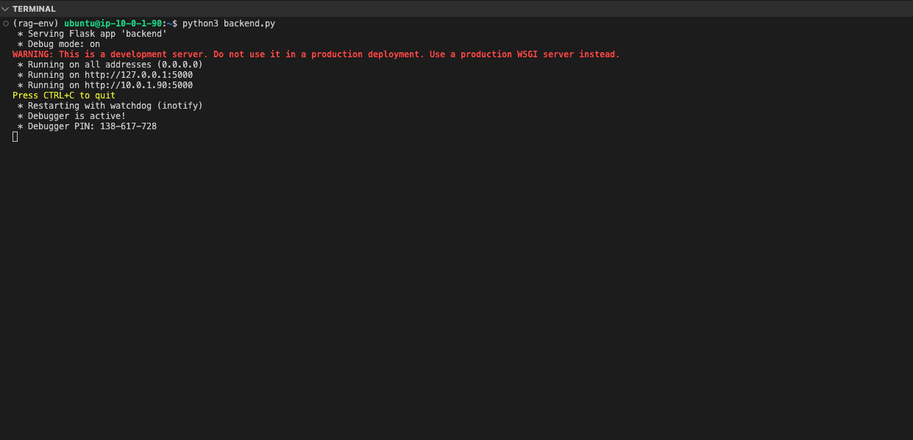

## Backend Script for RAG-based LLM Server
Once the virtual environment is activated, create a `backend.py` script using the following content. This script integrates the LLM with the FAISS vector database for RAG:

```python
import os
import time
import logging
from flask import Flask, request, jsonify
from flask_cors import CORS
from langchain_community.vectorstores import FAISS
from langchain_community.embeddings import HuggingFaceEmbeddings
from langchain_community.llms import LlamaCpp
from langchain_core.callbacks import StreamingStdOutCallbackHandler
from langchain_core.prompts import PromptTemplate
from langchain_community.document_loaders import PyPDFLoader, DirectoryLoader
from langchain_text_splitters import HTMLHeaderTextSplitter, CharacterTextSplitter
from langchain.schema.runnable import RunnablePassthrough
from langchain_core.output_parsers import StrOutputParser
from langchain_core.runnables import ConfigurableField

# Configure logging
logging.getLogger('watchdog').setLevel(logging.ERROR)
logger = logging.getLogger(__name__)

# Initialize Flask app
app = Flask(__name__)
CORS(app)

# Configure paths
BASE_PATH = "$HOME"
TEMP_DIR = os.path.join(BASE_PATH, "temp")
VECTOR_DIR = os.path.join(BASE_PATH, "vector")
MODEL_PATH = os.path.join(BASE_PATH, "models/llama3.1-8b-instruct.Q4_0_arm.gguf")

# Ensure directories exist
os.makedirs(TEMP_DIR, exist_ok=True)
os.makedirs(VECTOR_DIR, exist_ok=True)

# Token Streaming
class StreamingCallback(StreamingStdOutCallbackHandler):
    def __init__(self):
        super().__init__()
        self.tokens = []
        self.start_time = None

    def on_llm_start(self, *args, **kwargs):
        self.start_time = time.time()
        self.tokens = []
        print("\nLLM Started generating response...", flush=True)

    def on_llm_new_token(self, token: str, **kwargs):
        self.tokens.append(token)
        print(token, end="", flush=True)

    def on_llm_end(self, *args, **kwargs):
        end_time = time.time()
        duration = end_time - self.start_time
        print(f"\nLLM finished generating response in {duration:.2f} seconds", flush=True)

def format_docs(docs):
    return "\n\n".join(doc.page_content for doc in docs).replace("Context:", "").strip()

# Vectordb creating API
@app.route('/create_vectordb', methods=['POST'])
def create_vectordb():
    try:
        data = request.json
        vector_name = data['vector_name']
        chunk_size = int(data['chunk_size'])
        doc_type = data['doc_type']
        vector_path = os.path.join(VECTOR_DIR, vector_name)

        # Process document
        chunk_overlap = 30
        if doc_type == "PDF":
            loader = DirectoryLoader(TEMP_DIR, glob='*.pdf', loader_cls=PyPDFLoader)
            docs = loader.load()
        elif doc_type == "HTML":
            url = data['url']
            splitter = HTMLHeaderTextSplitter([
                ("h1", "Header 1"), ("h2", "Header 2"),
                ("h3", "Header 3"), ("h4", "Header 4")
            ])
            docs = splitter.split_text_from_url(url)
        else:
            return jsonify({"error": "Unsupported document type"}), 400

        # Create vectorstore
        text_splitter = CharacterTextSplitter(
            chunk_size=chunk_size,
            chunk_overlap=chunk_overlap
        )
        split_docs = text_splitter.split_documents(docs)
        embedding = HuggingFaceEmbeddings(model_name="thenlper/gte-base")
        vectorstore = FAISS.from_documents(documents=split_docs, embedding=embedding)
        vectorstore.save_local(vector_path)

        return jsonify({"status": "success", "path": vector_path})
    except Exception as e:
        logger.exception("Error creating vector database")
        return jsonify({"error": str(e)}), 500

# Query API
@app.route('/query', methods=['POST'])
def query():
    try:
        data = request.json
        question = data['question']
        vector_path = data.get('vector_path')
        use_vectordb = data.get('use_vectordb', False)

        # Initialize LLM
        callbacks = [StreamingCallback()]
        model = LlamaCpp(
            model_path=MODEL_PATH,
            temperature=0.1,
            max_tokens=1024,
            n_batch=2048,
            callbacks=callbacks,
            n_ctx=10000,
            n_threads=64,
            n_threads_batch=64
        )

        # Create chain
        if use_vectordb and vector_path:
            embedding = HuggingFaceEmbeddings(model_name="thenlper/gte-base")
            vectorstore = FAISS.load_local(vector_path, embedding, allow_dangerous_deserialization=True)
            retriever = vectorstore.as_retriever().configurable_fields(
                search_kwargs=ConfigurableField(id="search_kwargs")
            ).with_config({"search_kwargs": {"k": 5}})

            template = """<|begin_of_text|><|start_header_id|>system<|end_header_id|>
            You are a helpful assistant. Use the following context to answer the question.
            Context: {context}
            Question: {question}
            Answer: <|eot_id|>"""

            prompt = PromptTemplate(template=template, input_variables=["context", "question"])
            chain = (
                {"context": retriever | format_docs, "question": RunnablePassthrough()}
                | prompt
                | model
                | StrOutputParser()
            )
        else:
            template = """<|begin_of_text|><|start_header_id|>system<|end_header_id|>
            Question: {question}
            Answer: <|eot_id|>"""

            prompt = PromptTemplate(template=template, input_variables=["question"])
            chain = RunnablePassthrough().assign(question=lambda x: x) | prompt | model | StrOutputParser()

        # Generate response
        response = chain.invoke(question)
        return jsonify({"answer": response})
    except Exception as e:
        logger.exception("Error processing query")
        return jsonify({"error": str(e)}), 500

# File Upload API
@app.route('/upload_file', methods=['POST'])
def upload_file():
    try:
        file = request.files['file']
        if file and file.filename.endswith('.pdf'):
            filename = os.path.join(TEMP_DIR, "uploaded.pdf")
            file.save(filename)
            return jsonify({"status": "success", "path": filename})
        return jsonify({"error": "Invalid file"}), 400
    except Exception as e:
        logger.exception("Error uploading file")
        return jsonify({"error": str(e)}), 500

if __name__ == '__main__':
    app.run(host='0.0.0.0', port=5000, debug=True)
```

## Run the Backend Server

You are now ready to run the backend server for the RAG Chatbot.
Use the following command in a terminal to start the backend server:

```python
python3 backend.py
```

You should see output similar to the image below when the backend server starts successfully:

