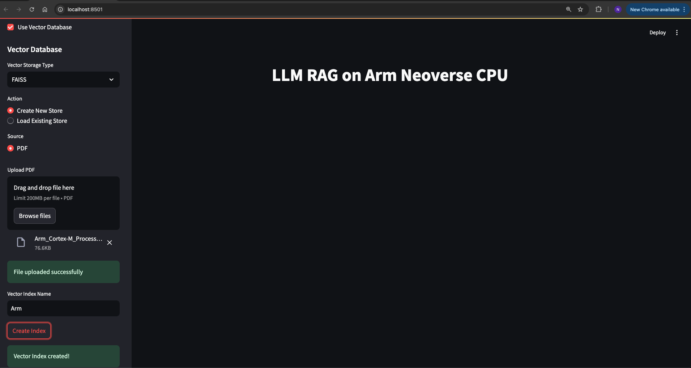
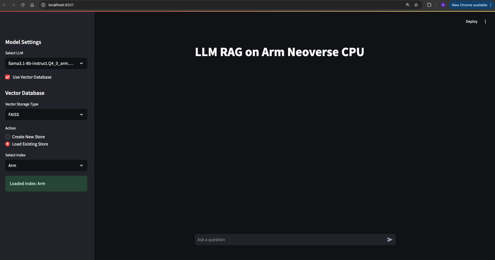
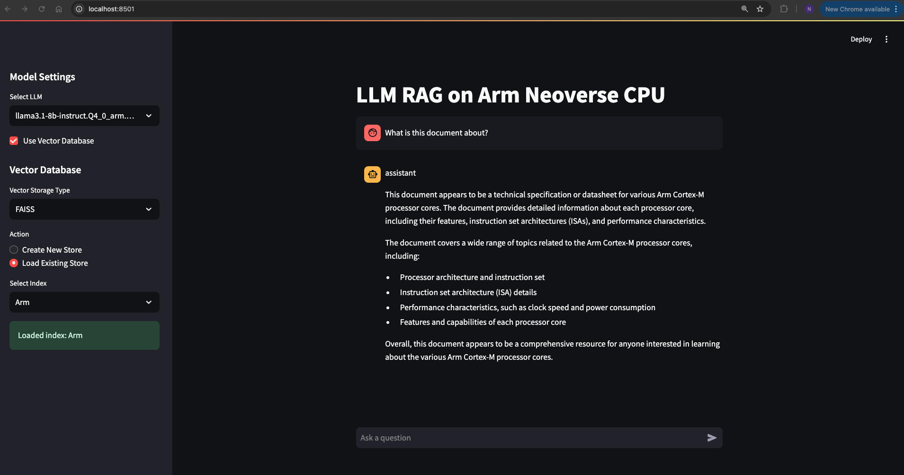
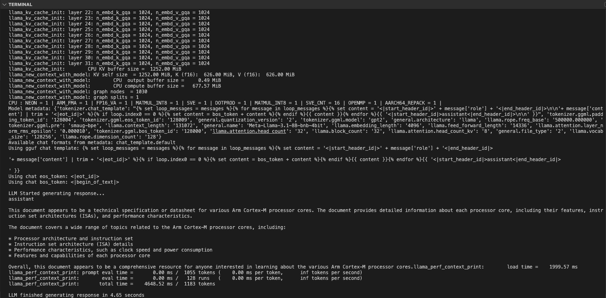

## Access the Web Application

Open the web application in your browser using the external URL:

```bash
http://[your instance ip]:8501
```

{}

To access the links you may need to allow inbound TCP traffic in your instance's security rules. Always review these permissions with caution as they may introduce security vulnerabilities.

For an Axion instance, this can be done as follows from the gcloud cli:

gcloud compute firewall-rules create allow-my-ip \
    --direction=INGRESS \
    --network=default \
    --action=ALLOW \
    --rules=tcp:8501 \
    --source-ranges=[your IP]/32 \
    --target-tags=allow-my-ip

For this to work, you must ensure that the allow-my-ip tag is present on your Axion instance.

{}
## Upload a PDF File and Create a New Index

Now you can upload a PDF file in the web browser by selecting the **Create New Store** option.

Follow these steps to create a new index:

1. Open the web browser and navigate to the Streamlit frontend.
2. In the sidebar, select **Create New Store** under the **Vector Database** section.
3. By default, **PDF** is the source type selected.
4. Upload your PDF file using the file uploader.
5. Enter a name for your vector index.
6. Click the **Create Index** button.

Upload the Cortex-M processor comparison document, which can be downloaded from [this website](https://developer.arm.com/documentation/102787/latest/).

You should see a confirmation message indicating that the vector index has been created successfully. Refer to the image below for guidance:



## Load Existing Store

After creating the index, you can switch to the **Load Existing Store** option and then select the index you created earlier. Initially, it will be the only available index and will be auto-selected.

Follow these steps:

1. Switch to the **Load Existing Store** option in the sidebar.
2. Select the index you created. It should be auto-selected if it's the only one available.

This will allow you to use the uploaded document for generating contextually-relevant responses. Refer to the image below for guidance:



## Interact with the LLM

You can now start asking various queries to the LLM using the prompt in the web application. The responses will be streamed both to the frontend and the backend server terminal.

Follow these steps:

1. Enter your query in the prompt field of the web application.
2. Submit the query to receive a response from the LLM.



While the response is streamed to the frontend for immediate viewing, you can monitor the performance metrics on the backend server terminal. This gives you insights into the processing speed and efficiency of the LLM.



## Observe Performance Metrics

As shown in the image above, the RAG LLM Chatbot completed the generation in 4.65 seconds, processing and generating a total count of tokens as `1183`.

This demonstrates the efficiency and speed of the RAG LLM Chatbot in handling queries and generating responses.

## Further Interaction and Custom Applications

You can continue to ask follow-up prompts and observe the performance metrics in the backend terminal.

This setup demonstrates how you can create various applications and configure your LLM backend connected to RAG for custom text generation with specific documents. This Learning Path serves as a guide and example to showcase the LLM inference of RAG on Arm CPUs, highlighting the optimized performance gains.


